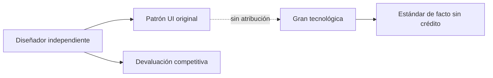

# Stolen Buttons: Cómo las grandes tecnológicas devoran el diseño independiente sin dar crédito

Hay una práctica en la industria tecnológica que rara vez se denuncia con la fuerza que merece: la apropiación sistemática de patrones de diseño, interacciones y elementos visuales creados por desarrolladores y diseñadores independientes. Anatoly Zenkov, en su ensayo "Stolen Buttons" publicado en su sitio personal y discutido en Hacker News, pone el dedo en una llaga que muchos conocen pero pocos articulan: los gigantes del software toman prestadas ideas —a veces idénticas, píxel a píxel— sin atribución, sin compensación y, sobre todo, sin consecuencias.

## El mecanismo silencioso de la transferencia de valor

El fenómeno no es nuevo, pero sí se ha acelerado. Cuando una empresa como Apple introduce un nuevo gesto en iOS, cuando Google rediseña su barra de navegación en Android, o cuando Microsoft copia el menú contextual de una aplicación indie para integrarlo en Windows, no estamos simplemente ante "convergencia de diseño" o "tendencias inevitables". Estamos ante una transferencia de valor no reconocida: pequeñas ideas que, una vez absorbidas por plataformas con cientos de millones de usuarios, se convierten en estándares de facto sin que sus creadores originales obtengan visibilidad, ingresos ni reconocimiento.

## Una historia repetida

Más recientemente, hemos visto cómo Microsoft ha integrado funcionalidades que durante años fueron dominio de extensiones de navegador y aplicaciones de terceros. La barra lateral de Edge, las pestañas verticales, las funciones de IA generativa: cada una de estas "innovaciones" tiene predecesores claramente identificables en productos más pequeños.

## El problema estructural: asimetría de recursos

Lo que Zenkov expone con crudeza es que este no es un problema de "malos actores" individuales, sino de estructura. Las grandes tecnológicas tienen equipos de diseño de cientos de personas cuyo trabajo incluye explícitamente monitorizar la competencia, analizar tendencias en Dribbble, Product Hunt, GitHub y Hacker News, y empaquetar lo que funciona dentro de sus propios ecosistemas. Es una práctica de inteligencia competitiva completamente legal.

El problema es que el "stolen button" —ese pequeño elemento de UI, ese micro-interaction, ese patrón de navegación— cuando es adoptado por Apple o Google, deja de ser un diferenciador competitivo. Para el diseñador independiente que lo creó, la idea se devaluiza instantáneamente. Su ventana de ventaja competitiva, que ya era estrecha, se cierra. Y lo que queda es la pregunta filosófica: si la idea era tan buena que el gigante la copió, ¿no es eso una validación? Quizás. Pero no paga las cuentas.

## Contexto histórico: del "embrace, extend, extinguish" al "copia, distribuye, olvida"

Microsoft popularizó en los años noventa la estrategia conocida como "embrace, extend, extinguish": adoptar estándares de la competencia, extenderlos con funcionalidades propietarias y extinguir al competidor. Aunque la fórmula explícita ha caído en desuso, su espíritu sobrevive en la era del diseño de interfaces. La diferencia es que hoy el ciclo es más rápido, los tribunales están menos dispuestos a intervenir en cuestiones de diseño, y la velocidad de copia se ha incrementado gracias a herramientas automatizadas de análisis de UI.

Apple, por su parte, ha construido toda una mitología alrededor de la "invención" de categorías que en realidad ya existían. El iPhone no inventó el smartphone táctil; los tablets existían antes del iPad; las tiendas de aplicaciones no fueron una idea original de Apple. Pero la empresa de Cupertino ha perfeccionado el arte de tomar ideas preexistentes, refinarlas con presupuestos de diseño masivos y presentarlas como propias en eventos que son seguidos por millones de personas.

## ¿Hay solución?

Algunos diseñadores independientes han recurrido a la marca, la personalidad y la construcción de comunidades como formas de defensa. Otros han optado por publicar sus ideas bajo licencias que, aunque difícilmente aplicables contra gigantes, al menos dejan un registro público de la autoría. Las licencias de diseño, como las que propone la Open Source Design initiative, son un paso en la dirección correcta, pero su adopción sigue siendo marginal.

La solución real, si es que existe, pasaría por una combinación de legislación más robusta sobre diseño de interfaces, mayor transparencia por parte de las grandes plataformas (¿qué pasaría si Apple incluyera una sección de "inspiraciones" en sus keynotes?) y, sobre todo, por una mayor cultura de atribución dentro de la propia comunidad tecnológica. Mientras los ingenieros y diseñadores sigan celebrando a las grandes empresas por "innovar" y denostando a los pequeños por "quejarse", el ciclo continuará.

## Reflexión final

El ensayo de Zenkov no es solo una queja; es un espejo. Cada vez que aplaudimos un nuevo botón en iOS sin preguntarnos de dónde vino realmente la idea, estamos avalando un sistema que recompensa al extractor y castiga al creador original. En una industria que se enorgullece de hablar de "innovación" y "disrupción", tal vez sea hora de empezar a hablar también de procedencia, crédito y justicia distributiva en el diseño de software.

Porque al final, como dice el propio Zenkov, todos los botones tienen un autor. La pregunta es si a ese autor le importa más la difusión de su idea o el reconocimiento de su trabajo. Y la respuesta, en un ecosistema dominado por monopolios de plataforma, no debería ser una elección.

