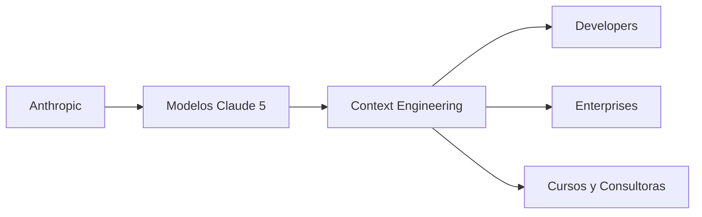

# Context Engineering: La nueva habilidad que Anthropic quiere monopolizar

Cuando Anthropic publicó su artículo sobre "las nuevas reglas del context engineering" para los modelos Claude de quinta generación, la industria tecnológica hizo lo que siempre hace: aplaudir, compartir y repetir el vocabulario del actor más grande de la sala. Pero pocas voces se detuvieron a preguntar algo fundamental: **¿por qué una empresa privada está redefiniendo cómo nos comunicamos con la inteligencia artificial?**

Detrás del lenguaje técnico hay una disputa de poder que merece ser analizada con lupa.

## Del "prompt engineering" al "context engineering": un cambio de marco conveniente

Durante 2023 y 2024, el "prompt engineering" se convirtió en una industria menor: cursos, certificaciones, consultores. Era, en esencia, el arte de hablar bien con los modelos de lenguaje. Anthropic propone ahora algo diferente: no se trata solo de redactar instrucciones, sino de **diseñar todo el contexto** que rodea una consulta: instrucciones del sistema, herramientas disponibles, memoria, documentos de referencia, historial.

Pero la pregunta incómoda es: **¿por qué llamarlo "nuevas reglas" en lugar de "mejores prácticas"?** Porque Anthropic no está vendiendo una técnica. Está vendiendo un estándar. Y quien define el estándar, controla el mercado.

## Los sospechosos habituales: quién financia a quién

Es el mismo patrón histórico que vimos con Microsoft y las APIs de Windows en los 90, con Google y el PageRank en los 2000, o con Apple y el "design thinking" en los 2010. **El actor dominante no solo compite con un producto: compite con una gramática.**

## El negocio invisible: consultoras, cursos y certificaciones

Cada vez que surge una "nueva habilidad" en tecnología, aparece un ecosistema paralelo que intenta monetizarla. El prompt engineering generó un mercado estimado de cientos de millones de dólares en formación corporativa, libros y herramientas SaaS. El "context engineering" promete ser más lucrativo porque es más complejo y más difícil de automatizar.

## La paradoja de la dependencia

Los desarrolladores que internalizan las recomendaciones de Anthropic sobre estructuración de contexto, uso de sub-agentes y razonamiento extendido están, sin saberlo, optimizando sus carreras para una plataforma. Si mañana Claude pierde la carrera contra GPT-6 o Gemini 3, esas habilidades no transferirán limpiamente. Cada modelo tiene idiosyncrasias. El conocimiento se estrecha en lugar de ampliarse.

## ¿Y los usuarios empresariales?

Para las grandes corporaciones que están integrando IA en sus operaciones, este debate no es académico. Cada proveedor de modelo ofrece su propia "metodología" de interacción. OpenAI tiene sus function calling. Google tiene sus Gemini API guides. Anthropic tiene su "context engineering". La fragmentación es real y costosa: las empresas deben mantener equipos especializados en cada ecosistema, o apostar todo a uno y aceptar el riesgo.

## Conclusión: el vocabulario como campo de batalla

Las "nuevas reglas del context engineering" son, técnicamente, un avance legítimo. Anthropic tiene modelos competitivos y un equipo de investigación serio. Pero como analistas independientes, debemos leer estos anuncios no solo como documentación técnica, sino como **actos de posicionamiento de mercado**.

La próxima vez que veas un artículo de una gran empresa de IA definiendo "las nuevas reglas" de algo, pregúntate: ¿a quién benefician estas reglas? ¿Quién paga la cuenta? ¿Qué alternativas existen? Porque en la industria tecnológica, el vocabulario no es neutral. Es infraestructura. Y quien controla la infraestructura, controla el futuro.