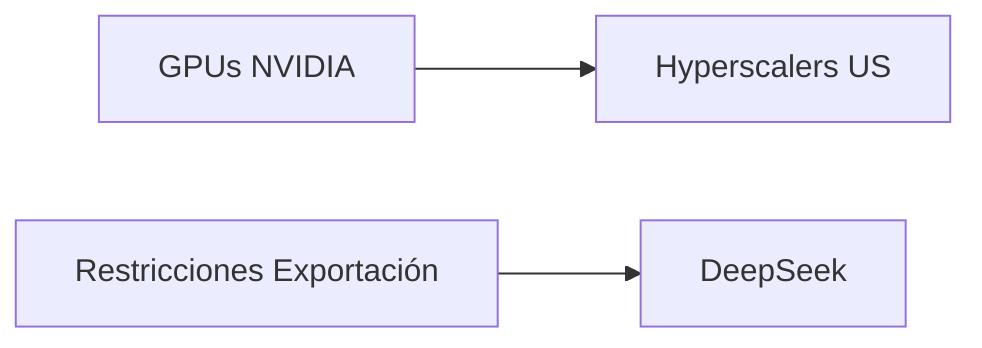

# DeepSeek pausa su ronda: la brecha de cómputo como nuevo campo de batalla geopolítico

El pasado julio, un documento en PDF con la transcripción de una reunión entre **Liang Wenfeng**, fundador de DeepSeek, y un grupo de inversores comenzó a circular por canales informados de la industria. Lo que en condiciones normales habría sido un rutinario pitch de ronda se transformó en una pequeña crisis: la startup china habría pausado su proceso de captación de capital después de que se filtraran comentarios francos sobre la **brecha de cómputo** que la separa de sus competidores estadounidenses. No fue la tecnología lo que espantó a los inversores. Fue la verdad.

## El contexto: un héroe incómodo

DeepSeek llevaba meses construyendo una narrativa de David contra Goliat: eficiencia de entrenamiento, modelos abiertos, costes por token drásticamente menores. Era, hasta la filtración, el ejemplo perfecto de que la innovación podía competir con el capital.

## La economía política de una pausa

¿Por qué una frase sobre hardware congela una ronda? Porque los mercados de capital privado no castigan la debilidad tecnológica: castigan la **incertidumbre narrativa**. En un sector donde cada nueva ronda redefine la jerarquía de poder —quién negocia con los hyperscalers, quién firma contratos plurianuales con Microsoft Azure, quién paga las facturas de NVIDIA— admitir públicamente una dependencia estructural es, literalmente, destruir tu propia tesis de inversión.

## El compute gap no es un problema técnico: es una arquitectura de poder

DeepSeek, como cualquier actor fuera de ese club, debe conformarse con **chips H800 y H20 degradados**, diseñados específicamente para cumplir la normativa de exportación sin ser inútiles para entrenamiento. Es un techo de cristal tecnológico fijado por decreto.

Lo que la filtración revela es algo más profundo: Liang Wenfeng y su equipo son, probablemente, los ingenieros con mejor relación tokens/dólar del mundo. Pero esa eficiencia tiene rendimientos decrecientes cuando compites contra un rival cuyo coste marginal de cómputo no le importa. **Es como optimizar un velero frente a un portaaviones**: la elegancia ingenieril importa menos que el desplazamiento.

## Lectura histórica: del Sputnik al semiconductor

No es casualidad que la ronda de DeepSeek se haya pausado, no cancelado. Los inversores chinos —High-Flyer, Alibaba, los fondos estatales— entienden perfectamente el problema. La pregunta que se hacen es si el capital propio chino es suficiente para construir una alternativa real a la pila de **NVIDIA + TSMC + AWS**. Y esa pregunta, en 2026, todavía no tiene respuesta afirmativa.

## ¿Qué viene después?

La filtración del PDF es, paradójicamente, una buena noticia para la transparencia industrial. Muestra que la IA china no es una amenaza inminente para la supremacía de cómputo estadounidense; es un competidor severamente limitado que intenta exprimir cada ciclo de instrucción con disciplina de ingeniería notable. Los modelos de DeepSeek seguirán siendo punteros en su segmento. Pero la frontera de la AGI —si es que existe— pertenece, hoy por hoy, a quien pueda pagar las facturas de luz de un cluster de **100.000 Blackwell Ultra**.

Y aquí está la reflexión incómoda: la "democratización de la IA" que DeepSeek encarnaba en su narrativa pública nunca fue del todo real. Era un mensaje para inversores y reguladores, no una descripción técnica. La verdadera distribución del poder en esta industria sigue obedeciendo a quién tiene acceso a **wafers de silicio, agua ultrapura, y conexiones eléctricas de alta densidad**. Todo lo demás —los papers, los benchmarks, los modelos abiertos— es marketing con distinto grado de sofisticación.

Quizás la lección más honesta de esta filtración es la más simple: en tecnología, la narrativa siempre es el primer producto. Y cuando la narrativa se agrieta, el capital huye. No por cobardía, sino por matemáticas.

