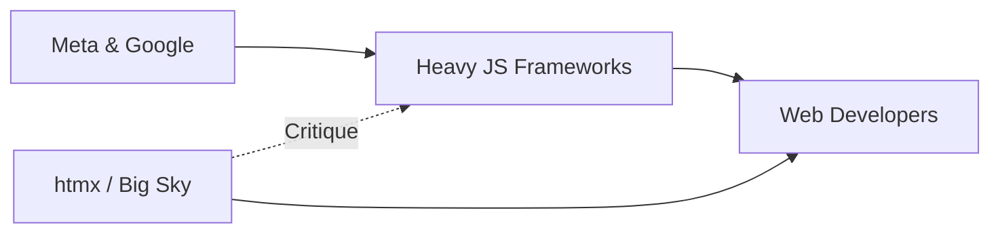

# htmx 4.0 llega a Game Boy: una pequeña rebelión contra los gigantes del framework

Hay noticias que parecen un meme, y memes que terminan siendo un análisis político de toda una industria. El anuncio de que **htmx 4.0** se publica exclusivamente en formato cartucho para Nintendo Game Boy pertenece a esa segunda categoría. Detrás del ingenio hay un dardo lanzado con precisión contra el complejo industrial del frontend moderno: Meta, Google, Vercel y la economía extractiva que han construido alrededor de JavaScript.

## El producto que cabe en la palma de la mano

Big Sky Software, la pequeña empresa detrás de htmx, puso a la venta un cartucho físico compatible con Game Boy que contiene la última versión de la librería. No es una distribución digital: es un objeto. Se conecta, se enciende, y la pantalla de 160x144 píxeles muestra el código. Carson Gross, creador del proyecto, lleva años repitiendo una idea incómoda para Silicon Valley: la web se ha vuelto absurdamente compleja, y esa complejidad beneficia a muy pocos.

## Quién controla el estándar de facto del frontend

Conviene recordar el mapa de poder real. **React**, la librería más usada del ecosistema, es propiedad de Meta. **Angular** nació en Google. **Vue.js** se mantiene independiente pero su creador Evan You ahora trabaja para un *startup* respaldado por capital de riesgo. **Next.js**, la capa más popular sobre React, pertenece a **Vercel**, una empresa que cotiza en bolsa y que recientemente ha sido señalada por conflictos de interés al dar ventajas a proyectos alojados en su infraestructura.

Esto no es conspiración: es la estructura habitual del software propietario disfrazado de código abierto. Las grandes tecnológicas financian proyectos *open source* porque el *open source* gratuito les ahorra costes laborales y les da influencia sobre los estándares. Cuando Meta lanza una nueva versión de React, millones de desarrolladores reescriben su código. Cuando Vercel introduce un nuevo patrón de renderizado, los *tutoriales*, las empresas de consultoría y los bootcamps se alinean.

El resultado es una **dependencia funcional** de unas pocas decisiones tomadas en Menlo Park y Mountain View.

## El capital detrás de la complejidad

- **Demanda de desarrolladores especializados**, lo que justifica salarios inflados y rotación constante.
- **Dependencia de infraestructura cloud**, donde AWS, Vercel y similares capturan el gasto.
- **Servicios de monitorización y observabilidad** que venden herramientas como Datadog o Sentry a equipos que no las necesitarían con arquitecturas más simples.
- **Mercado de formación**, dominado por plataformas como Udemy, Coursera o Scrimba, donde cada nueva versión de React es un curso de 40 horas a 12,99 euros.

## El cartucho como manifiesto cultural

Vender htmx como cartucho es decir: esto funciona, es estable, y no necesita tu conexión, tu suscripción ni tu consentimiento para ejecutarse. En una industria obsesionada con el *engagement* y los *funnels*, hay algo casi clandestino en poner una librería en un cartucho.

