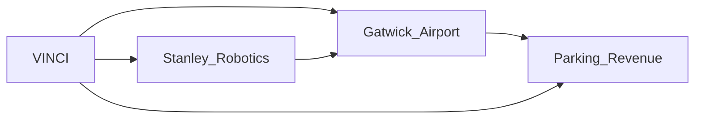

# Robots in the Parking Lot: What Gatwick's Automation Reveals About Capital's Quiet Consolidation

When London Gatwick announced the launch of its robotic parking service powered by Stanley Robotics, the press coverage leaned heavily on the consumer convenience angle: drop your car at a terminal kiosk, fly out, and find your vehicle waiting, freshly washed, when you return. It is a tidy story. It is also a misleading one. The real story is not about valet robots. It is about the quiet, almost invisible consolidation of infrastructure capital that this deployment exemplifies.

## The Service Looks Like Convenience, but the Structure Is Control

Stanley Robotics, founded in 2015 in France, has built a business model around what it calls "one-stop parking." The robot lifts vehicles and arranges them in optimized outdoor compounds, allowing airports to fit up to 50% more cars in the same footprint. On the surface, this is a logistical improvement. Underneath, it is a restructuring of who owns the parking transaction, who owns the data, and who collects the recurring revenue.

When the airport operator is a financial backer of the technology provider, the deployment is no longer a neutral procurement decision. It is a captive distribution channel. The same holding structure that extracts value from landing fees now extracts value from parking fees, technology licensing, and, increasingly, from the behavioral data generated by every car that enters the system.

## The Robotics-as-a-Service Pipeline

It mirrors the evolution we have seen in cloud computing, where AWS, Azure, and GCP turned infrastructure into recurring subscriptions. Robotics-as-a-service is the same logic applied to physical assets. The customer, in this case the airport, avoids capex but cedes long-term control over a core operational layer. Once the robotic fleet is integrated, switching costs become prohibitive: the data models, the maintenance contracts, the operational workflows all belong to the vendor.

## Automation and the Labor Question

The airport industry employs tens of thousands of people in parking operations, customer service, and ground handling across Europe. Automated parking does not eliminate these roles overnight, but it sets a direction. The workers who once moved cars, managed lots, and handed out tickets are replaced by a smaller technical team that maintains the robots and handles exceptions.

---

