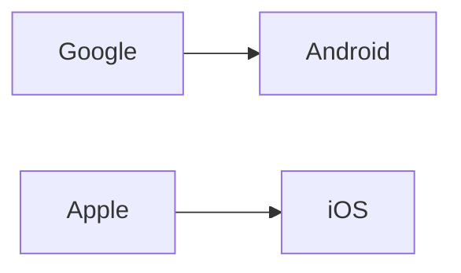

# El teléfono que se borró solo: el caso GrapheneOS que revela la asimetría de poder digital

## La asimetría de poder fundamental

GrapheneOS, un sistema operativo de código abierto basado en Android pero sin los servicios de Google ni la telemetría corporativa, incorpora mecanismos de seguridad que reinician el dispositivo tras períodos de inactividad. Cuando un teléfono cambia de manos en un punto de control, ese mecanismo puede activarse, devolviendo el equipo a un estado bloqueado que frustra los intentos de extracción forense.

¿Fue intencional? ¿Fue accidental? El Departamento de Justicia asume lo primero. El problema es que, técnicamente, no hay manera de distinguir ambos escenarios, y eso es exactamente lo que incomoda a las agencias: un sistema diseñado por defecto para proteger al usuario, no para facilitar la intrusión estatal.

## El duopolio que define el debate

Para entender por qué GrapheneOS importa, hay que recordar el terreno que disputa. Android, controlado por Google, y iOS, controlado por Apple, dominan más del 99% del mercado global de smartphones. Ambas plataformas mantienen relaciones contractuales y comerciales estrechas con gobiernos occidentales: Apple participó en el programa PRISM según los documentos de Snowden, y Google no quedó mejor parada en esas revelaciones.

Cuando el mercado se concentra así, las opciones alternativas como GrapheneOS, LineageOS o /e/OS nacen en los márgenes. Son proyectos mantenidos por comunidades pequeñas, financiados mediante donaciones y, en el caso de GrapheneOS, con el liderazgo técnico de figuras como Daniel Micay, conocido por su enfoque rigorista en seguridad. No tienen presupuesto para cabildeo, ni equipos de relaciones gubernamentales, ni acceso a los canales de distribución masiva que reservan Google Play y App Store para sí mismas.

## Las Cripto Wars y la continuidad histórica

En 2016, el caso del iPhone de San Bernardino mostró el patrón inverso: el FBI presionó a Apple para crear una puerta trasera específica. Tim Cook publicó una carta abierta defendiendo el cifrado como cuestión de seguridad nacional. El caso se resolvió cuando el FBI encontró otra vía de acceso, pero el precedente quedó claro: cuando el Estado quiere acceso, presiona al custodio del sistema.

## Los incentivos económicos detrás de la vigilancia

Hay una dimensión que suele quedar fuera del análisis: los datos son dinero contante. El modelo de negocio de Google depende de la publicidad dirigida, que a su vez depende de la extracción continua de información del dispositivo. Cada byte de telemetría que Android "amablemente" transmite a los servidores de Mountain View es una variable en un modelo de machine learning que vale, literalmente, miles de millones de dólares en ingresos trimestrales.

Por eso los teléfonos "convencionales" son tan permeables por defecto. No es solo una cuestión de decisiones técnicas: es una decisión de modelo de negocio. Apple ha intentado diferenciarse con su discurso de privacidad en los últimos años, pero sigue siendo una empresa con capitalización cercana a los tres billones de dólares y creciente dependencia de ingresos por servicios que requieren datos.

GrapheneOS, al eliminar la capa de Google y sus servicios predeterminados, rompe esa ecuación. El dispositivo deja de ser un nodo de extracción continua de datos y se convierte en lo que originalmente debería haber sido: una herramienta de comunicación bajo control efectivo del usuario.

## ¿Quién paga el costo real de la privacidad?

El caso del aeropuerto de Atlanta terminará en los tribunales y, eventualmente, establecerá un precedente legal relevante. Pero el verdadero precedente ya está escrito en el mercado: la privacidad significativa es un lujo que solo algunos pueden pagar con tiempo, conocimiento técnico y dispositivos compatibles.

Mientras el sistema operativo dominante siga siendo un producto aparentemente gratuito a cambio de datos personales, la privacidad real quedará relegada a proyectos comunitarios como GrapheneOS. La ironía final es que procesar a un usuario por recurrir a esas herramientas equivale, implícitamente, a procesarlo por haberse tomado en serio lo que el marketing corporativo lleva años prometiendo.

La pregunta que queda abierta no es legal, sino política y económica: ¿estamos cómodos con un ecosistema digital donde el único camino hacia la privacidad significativa pasa por renunciar al sistema operativo que utiliza el 99% del mercado? Y, más profundamente, ¿qué dice esto sobre el contrato social implícito entre ciudadanos, Estados y las corporaciones que median nuestra vida digital?

