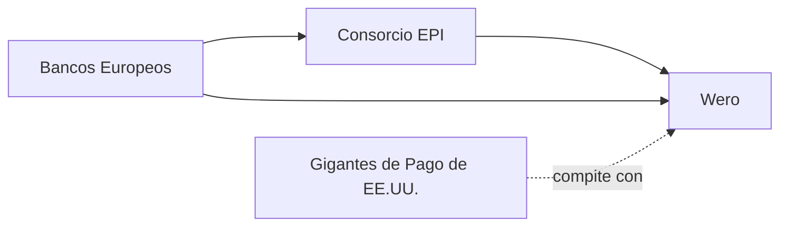

La cadena francesa de artículos deportivos Decathlon acaba de dar un paso pequeño pero simbólico en Alemania: integrar **Wero**, el sistema de pagos digitales promovido por la European Payments Initiative (EPI), en su sitio web alemán. A primera vista parece una decisión técnica menor, una opción más en el checkout. En realidad, es un movimiento estratégico que refleja las tensiones geopolíticas y económicas más profundas del ecosistema digital europeo.

## ¿Qué es Wero y quién está detrás?

El lanzamiento oficial de Wero tuvo lugar en 2024 en Alemania, Francia, Bélgica y Países Bajos, y desde entonces ha ido expandiéndose tanto en merchants como en funcionalidades. La integración en Decathlon Alemania marca un nuevo hito: por primera vez, un retailer del top tres del sector deportivo a nivel europeo adopta Wero como opción de pago en su sitio principal.

## El tablero de juego: capital concentrado, poder asimétrico

La creación de Wero responde a un diagnóstico compartido: la dependencia europea de infraestructura de pagos controlada por actores estadounidenses constituye una vulnerabilidad estratégica. Cada transacción procesada fuera de Europa implica no solo comisiones que salen del continente, sino también datos de comportamiento de consumo que alimentan algoritmos de empresas que no están sujetas al marco regulatorio europeo (GDPR, DMA, PSD2).

Decathlon, con más de 1.700 tiendas en 60 países y una facturación superior a los 15.000 millones de euros anuales, no es un actor neutral. Su adopción de Wero no es solo una decisión de la filial alemana, sino una señal que probablemente tenga implicaciones para el resto de mercados europeos donde opera.

## La sombra de los fracasos anteriores

Cualquier analista con algo de memoria histórica sentirá un escalofrío al escuchar "consorcio de bancos europeos lanza sistema de pagos". El historial es sombrío. En 2014, varios bancos europeos lanzaron **Paylib**, que prometía ser la respuesta europea a Apple Pay. El proyecto avanzó con lentitud geográfica, una experiencia de usuario fragmentada y, finalmente, terminó siendo absorbido por Wero en 2023.

Antes de Paylib, hubo intentos como Monitise y otros proyectos de pagos móviles que no lograron tracción. La pregunta es legítima: ¿qué tiene Wero de diferente?

## Decathlon: el socio comercial ideal

Para Decathlon, los beneficios también son tangibles. Reduce la dependencia de intermediarios estadounidenses en una parte de sus transacciones, potencialmente baja los costes de procesamiento y obtiene una ventaja de marketing al posicionarse como retailer "europeo e innovador" en un mercado, el alemán, donde este tipo de discurso tiene resonancia con el consumidor.

## Lo que no se dice

Hay, sin embargo, aspectos críticos que conviene señalar. La EPI es, en esencia, un **cártel de bancos europeos**. Si bien su objetivo declarado —competir con los gigantes estadounidenses— es legítimo, la concentración de poder que supone que los mayores bancos del continente controlen la infraestructura de pagos europea tiene sus propios riesgos. ¿Quién fiscaliza a los fiscalizadores? ¿Qué garantías hay de que Wero no reproduzca, con acento europeo, las mismas prácticas de exclusión o tarifas abusivas que se le critican a las redes de tarjetas?

Además, la verdadera prueba de fuego no está en integraciones puntuales con retailers pioneros, sino en conseguir una adopción masiva por parte del consumidor final. Y aquí la batalla es cultural tanto como tecnológica. Los europeos llevan años usando Google Pay, Apple Pay y PayPal con naturalidad. Convencerles de usar Wero requerirá una propuesta técnica competitiva y, sobre todo, una narrativa que conecte con sus valores.

## Conclusión: ¿soberanía real o cambio de siglas?

La adopción de Wero por parte de Decathlon Alemania es un dato empresarial relevante, pero también un símbolo de una época. Europa está intentando construir, tarde y con herramientas imperfectas, las infraestructuras digitales que le permitan dejar de ser un simple mercado consumidor de tecnología estadounidense. En pagos, en cloud, en semiconductores, en inteligencia artificial: el patrón se repite.

La pregunta abierta no es si Wero sobrevivirá —probablemente lo hará, al menos en alguna forma—, sino si logrará algo más que sustituir un logo extranjero por uno europeo. La soberanía digital no es solo una cuestión de geografía corporativa; es una cuestión de gobernanza, de competencia real, de derechos de los usuarios y de arquitectura de poder. Si Wero termina siendo simplemente un nuevo intermediario con sede en Frankfurt en lugar de San José, el ejercicio habrá sido cosmético. Si, en cambio, se convierte en una pieza de un ecosistema más abierto, interoperable y regulado democráticamente, entonces quizás esta pequeña decisión de Decathlon habrá sido, en perspectiva, el primer paso de algo mucho más grande.

