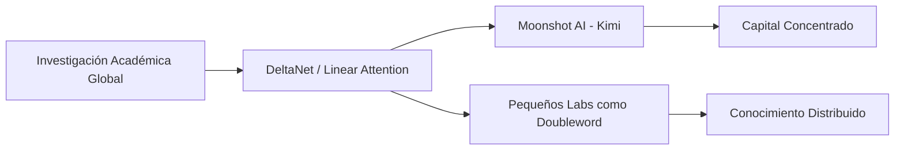

## La noticia que incomoda a los gigantes

En un ecosistema saturado de comunicados de prensa donde OpenAI, Google DeepMind y Anthropic presentan cada nueva versión como un salto casi místico hacia la inteligencia artificial general, aparece un artículo que resulta incómodo: el blog de Doubleword, una empresa relativamente pequeña de infraestructura para IA, demuestra que mecanismos como la "delta attention" —la innovación central detrás del modelo Kimi de Moonshot AI— podrían haber sido descubiertos por cualquier investigador con tiempo, café y acceso a Papers with Code.

No se trata de minimizar el trabajo de Moonshot AI, la startup china respaldada por Alibaba que ha captado cientos de millones de dólares en rondas de financiación. La delta attention es, técnicamente, una mejora elegante: reduce la complejidad cuadrática de los transformers a algo lineal, permitiendo procesar ventanas de contexto mucho más largas sin el coste computacional habitual. Es ingeniería brillante. Pero la tesis de Doubleword es más provocadora: la idea llevaba tiempo flotando en la literatura académica sobre atención lineal, desde la familia DeltaNet hasta trabajos fundacionales como los de Katharopoulos y compañía en 2020.

## La geopolítica de los mecanismos de atención

Esto contradice la narrativa habitual de que China simplemente "copia" a Occidente. La realidad es más compleja: existe un circuito de investigación distribuido, con papers abiertos, implementaciones en GitHub y experimentos en pequeños laboratorios que muchas veces preceden a las aplicaciones comerciales de las grandes empresas. La delta attention no salió de una sesión de brainstorming en una sala de juntas de San Francisco; emergió de una comunidad académica global que incluye a investigadores en Europa, Asia y América.

## ¿Qué significa realmente que "cualquiera podría haberlo descubierto"?

La afirmación de Doubleword no es una crítica a Moonshot AI; es una observación sobre cómo funciona la ciencia. Los grandes avances rara vez tienen un único autor; son la cristalización de ideas que estaban "en el aire", esperando que alguien las conectara. La ley de Wright, originalmente formulada en 1929 para explicar por qué inventos similares aparecen simultáneamente en distintos lugares, sigue vigente.

## El papel de los actores pequeños en un campo de gigantes

Empresas como Doubleword, que ofrecen infraestructura de inferencia optimizada, ocupan un nicho estratégico en esta geografía del poder. No pueden competir entrenando modelos foundation desde cero, pero pueden aportar eficiencia, herramientas y, sobre todo, análisis crítico que los grandes laboratorios tienen pocos incentivos para producir. Su blog es, en cierto sentido, un acto de soberanía intelectual: demostrar que la frontera de la investigación no es propiedad privada de nadie.

Esta dinámica recuerda a los primeros días del movimiento open source, cuando empresas como Red Hat construyeron negocios sólidos sobre Linux sin tener que competir directamente con Microsoft en sistemas operativos de escritorio. La capa de valor se desplazaba: no era el código en sí, sino la implementación, el soporte y la optimización.

## Conclusión: la próxima frontera es política, no técnica

La historia de la tecnología nos enseña que las ideas se distribuyen, pero el poder se concentra. La delta attention es solo el último ejemplo. El reto para los próximos años no será descubrir el próximo avance algorítmico —eso seguirá ocurriendo en laboratorios pequeños, universidades y empresas modestas— sino construir las instituciones, las regulaciones y los modelos de negocio que eviten que los frutos de ese conocimiento se acumulen en manos de unos pocos.

Mientras tanto, conviene recordar: la próxima vez que un comunicado de prensa presente un avance como exclusivo e inimitable, vale la pena mirar si alguien, en algún blog poco conocido, ya lo había anticipado.