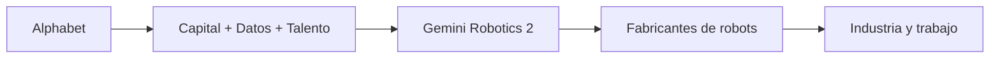

# Gemini Robotics 2: el movimiento de Google para convertirse en el sistema operativo de los robots

La semana pasada, Google DeepMind presentó Gemini Robotics 2, su nuevo modelo de inteligencia artificial diseñado para dotar a robots humanoides y brazos industriales de lo que la empresa denomina "inteligencia corpórea completa". Sobre el papel, el anuncio es técnico: mejor comprensión multimodal, mayor control motriz, capacidad de planificación multi-paso. Pero si se observa con perspectiva crítica, lo que DeepMind acaba de hacer es algo mucho más relevante: ha colocado una pieza fundamental en la estrategia de Alphabet para dominar la próxima frontera de la inteligencia artificial, aquella que sale de las pantallas y entra en el mundo físico.

## El contexto: la carrera por la IA corpórea

- Tesla, con su programa Optimus y la promesa de un millón de unidades anuales para 2030.
- Figure AI, que ya firmó acuerdos con BMW y recibió capital de Microsoft y OpenAI.
- 1X Technologies, respaldada por OpenAI, que presentó su robot doméstico Neo.
- Physical Intelligence, que recaudó 400 millones de dólares en una ronda liderada por Jeff Bezos.
- Apptronik, que precisamente cuenta con el respaldo financiero de Google.
- Boston Dynamics, ahora propiedad del conglomerado surcoreano Hyundai.
- NVIDIA, que vende tanto el silicio (Jetson, Thor) como las plataformas de simulación (Isaac, Omniverse) sobre las que se entrenan estos robots.

Lo que DeepMind presenta con Gemini Robotics 2 es, esencialmente, el equivalente robótico de Android: una capa de software que cualquier fabricante de hardware puede licenciar para dotar a sus máquinas de capacidades cognitivas avanzadas. El modelo se entrena con datos multimodales (vídeo, texto, movimiento) y se adapta a múltiples plataformas de robots. La promesa es ambiciosa y, por supuesto, está cuidadosamente empaquetada en lenguaje de democratización tecnológica.

## Las asimetrías estructurales de Alphabet

1. **Capital ilimitado a corto plazo.** Alphabet generó más de 100.000 millones de dólares en flujo de caja libre solo en 2024. Su inversión en infraestructura de inteligencia artificial supera los 75.000 millones anuales y sigue creciendo, una cifra que iguala el PIB de muchos países medianos.

2. **Datos a escala planetaria.** YouTube, Google Maps, Street View, Search y Android generan diariamente un volumen de vídeo y datos espaciales que ningún competidor puede replicar fácilmente. Estos son los insumos perfectos para entrenar modelos de comprensión del mundo físico.

3. **Talento concentrado.** DeepMind sigue siendo uno de los pocos laboratorios del mundo con la masa crítica de investigadores en aprendizaje por refuerzo y modelos multimodales. Además, Alphabet controla Intrinsic, su filial de software industrial, lo que le permite cerrar el ciclo entre el modelo y la integración en fábricas reales.

Esta trifecta (capital, datos, talento) no es nueva. Es exactamente la misma que permitió a Google monopolizar la búsqueda, la publicidad digital y, posteriormente, los sistemas operativos móviles con Android. La pregunta que deberíamos hacernos no es si Gemini Robotics 2 es un buen producto técnico, sino si Alphabet está en posición de convertir los modelos fundacionales de robótica en un nuevo mercado de un solo ganador, como ocurrió con la búsqueda.

## Lecciones históricas: de Android a la IA corpórea

La analogía con Android es deliberada, y conviene tomarla en serio. Cuando Google adquirió Android Inc. en 2005, el mercado de sistemas operativos móviles estaba fragmentado entre Symbian, BlackBerry OS, Windows Mobile y otros actores menores. En menos de una década, Android concentró más del 70% del mercado global de smartphones, no porque fuera técnicamente superior en todos los aspectos, sino porque Google ofreció una alternativa aparentemente "gratuita" y abierta a los fabricantes a cambio del control del ecosistema publicitario y de datos.

¿Se repetirá el patrón? Es probable. Si Gemini Robotics 2 y sus sucesores se distribuyen mediante licencias accesibles y APIs en la nube, los fabricantes de robots podrían quedarse dependientes de la infraestructura de Google exactamente de la misma manera que Samsung, Xiaomi y Oppo dependen hoy de los servicios móviles de la compañía. La promesa de "democratizar la robótica" puede convertirse, como tantas veces en esta industria, en un sofisticado mecanismo de extracción de rentas.

También conviene recordar el precedente de la inteligencia artificial de consumo: cuando OpenAI lanzó GPT-4, Microsoft se aseguró la exclusividad cloud y el acceso preferente, mientras Google respondía con Gemini y Anthropic con Claude. La competencia es real en la superficie, pero las capas fundamentales (cómputo, datos, distribución) siguen concentradas en tres o cuatro actores como máximo. La robótica parece destinada a recorrer un camino similar.

## Los riesgos ocultos del nuevo modelo de negocio

Hay, además, dos riesgos que rara vez aparecen en los comunicados de prensa de DeepMind:

- **Sustitución masiva de trabajo físico.** Un robot con "inteligencia corpórea" capaz de aprender tareas nuevas a partir de vídeo es, en esencia, un candidato directo para reemplazar a trabajadores de almacén, operarios de fábrica, personal de limpieza o repartidores. Las estimaciones de McKinsey sugieren que hasta el 30% de las horas trabajadas en economías avanzadas podrían automatizarse para 2030; modelos como Gemini Robotics 2 aceleran ese calendario de forma significativa.

- **Concentración de capital en una sola cadena de valor.** Si Alphabet controla el modelo, la nube donde se ejecuta y, cada vez más, los datos de entrenamiento, los fabricantes de robots se convierten en simples ensambladores de hardware. Es el mismo patrón que Intel y Microsoft establecieron en los PCs de los años noventa, y que NVIDIA y TSMC están replicando ahora con la inteligencia artificial generativa.

A esto se suma un tercer riesgo menos visible: la captura regulatoria. Alphabet, junto con OpenAI, Anthropic y Microsoft, ha creado uno de los grupos de cabildeo más sofisticados de la historia reciente en Washington y Bruselas. Cada vez que se discute una ley sobre inteligencia artificial, estas empresas ya han redactado el borrador, propuesto los estándares y colocado a sus expertos en los comités asesores. La regulación, paradójicamente, suele profundizar la concentración en lugar de frenarla.

## Conclusión: la pregunta que nadie hace

Gemini Robotics 2 es, técnicamente, un avance notable. Pero más allá del titular, el anuncio de DeepMind confirma una tendencia que debería preocupar a reguladores, trabajadores y competidores por igual: la inteligencia corpórea se está convirtiendo en otro terreno de juego donde las asimetrías del capitalismo digital de plataforma se reproducen a escala industrial.

Mientras la Comisión Europea discute la AI Act y Estados Unidos debate tímidos marcos regulatorios, Alphabet, NVIDIA, Microsoft y los fondos de inversión que respaldan a Figure, Physical Intelligence y 1X ya están construyendo las infraestructuras que definirán quién controla el trabajo físico del siglo XXI. La pregunta ya no es si los robots serán inteligentes, sino quién será el dueño de esa inteligencia. Y, hasta ahora, todas las respuestas apuntan a las mismas direcciones: Silicon Valley, Wall Street y un puñado de conglomerados con balances más grandes que el PIB de la mayoría de países del mundo.

Quizá ha llegado el momento de preguntarnos si queremos que el futuro del trabajo humano dependa de un puñado de modelos cerrados, entrenados en granjas de servidores que consumen la electricidad de ciudades enteras. La revolución de la robótica no debería discutirse solo en términos de capacidad técnica, sino también de poder, propiedad y soberanía. Lo que DeepMind anunció esta semana es importante, pero lo que no se está discutiendo en paralelo es, posiblemente, aún más relevante.

