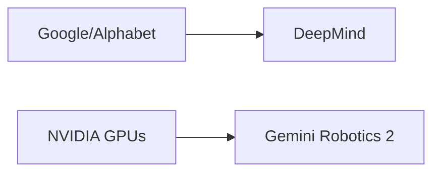

# Gemini Robotics 2: la apuesta de Google por controlar la próxima frontera de la IA

Google DeepMind acaba de presentar **Gemini Robotics 2**, una arquitectura de inteligencia artificial diseñada para dotar a robots de "inteligencia de cuerpo completo". El anuncio, publicado en el blog oficial de DeepMind, describe un sistema capaz de coordinar brazos, manos, torso y locomoción de manera unificada, abriendo la puerta a robots de uso general que podrían ejecutar tareas complejas en entornos reales. Pero más allá del avance técnico, lo verdaderamente relevante es **qué nos dice este lanzamiento sobre las dinámicas de poder que están moldeando la industria de la IA y la robótica**.

## El salto técnico: de tareas aisladas a un "cuerpo" inteligente

Hasta ahora, la mayoría de los robots industriales y de servicio operaban con **módulos de IA fragmentados**: un modelo para reconocer objetos, otro para planificar movimientos, otro para el agarre. Gemini Robotics 2 propone unificar todo esto bajo un solo modelo fundacional entrenado con datos multimodales, incluyendo video, lenguaje, y señales de control robótico. Es el mismo enfoque que Google aplicó con Gemini en el mundo textual y visual, pero trasladado a la **inteligencia artificial encarnada** (*embodied AI*).

El problema, como señala cualquier analista con sentido crítico, es que este tipo de saltos no ocurren en el vacío. Requieren **capital computacional, talento y datos** que solo unas pocas empresas en el planeta pueden movilizar.

## La barrera de entrada: cuando solo cinco jugadores pueden jugar

Entrenar un modelo de robótica multimodal exige **decenas de miles de GPUs de alta gama** funcionando durante meses. Esto coloca a Gemini Robotics 2 en una categoría accesible únicamente para un club muy reducido:

- **Google/Alphabet**: con acceso a TPUs propias, DeepMind y recursos prácticamente ilimitados.
- **Microsoft**: con su alianza estratégica con OpenAI y Azure como infraestructura.
- **Meta**: con su apuesta por la IA abierta y la inversión masiva en Reality Labs.
- **Amazon**: con AWS, DeepRacer y proyectos de fulfillment robótico.
- **NVIDIA**: que aunque no entrena modelos propios, controla el **80% del mercado de GPUs** y ha entrado de lleno en la robótica con Isaac y GR00T.

Cualquier startup que quiera competir en este espacio **depende estructuralmente** de la infraestructura de estas compañías. No es una exageración decir que la robótica avanzada se ha convertido en un **oligopolio de facto**, con Nvidia como beneficiario transversal y Google/DeepMind como actor dominante en el lado de los modelos.

## Conexión histórica: el patrón de la concentración tecnológica

1. **IBM en los años 60-80**: controló el hardware mainframe y creó un ecosistema de proveedores cautivos.
2. **Microsoft en los 90-2000**: monopolizó el sistema operativo del PC y extendió su poder a Office, navegadores y servidores.
3. **Google en los 2010-2020**: dominó la búsqueda, la publicidad digital y el mobile con Android.

En cada caso, la empresa líder **no solo creó un producto superior**, sino que construyó una **ventaja estructural**: datos, escala, talento y capital que los competidores no podían igualar. DeepMind, ahora integrada completamente en Google, tiene acceso exclusivo a infraestructura de Alphabet, a datos de entrenamiento de YouTube y a una hoja de ruta de producto que conecta robots con Gemini, Google Cloud y Android. Es un **efecto de red sobrealimentado**.

## El dato es el nuevo petróleo, y Google tiene el yacimiento

Un aspecto poco discutido del anuncio es la **ventaja de datos** que Google acumula silenciosamente. Para entrenar Gemini Robotics 2, se necesitan **millones de horas de interacción física**, ya sea en simulaciones o en robots reales. Alphabet, a través de sus inversiones en Waymo, Wing, Everyday Robots (aunque esta última fue disuelta, su conocimiento permanece) y sus acuerdos con fabricantes automotrices, tiene acceso a un caudal de datos del mundo físico que **ningún competidor open source puede replicar fácilmente**.

Mientras Meta apuesta por modelos abiertos con Llama y empresas como Hugging Face promueven la democratización, Google sigue una estrategia deliberadamente cerrada en robótica. Esto crea una **asimetría peligrosa**: la investigación abierta avanza, pero el despliegue comercial y la escala industrial quedan en manos privadas.

## Implicaciones laborales: la pregunta que nadie quiere hacer

Un robot con "inteligencia de cuerpo completo" capaz de manipular objetos, navegar entornos y aprender nuevas tareas tiene implicaciones directas en el **mercado laboral**. No hablamos de robots industriales de brazos fijos en fábricas (que ya existen desde los años 60), sino de **robots versátiles** que podrían sustituir trabajo de logística, limpieza, agricultura, cocina y atención al cliente.

Google, por supuesto, no aborda esta dimensión en su comunicado. Es comprensible desde una lógica corporativa, pero **éticamente irresponsable** desde una perspectiva de política pública. La historia demuestra que cada ola de automatización ha generado ganadores y perdedores, y que sin intervención estatal, los costos sociales los pagan los trabajadores mientras las ganancias las capturan los accionistas.

## Conclusión: ¿hacia una inteligencia artificial con custodia privada?

Gemini Robotics 2 es, técnicamente, un avance impresionante. Estratégicamente, es una pieza más en el tablero de un **juego de dominación** que Google lleva años jugando con maestría. La pregunta ya no es si la IA encarnada cambiará el mundo —lo hará—, sino **quiénes controlarán esa tecnología, en beneficio de quién, y con qué contrapesos democráticos**.

Como sociedad, tenemos dos opciones: aceptar pasivamente que las decisiones sobre el futuro del trabajo, la producción y la inteligencia artificial las tome un puñado de consejos de administración en Mountain View, o exigir **regulación antimonopolio seria, transparencia algorítmica y financiación pública robusta para alternativas independientes**. La ventana para la segunda opción se está cerrando más rápido de lo que parece.

