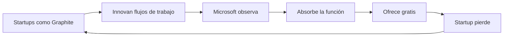

# Los Stacked PRs de GitHub Revelan el Monopolio Silencioso de Microsoft sobre los Flujos de Trabajo de los Desarrolladores

El 30 de julio de 2026, GitHub anunció que los Stacked PRs están ahora en vista previa pública. En la superficie, esto parece un lanzamiento de función rutinario: un aumento de productividad para ingenieros que trabajan en cambios de código complejos. Pero rasca debajo de la superficie y encontrarás un patrón familiar: Microsoft, el propietario de GitHub valorado en un billón de dólares, absorbiendo sistemáticamente las innovaciones pionadas por competidores más pequeños financiados con capital de riesgo y utilizando su dominio de plataforma para encerrar a los desarrolladores más profundamente en su ecosistema.

## ¿Qué son los Stacked PRs y por qué importan?

Para los no iniciados, los Stacked PRs permiten a los desarrolladores dividir un cambio de código grande en una serie de pull requests más pequeños y dependientes que pueden ser revisados y fusionados de forma incremental. Este flujo de trabajo, popularizado hace años por herramientas como Phabricator, se convirtió en una industria pequeña pero lucrativa en la década de 2020. Startups como **Graphite** recaudaron más de 20 millones de dólares en capital de riesgo precisamente para comercializar este flujo de trabajo para los usuarios modernos de GitHub. Otras herramientas, incluyendo **Sourcery**, **Gitar** y varios scripts de código abierto, compitieron en el mismo espacio.

## El manual de absorción de Microsoft

1. **Adquirir una plataforma dominante** (GitHub, 2018, 7500 millones de dólares).
2. **Permitir que terceros construyan funciones valiosas encima** (CI/CD, revisión de código, asistencia de IA).
3. **Observar qué funciones ganan tracción** y cuáles tienen valor comercial.
4. **Lanzar esas funciones de forma nativa**, a menudo gratis, socavando a los terceros.
5. **Adquirir o absorber** a los competidores más exitosos.

La pregunta es: ¿deberíamos celebrar que este flujo de trabajo sea ahora gratuito para todos, o deberíamos preocuparnos por la dinámica del mercado subyacente?

## Ambas cosas, en realidad

La respuesta honesta es que esto tiene sus pros y sus contras, y el encuadre importa enormemente.

**Por un lado**, el soporte nativo para Stacked PRs en GitHub es genuinamente bueno para los millones de desarrolladores que no quieren pagar por otra herramienta de suscripción. Democratiza un flujo de trabajo que antes estaba bloqueado detrás de servicios de pago. Para un desarrollador individual o un equipo pequeño, esto es sin ambigüedades positivo.

**Por otro lado**, Graphite — la startup que posiblemente hizo más por evangelizar y refinar este flujo de trabajo para GitHub — ahora enfrenta una amenaza existencial. Cuando un propietario de plataforma con un presupuesto de I+D efectivamente ilimitado lanza tu función principal de forma gratuita, la economía de construir un negocio sostenible sobre esa plataforma se vuelve brutal.

Esta es la **"trampa del innovador" explotada a escala de plataforma**. Clayton Christensen escribió sobre cómo las empresas establecidas luchan por interrumpirse a sí mismas. Microsoft ha resuelto el dilema adquiriendo la plataforma en sí, dejando que el ecosistema innove, y luego absorbiendo las mejores ideas.

## El problema de la concentración de capital

Aleja la vista y verás la historia más grande: el mercado de herramientas para desarrolladores se está volviendo extraordinariamente concentrado. La capitalización de mercado de Microsoft ronda los 3 billones de dólares. La compañía es dueña de:

- **GitHub** — el estándar de facto para el alojamiento de código fuente.
- **VS Code** — el editor de código dominante, con una cuota reportada de ~70% entre desarrolladores profesionales.
- **TypeScript** — ahora utilizado en la mayoría de proyectos profesionales en JavaScript.
- **GitHub Copilot** — el asistente líder de codificación con IA.
- **Azure** — uno de los tres principales proveedores de nube, todos los cuales se integran estrechamente con GitHub.

Cuando una sola compañía controla el editor, el lenguaje de herramientas, la plataforma de control de versiones, el asistente de IA y la infraestructura de la nube, los desarrolladores individuales y los equipos pequeños pierden poder de negociación. Ya no pueden amenazar creíblemente con irse. Los costos de cambio se acumulan. La atadura no es solo técnica, es social, económica y cada vez más cognitiva.

## Un eco histórico

Los desarrolladores, a menudo los más idealistas sobre la tecnología y la competencia, han estado notablemente callados sobre esta concentración. El atractivo de las funciones "gratis" y la integración sin fisuras es poderoso. También lo es la fuerza gravitacional de donde ya está el resto de la comunidad.

## La trampa de la "vista previa pública"

También vale la pena señalar el lenguaje cuidadoso que usó GitHub: "vista previa pública". Este es un lanzamiento suave que permite a la compañía lanzar la función, recopilar datos, iterar y, crucialmente, **no comprometerse con soporte a largo plazo**. Es una cobertura. Permite a Microsoft retirar, cambiar precios o modificar términos sin el tipo de obligación contractual que exigen los clientes empresariales. Para los desarrolladores individuales, "preview" significa: úsalo bajo tu propio riesgo y no construyas tu negocio alrededor de ello.

## ¿Hacia dónde lleva esto?

Hasta que los desarrolladores, y las compañías que los emplean, comiencen a tratar la concentración de plataformas con la misma seriedad con la que tratan otras formas de poder de mercado, Microsoft seguirá haciendo trampa.

