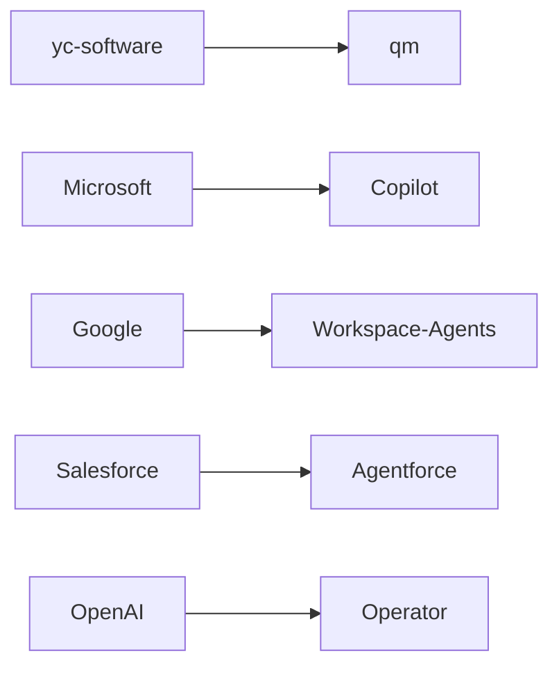

## El código que se atreve a orquestar agentes

En un ecosistema tecnológico donde OpenAI, Anthropic y Google gastan miles de millones para construir asistentes autónomos propietarios, aparece en GitHub un proyecto modesto con una propuesta ambiciosa: **qm**, descrito como un "multiplayer agent harness for work". Es decir, un arnés que permite coordinar múltiples agentes de inteligencia artificial trabajando juntos en tareas reales, con intervención humana en el bucle.

El proyecto, alojado en el repositorio de yc-software, no proviene de un gigante tecnológico ni de un laboratorio con nueve cifras de financiamiento. Viene de la comunidad. Y eso, en la geopolítica actual de la inteligencia artificial, es un acto que merece escrutinio.

qm representa, sin proponérselo explícitamente, una de las preguntas más urgentes del momento: ¿quién controla la capa de orquestación de los agentes de IA? ¿Las plataformas centralizadas, como quieren Microsoft con Copilot y Salesforce con Agentforce? ¿O una constelación abierta de herramientas comunitarias que ningún consejo de administración puede absorber de un plumazo?

## La guerra de plataformas que nadie vio venir

Hace apenas dos años, los agentes de IA eran una curiosidad académica. Hoy son el campo de batalla central de las grandes tecnológicas.

El patrón es claro: cada empresa quiere ser el **sistema operativo** de la nueva era. Y el sistema operativo es, recordemos, el activo más rentable de la historia del software. Microsoft lo entendió en los ochenta. Google lo entendió en los dos mil. Ahora todos quieren esa posición, pero ahora el sistema operativo no ejecuta instrucciones de un usuario: ejecuta instrucciones de una inteligencia artificial que, a su vez, ejecuta intenciones humanas.

## Ciclos que se repiten: el código abierto como contrapeso

El software open source lleva cuatro décadas desempeñando el mismo papel: ofrecer alternativas cuando una capa crítica del stack tecnológico se concentra demasiado.

En los noventa, **Linux** surgió como respuesta al monopolio Unix propietario de Sun, HP e IBM. Apache y MySQL compitieron contra Microsoft IIS y SQL Server. En los 2000, fue Firefox contra Internet Explorer; en los 2010, **Kubernetes** contra las soluciones de orquestación propietarias de AWS, Docker Swarm y Mesos. Más recientemente, Elasticsearch y Redis han vivido el ciclo inverso: abiertos bajo licencia MIT, adoptados masivamente, y finalmente capturados por AWS mediante forks comerciales que obligaron a las empresas originales a relicenciar bajo términos más restrictivos.

qm se inscribe en esta tradición, pero con una diferencia crucial. Los proyectos open source anteriores competían en infraestructura o en aplicaciones. Aquí la competencia es por la **capa de coordinación entre modelos de IA**, una abstracción de nivel superior donde el valor capturado será potencialmente mayor y los efectos de red más fuertes.

La pregunta, por tanto, no es si qm concretamente llegará a ser el ganador. Probablemente no lo será. La pregunta es si el ecosistema de herramientas abiertas puede mantener suficiente autonomía para evitar que los gigantes conviertan la orquestación de agentes en otra API propietaria, encerrada detrás de autenticaciones, límites de uso y precios que estrangulen a los usuarios dependientes.

## Capital, poder y la ilusión de la neutralidad

Detrás de cada protocolo "abierto" que las grandes tecnológicas promueven hay frecuentemente una estrategia de captura. **MCP**, el protocolo de contexto de modelo que Anthropic lanzó y donó a una fundación, es un ejemplo reciente: útil, pero diseñado para funcionar mejor con los modelos de Anthropic. Lo mismo podría decirse de la Assistants API de OpenAI o de las integraciones agénticas de Google.

qm, al ser un proyecto comunitario sin afiliación corporativa explícita, opera fuera de esta dinámica, al menos por ahora. Su supervivencia depende de algo que los proyectos open source conocen bien: la gobernanza distribuida, el financiamiento alternativo y la construcción de una comunidad que resista la tentación de un cheque de adquisición disfrazado de "colaboración estratégica".

## Qué significa esto para desarrolladores y empresas

Para los ingenieros y equipos técnicos, la aparición de qm y proyectos similares tiene implicaciones prácticas inmediatas. Existen alternativas a las plataformas cerradas para experimentar con flujos de trabajo agénticos. Las decisiones arquitectónicas sobre cómo se coordinan los agentes de IA no tienen que pasar forzosamente por una licencia enterprise de Salesforce o un crédito prepagado de OpenAI.

## Una reflexión abierta

Quizás el indicador más honesto del valor real de qm no sea su funcionalidad, sino la velocidad con la que los gigantes reaccionan. Si Microsoft, Google o Anthropic anuncian en los próximos meses un "multiplayer agent harness" propio, será la mejor confirmación de que la comunidad vio algo importante antes que ellos.

