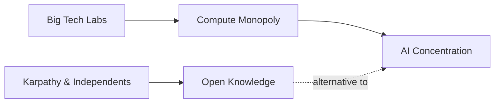

# Karpathy y el pelícano: la falsa promesa del investigador independiente en IA

Cuando Andrej Karpathy tuitea algo, el ecosistema de la inteligencia artificial se detiene a mirar. El exdirector de IA de Tesla, cofundador de OpenAI y actual fundador de Eureka Labs publicó recientemente un proyecto bautizado informalmente como "Karpathy's Pelican". Es un recordatorio perfecto de una de las narrativas más seductoras —y más engañosas— de la industria tecnológica contemporánea: la del héroe solitario que desafía a las grandes corporaciones desde su garaje.

Pero, ¿qué hay realmente detrás de ese pelícano?

## El mito del investigador indie

La figura de Karpathy encarna un ideal muy americano: el científico brillante que puede trabajar al margen de las grandes instituciones. Su canal de YouTube, sus repositorios en GitHub y su contenido educativo gratuito han formado a una generación entera de ingenieros de machine learning. Y, sin embargo, Karpathy es, en muchos sentidos, una excepción que confirma la regla.

Para entrenar cualquier modelo mínimamente serio, incluso uno "pequeño" como el que parece insinuar este proyecto, hace falta:

- Acceso a GPUs de alto rendimiento, mayoritariamente concentradas en NVIDIA.
- Servicios de nube operados por AWS, Google Cloud o Microsoft Azure.
- Datasets que, en muchos casos, provienen del scraping masivo que solo las grandes plataformas pueden sostener.
- Talento especializado que los propios FAANG y laboratorios como OpenAI, Anthropic o DeepMind reclutan agresivamente.

La "independencia" de un investigador en inteligencia artificial, en 2025, es siempre una independencia relativa. Se trata, en el mejor de los casos, de una autonomía intelectual que sigue dependiendo financieramente de la infraestructura de los mismos actores que dice cuestionar.

## La concentración del capital y el cómputo

Este es el punto que rara vez se aborda en las conversaciones entusiastas sobre los *indie hackers* de la IA. La industria está atravesada por tres ejes de concentración que se refuerzan mutuamente:

1. **Capital**: las rondas de financiación de xAI, Anthropic, Mistral u OpenAI miden ya en miles de millones. Stargate, la *joint venture* de OpenAI con SoftBank, Oracle y MGX, promete inversiones cercanas a los 500.000 millones de dólares. Pocos capitales privados están en disposición real de competir.

2. **Cómputo**: NVIDIA controla aproximadamente el 80% del mercado de GPUs avanzadas y su margen bruto operativo supera el 70%. Sin acceso a sus chips —o a los de AMD, en el mejor de los casos— no hay experimento que valga.

3. **Datos**: Meta, Google, Microsoft y X (antes Twitter) acumulan corpus textuales y multimodales prácticamente inaccesibles para actores independientes. Las demandas por derechos de autor (New York Times vs. OpenAI, Getty vs. Stability AI) son solo el síntoma más visible de esta asimetría estructural.

Cuando Karpathy publica un proyecto como este, no está compitiendo con OpenAI o Anthropic: está usando su reputación personal para complementar el ecosistema que esas empresas dominan. Es influencia, no disputa de poder.

## La larga sombra de los precedentes históricos

Esta no es la primera vez que la industria tecnológica celebra la figura del *outsider*. En los años setenta y ochenta, el movimiento del software libre —con Richard Stallman a la cabeza— prometió una alternativa al código propietario de IBM, Microsoft y Apple. GPL, Linux, Apache: toda una infraestructura de conocimiento abierto.

La pregunta incómoda es: ¿seguirá la inteligencia artificial el mismo patrón? Ya vemos señales preocupantes. Meta ha liberado Llama como contrapeso estratégico, no como gesto desinteresado. Mistral se presenta como el "campeón europeo" pero acaba de cerrar rondas con capital estadounidense. Los modelos abiertos de DeepSeek sacudieron los mercados en enero de 2025, pero detrás de ese laboratorio está, otra vez, la sombra del Estado chino y de fondos cuantitativos con intereses geopolíticos claros.

## El contenido educativo como nuevo extractivismo

Es, salvando las distancias, un patrón similar al que la academia ha mantenido históricamente con la industria farmacéutica: investigación básica financiada con fondos públicos, beneficios privatizados por las grandes corporaciones. Karpathy no es el problema; es el síntoma de un sistema que convierte el conocimiento abierto en materia prima para el capital concentrado.

## ¿Hay salida?

Mientras tanto, cada vez que un investigador independiente publica un proyecto atractivo conviene preguntarse: ¿quién financia las GPUs que lo hacen posible? ¿Quién entrenó los modelos base que invoca? ¿A qué empresa acaba nutriendo, directa o indirectamente, su trabajo?

## Conclusión: el pelícano en la pecera

La tecnología, como el pelícano, no es libre por naturaleza. Lo es solo en la medida en que decidamos —colectivamente, políticamente, institucionalmente— que lo sea.