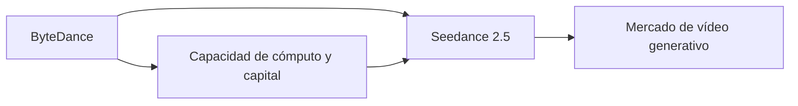

# Seedance 2.5: Cómo la IA de vídeo de ByteDance señala una nueva fase en las guerras del vídeo generativo

Cuando ByteDance publicó discretamente los detalles técnicos de **Seedance 2.5** en su blog de investigación Seed, el anuncio apenas causó revuelo fuera de los círculos especializados en IA. Ese silencio es engañoso. Seedance 2.5 no es una curiosidad de un laboratorio de investigación: es un artefacto estratégico de la consolidación que está ocurriendo ahora mismo en el vídeo generativo, y nos dice mucho sobre quién será el propietario de la siguiente capa de la pila creativa.

## Lo que Seedance 2.5 realmente hace

Sobre el papel, esto sitúa a Seedance 2.5 en competencia directa con **Sora de OpenAI**, **Veo de Google DeepMind**, **Gen-3/4 de Runway**, **Kling de Kuaishou** y **Pika Labs**. En términos de capital, sin embargo, solo dos o tres de estos nombres importan realmente.

## La economía del vídeo generativo está brutalmente concentrada

- Decenas de miles de GPUs de alta gama (principalmente NVIDIA H100 o los chips Blackwell más nuevos).
- Petabytes de datos de vídeo con licencia o extraídos, a menudo reunidos mediante acuerdos opacos con conglomerados de medios.
- Cientos de investigadores con paquetes de compensación de siete cifras.
- Infraestructura en la nube capaz de servir millones de solicitudes de inferencia con latencia inferior al segundo.

Este es un juego de capital, y el listón está subiendo. Una estimación de 2024 de SemiAnalysis cifró el coste de entrenar un modelo de vídeo de última generación en más de **100 millones de dólares**, sin incluir la adquisición de datos. Solo las empresas con el balance de un hyperscaler —o un campeón tecnológico chino respaldado por un estado— pueden jugar.

## El eje China-EE.UU.: una silenciosa carrera armamentística por los modelos de vídeo

El resultado es un mercado bifurcado: los modelos occidentales (Sora, Veo, Runway) dominan en el discurso en lengua inglesa y en los contratos empresariales occidentales, mientras que los modelos chinos (Kling, Vidu, Seedance) están optimizando para los mercados asiáticos, menores costes de inferencia y entornos regulatorios que —por ahora— son más permisivos con el entrenamiento sobre material con derechos de autor.

## Lo que los incumbentes no quieren que notes

Los principales estudios de Hollywood, las empresas publicitarias (WPP, Publicis, Omnicom) y los gigantes del material de archivo (Shutterstock, Getty) están observando el vídeo generativo con una mezcla de fascinación y pavor. La razón es simple: si un modelo como Seedance 2.5 puede producir un vídeo de 30 segundos seguro para una marca a partir de un párrafo de texto, toda la industria global de producción de vídeo, valorada en más de 300 mil millones de dólares, queda sujeta a una repreciación estructural.

La respuesta defensiva ha sido doble:

1. **Litigios y licencias.** Getty Images demandó a Stability AI; el New York Times demandó a OpenAI. Los estudios están negociando acuerdos de datos de entrenamiento "basados en el consentimiento", con la esperanza de cerrar el perímetro legal antes de que modelos como Seedance 2.5 se vuelvan indispensables.
2. **Integración vertical.** Adobe ha estado integrando Firefly en su suite creativa. Autodesk está haciendo lo mismo con sus pipelines 3D. La apuesta es que los creadores pagarán una prima por una IA "indemnizada" integrada en herramientas que ya utilizan.

Estos son movimientos inteligentes por parte de los incumbentes, pero no cambian la física subyacente: el coste marginal de generar vídeo está colapsando hacia cero, y el valor está migrando desde la producción hacia **la distribución, la curación y la confianza de marca**.

## Un paralelismo histórico: las guerras de la nube una vez más

Si este patrón te resulta familiar, debería. La misma dinámica se desarrolló entre 2010 y 2020 en la computación en la nube. AWS, Azure y Google Cloud utilizaron la escala y la intensidad de capital para aplastar a cualquier competidor independiente creíble. Los supervivientes —DigitalOcean, Linode, un puñado de proveedores regionales— sobreviven en nichos, no compitiendo en la frontera.

El vídeo generativo sigue la misma trayectoria, solo que comprimida en unos pocos años en lugar de una década. Para 2027, es plausible que **tres o cuatro empresas controlen más del 80% de la inferencia de vídeo generativo de calidad de producción** a nivel global. Seedance 2.5 es la apuesta de ByteDance para asegurarse de ser una de ellas.

## La pregunta incómoda

La prensa tecnológica tiende a enmarcar estos lanzamientos como "herramientas nuevas y emocionantes para los creadores". Ese encuadre no es incorrecto, pero está incompleto. Cada "herramienta" en esta categoría es también un **instrumento de poder**: determina quién puede producir vídeo a escala, qué estética se convierte en la predeterminada, qué valores quedan incrustados en los datos de entrenamiento y cuyo trabajo se vuelve redundante.

La próxima vez que un modelo de vídeo generativo aterrice con poca fanfarria en un blog corporativo, léelo menos como un lanzamiento de producto y más como un despacho desde el frente de la consolidación industrial más trascendental de la década.

---

