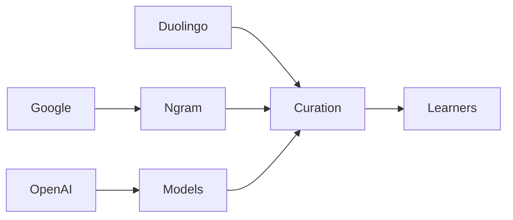

# El algoritmo que decide qué inglés aprendes

Durante más de un siglo, el libro de texto reinó en las aulas de inglés. Editores de **Oxford University Press**, **Cambridge University Press** y **Pearson** decidían qué palabras serían consideradas "esenciales" para los estudiantes extranjeros, destilando una lengua vasta en listas seleccionadas de 1.000, 2.000 o 3.500 vocablos. Esas listas moldearon lo que millones de estudiantes estudiaban en aulas de São Paulo, Seúl y Berlín.

## Del Oxford 3000 al algoritmo

Pero la frecuencia por sí sola no equivale a utilidad. Detrás de cada lista de palabras hay un conjunto de decisiones sobre *qué* textos muestrear. Elige artículos de periódicos y "tribunal" y "accionista" subirán en prioridad. Elige hilos de Reddit y "lol", "tbh" y "vibe" treparán en el ranking. Elige subtítulos de originales de Netflix y obtendrás un inglés completamente diferente.

Aquí es donde la industria tecnológica entra en la historia, no como proveedor pasivo sino como **proveedor de infraestructura con un motivo de lucro**.

## La economía de los corpus

Hoy en día, los corpus del inglés más influyentes son producidos por un pequeño grupo de actores bien capitalizados. El *Google Books Ngram Viewer* de **Google**, lanzado en 2010, transformó la lingüística histórica al darle a cualquier persona con un navegador acceso a un archivo de 500.000 millones de palabras. **COCA** (el *Corpus of Contemporary American English*) e **iWeb**, desarrollados por el profesor Mark Davies de la Brigham Young University, se sitúan junto a él como los estándares de facto para la investigación de frecuencia de vocabulario.

Estas herramientas son nominalmente gratuitas, pero los datos sobre los que se sustentan son abrumadoramente en inglés, provienen de la web y están moldeados por los hábitos editoriales de un puñado de conglomerados mediáticos. **News Corp**, **Bloomberg** y un puñado de editoriales académicas alimentan los corpus académicos a través de archivos digitalizados. El resultado es un inglés calibrado al habla de la clase profesional angloamericana — y al residuo digital de plataformas que ya dominan la atención global.

Luego está **Duolingo**, el unicornio del aprendizaje de idiomas con sede en Pittsburgh, ahora valorado por encima de los 7.000 millones de dólares tras su salida a bolsa de 2021. El modelo de vocabulario de Duolingo se construye sobre datos internos derivados de cientos de millones de interacciones de estudiantes. Las palabras que prioriza no son las que elegiría un lexicógrafo, sino las que sus usuarios tienen más probabilidades de encontrar en las aplicaciones, el contenido y, en última instancia, el entorno cultural que los rodea. **Duolingo no solo enseña inglés; selecciona un inglés que se adapta a su producto.**

## La IA como nueva editora

La llegada de los grandes modelos de lenguaje ha acelerado este cambio. **OpenAI**, **Anthropic** y **Google DeepMind** han entrenado modelos con billones de tokens de texto web en inglés. Sus suposiciones subyacentes de frecuencia de palabras ahora fluyen hacia correctores gramaticales, herramientas de traducción y agentes conversacionales que millones de estudiantes utilizan como tutores no oficiales.

Cuando un estudiante en Bogotá le pide a ChatGPT que "explique esta palabra en inglés sencillo", la respuesta está moldeada por datos de entrenamiento dominados por fuentes centradas en EE. UU. Cuando **Grammarly** (empresa de capital privado, valorada por última vez cerca de los 13.000 millones de dólares) subraya ciertas colocaciones como "más naturales", refuerza un registro particular de inglés como estándar global.

Esta es la **centralización** que rara vez se nombra en el discurso sobre tecnología educativa: **unas pocas empresas estadounidenses ahora actúan como editores implícitos de un idioma global.** Las consecuencias no son solo lingüísticas. Son económicas.

## El mercado de lo "esencial"

El análisis de The Pudding, que compara listas de palabras de décadas de antigüedad con resultados algorítmicos contemporáneos, muestra **convergencia entre productos comerciales**. Diferentes plataformas, basándose en fuentes de datos superpuestas y enfoques similares de aprendizaje automático, enseñan cada vez más el mismo vocabulario. La elección a nivel del estudiante se reduce aun cuando la oferta de productos se expande, un patrón clásico de **comoditización disfrazada de personalización**.

## Continuidad histórica

El artículo de The Pudding es, en este sentido, una contribución discreta pero contundente a un debate sobre **infraestructura digital y soberanía cultural**. Cuando los datos provienen de unas pocas empresas tecnológicas estadounidenses, la enseñanza del "inglés esencial" es también la enseñanza de una visión comercial estadounidense: términos como "startup", "freelance", "DM" y "subscription" están sobrerrepresentados en relación con su frecuencia cotidiana hablada porque aparecen desproporcionadamente en los corpus digitales que impulsan la pedagogía moderna.

## ¿Quién define el inglés?

La implicación más provocadora del artículo es metodológica: **la frecuencia es una decisión política, no una medición neutral.** Los corpus utilizados para calcularla están moldeados por las economías editoriales, las políticas de plataforma y las prácticas de moderación de contenido de un pequeño número de actores poderosos. Una lista de palabras que emerge de un raspado web de mil millones de tokens es un documento político disfrazado de estadístico.

Para los estudiantes, la conclusión práctica vale la pena exponerla con claridad. El "inglés esencial" que estudias está moldeado por los corpus de **Google**, los datos de usuario de **Duolingo** y los conjuntos de entrenamiento de **OpenAI**, no por un panel internacional de lingüistas. El inglés que encontrarás con más frecuencia es el inglés que los algoritmos han decidido que es más común.

La próxima vez que alguien pregunte qué inglés enseñar al mundo, la pregunta más interesante puede ser: **¿el inglés de quién, construido sobre los datos de quién, optimizado para el modelo de negocio de quién?**

