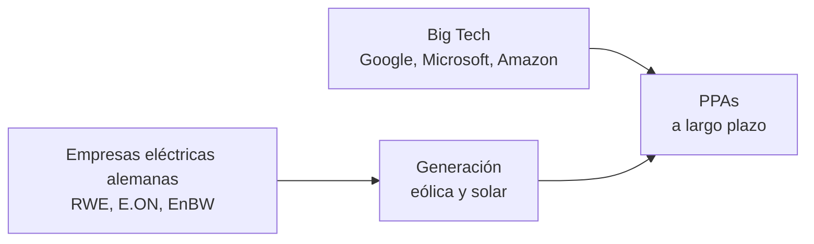

La próxima vez que alguien celebre un récord de renovables, conviene mirar el flujo de capitales que hay detrás. La energía más limpia del mundo no cambia el sistema por sí sola: lo reorganiza, y quienes controlan el capital definen la dirección del cambio.

---

## Mapa de actores

