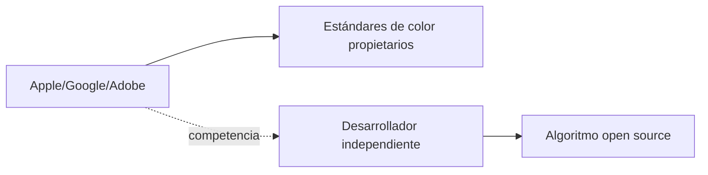

## El color no es neutral: una cuestión de poder algorítmico

En una industria obsesionada con la personalización, un detalle aparentemente menor como el tono de piel en un emoji, una cámara o un avatar revela estructuras de poder mucho más profundas. El proyecto "Inclusive Color Space" —publicado en Hacker News por el desarrollador Toney Alexander— propone un algoritmo y un espacio de color abiertos para representar la diversidad humana sin depender de los estándares impuestos por las grandes tecnológicas. La iniciativa es modesta en su código, pero ambiciosa en sus implicaciones.

Porque cuando hablamos de "color de piel" en tecnología, no hablamos solo de física óptica. Hablamos de quién decide qué tonos existen, qué nombres reciben y, sobre todo, qué comunidades son visibles en los productos digitales que usamos a diario.

## El monopolio silencioso del color

Pocas personas piensan en Adobe cuando ajustan un balance de blancos, pero la empresa detrás de Photoshop y Lightroom lleva décadas definiendo cómo el software interpreta el color humano. Su sistema Camera Raw, instalado en millones de cámaras profesionales, determina qué rostros "funcionan" automáticamente y cuáles requieren corrección manual. Adobe cobra entre 23 y 80 dólares mensuales por este privilegio, consolidando un ecosistema donde la representación precisa es un servicio premium.

Apple, por su parte, gestiona el estándar de emojis desde Unicode, pero también controla la cámara TrueDepth del iPhone, cuyo sistema de reconocimiento facial fue duramente cuestionado en 2020 por no funcionar correctamente con ciertos tonos de piel. Google siguió una ruta similar con Material You, su sistema de diseño que hasta 2021 ofrecía únicamente cinco tonos de piel genéricos para sus emojis. Microsoft arrastró durante años la misma limitación en Windows y Office.

En el centro de esta problemática está una decisión de diseño: ¿el color de piel es un parámetro técnico o una variable cultural? Para Silicon Valley, durante mucho tiempo, fue lo primero. El resultado fue una representación digital que reflejaba los sesgos demográficos de quienes escribían el código: mayoritariamente hombres blancos en California.

## ¿Por qué esto importa más allá de la estética?

Proyectos como "Inclusive Color Space" no van a resolver esta concentración por sí solos. Pero visibilizan un problema que las grandes tecnológicas prefieren tratar como un detalle de marketing antes que como una cuestión de infraestructura. Y en una industria donde la narrativa del "move fast and fix things later" ha justificado décadas de externalidades, recordar que lo básico —representar fielmente a los usuarios— sigue siendo un trabajo en proceso, tiene un valor que trasciende lo técnico.

## Conclusión: la inclusión como código, no como comunicado de prensa

La próxima vez que veas un comunicado corporativo celebrando "nuevos tonos de piel más inclusivos" en una cámara o un sistema operativo, recuerda que hubo un momento en que esa decisión no era prioritaria. No fue la voluntad de las empresas la que la hizo urgente: fue la presión sostenida de comunidades que dejaron claro que la representación no es un complemento estético, sino una condición mínima de funcionamiento. El proyecto de Alexander es una pieza más en esa presión. Pequeño en código, grande en intención. Y recordatorio constante de que, en tecnología, lo que no se mide ni se nombra, simplemente no existe.

