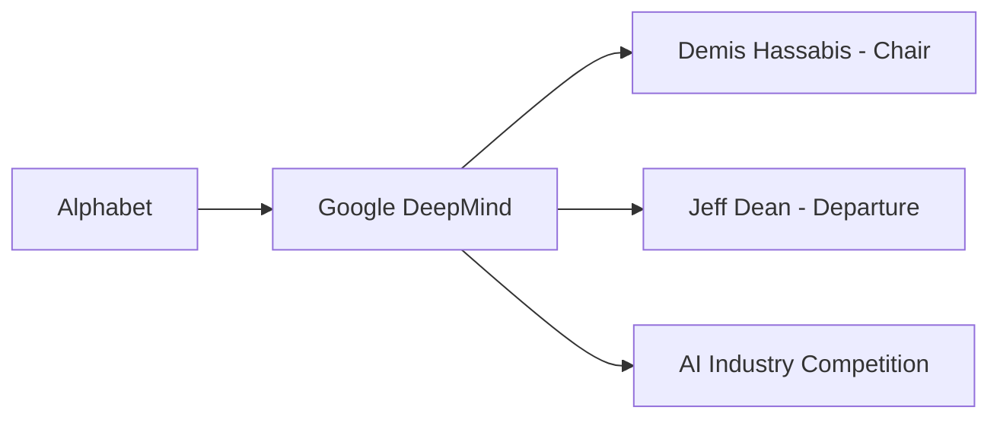

# La nueva arquitectura de poder en Google DeepMind: cuando los fundadores se convierten en símbolos

## Paralelismos históricos

El patrón se repite porque la estructura del poder en tecnología es siempre la misma: cuando una nueva arquitectura tecnológica emerge, las empresas incumbentes deben elegir entre canibalizar sus productos existentes o arriesgarse a ser canibalizadas. Google, dueña de Search —el negocio que más beneficios genera en la historia del capitalismo digital—, tiene más que perder que nadie. Cada punto de cuota de mercado que ChatGPT, Claude o Gemini pierden en búsquedas es, literalmente, miles de millones en ingresos publicitarios.

## Lo que esta reorganización no dice

Las reestructuraciones en Silicon Valley suelen tener un componente ritual: el momento en que una empresa se cuenta a sí misma una historia sobre su futuro. Google cuenta ahora la historia de una empresa donde el científico carismático se eleva a la presidencia, mientras el ingeniero que sostenía la infraestructura técnica se aleja. Es una historia sobre marcas, no sobre sistemas. Sobre caras visibles, no sobre decisiones que importan.

## ¿Quién decide realmente?

La pregunta de fondo no es si Hassabis será un buen presidente —probablemente lo será— ni dónde irá Dean —probablemente a fundar otra cosa—. La pregunta es quién decide, en 2025, qué hace la inteligencia artificial más poderosa del mundo con sus capacidades. Si esa decisión sigue concentrada en tres o cuatro empresas con sede en Mountain View, Redmond, Menlo Park y San Francisco, con consejos de administración que responden a accionistas y no a ciudadanos, entonces todas las reorganizaciones internas son, en el fondo, variaciones cosméticas sobre el mismo tema: cómo gestionar un poder cada vez más concentrado con las mismas herramientas corporativas de siempre.

