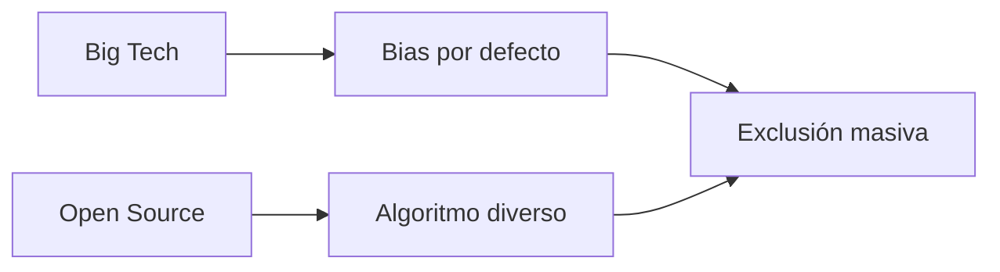

## El problema que "no existe" para las Big Tech

Desde hace más de una década, la industria tecnológica ha sido incapaz de resolver un problema básico: representar correctamente la diversidad de tonos de piel humana. No es un problema técnico complejo. Es un problema de voluntad corporativa, y por extensión, de cómo se distribuye el poder en Silicon Valley.

En 2015, Google Photos etiquetó automáticamente a personas afroamericanas como "gorilas". El incidente fue tratado como un fallo puntual, una anécdota desafortunada. Pero era el síntoma de algo mucho más profundo: la ausencia sistemática de datos diversos en los datasets de entrenamiento. Google tenía miles de ingenieros y miles de millones de dólares en infraestructura. Ninguna cantidad de talento parecía suficiente para resolver lo que un dataset equilibrado desde el inicio habría evitado.

## La economía política del tono de piel

¿Por qué ocurre esto? La respuesta no es técnica, sino estructural. Silicon Valley opera bajo una lógica extractiva donde los productos se diseñan primero para los mercados más rentables. Históricamente, esos mercados son Estados Unidos, Europa Occidental y Asia oriental. Las personas con tonos de piel oscuros representan, según los modelos de negocio publicitarios de estas plataformas, una proporción menor de los ingresos esperados por usuario, especialmente en regiones donde el poder adquisitivo promedio es más bajo.

Esta dinámica crea lo que podríamos denominar "defecto pale" (pale default): sesgos codificados que se asumen como norma universal porque coinciden con la experiencia de quienes diseñan los productos. Los filtros de belleza aclaran la piel porque ese es el estándar estético dominante en los equipos de diseño, compuestos mayoritariamente por personas blancas y asiáticas en países occidentales. Los algoritmos faciales se entrenan con datos que sobrerrepresentan tonos claros porque las imágenes de referencia provienen de culturas donde esos tonos predominan en los medios y la fotografía publicitaria.

## El sesgo como feature, no como bug

La industria tecnológica ha normalizado el sesgo como un efecto secundario inevitable del progreso. "Lo arreglaremos en la próxima versión", "es un caso límite", "necesitamos más datos de entrenamiento". Estas son las respuestas estándar cuando se descubren fallos que afectan desproporcionadamente a grupos subrepresentados. La lingüística del disculpa corporativa, perfeccionada por equipos de comunicación como los de Meta y Google, convierte problemas sistémicos en anécdotas aisladas.

Pero los "casos límite" son, en realidad, la mayoría global. Más del 80% de la población mundial tiene tonos de piel que no encajan en los estándares por defecto de Silicon Valley. Cuando un algoritmo falla para esa mayoría, no estamos ante un error técnico menor; estamos ante un fallo de diseño deliberado por omisión. La omisión es la forma más efectiva de mantener el status quo: no se necesita conspiración, basta con no cuestionar los supuestos iniciales.

El proyecto de Alexander es valioso no solo por su solución técnica, sino porque demuestra que existe un camino alternativo. Un espacio de color diseñado con inclusión desde el inicio, no como corrección posterior. Una especificación simple y documentada, no un paper académico inaccesible. Una licencia abierta, no un producto propietario que añade otra capa de extracción y dependencia.

## Reflexión final

La próxima vez que veas un comunicado de prensa de una Big Tech presumiendo de sus iniciativas de diversidad e inclusión, recuerda este caso. Recuerda que un programador en GitHub construyó en su tiempo libre lo que empresas con presupuestos de I+D superiores al PIB de muchos países no han priorizado en más de una década.

