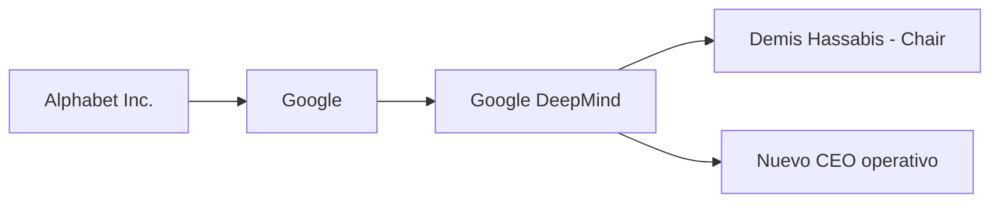

# Hassabis asciende a Chair y Jeff Dean se va: la nueva arquitectura de poder en Google DeepMind

Cuando Sundar Pichai publicó el pasado martes su carta titulada *"The next chapter of our AI momentum"*, pocos titulares se detuvieron en los detalles. Y sin embargo, el movimiento corporativo que describe esa misiva es una de las reconfiguraciones de poder más significativas del año en la industria tecnológica. Demis Hassabis, cofundador de DeepMind y flamante Premio Nobel de Química, deja la posición de CEO para convertirse en **Chair** de Google DeepMind. Jeff Dean, el ingeniero que durante dos décadas definió la cultura técnica de Google, anuncia su salida. No es una rotación menor: es un parteaguas.

## Lo que el ascenso de Hassabis realmente significa

En la gramática corporativa de Silicon Valley, la figura del **Chair** no es decorativa. Es la consagración de un líder como **sello de legitimidad**, una cara pública que trasciende la gestión operativa y se convierte en marca institucional. Microsoft lo hizo con Satya Nadella después del giro hacia la nube; OpenAI lo intentó —con turbulencias— con Sam Altman. Ahora Google hace lo propio con Hassabis, el único ejecutivo de Big Tech que puede presumir un Nobel junto a un historial probado en investigación frontier.

## La salida de Jeff Dean: el ocaso de una era

Si el ascenso de Hassabis es un movimiento de consolidación, la salida de Jeff Dean marca el **fin de una etapa**. Dean fue durante años el puente entre la vieja cultura de ingeniería de Google —basada en MapReduce, TensorFlow y la supremacía de la infraestructura— y la nueva urgencia marcada por la inteligencia artificial generativa. Su figura representaba la continuidad: el mismo hombre que ayudó a construir PageRank ahora intentaba mantener la relevancia de Google en un mundo que cambió de la noche a la mañana con ChatGPT.

Que Dean se vaya precisamente ahora, cuando Google parece haber encontrado su ritmo con Gemini, no es casual. Es la evidencia de que la **cultura de laboratorio de IA ha vencido a la cultura de ingeniería clásica** dentro de Alphabet. DeepMind no se subordinó a Google Research: lo absorbió. Y con la salida de Dean, el último contrapeso institucional de la vieja guardia se desvanece.

## Un patrón histórico que se repite

Esta no es la primera vez que una gran tecnológica reorganiza su estructura de poder alrededor de la inteligencia artificial, ni será la última. La historia reciente ofrece paralelismos incómodos.

Recordemos a **Bell Labs**, el mayor laboratorio de investigación industrial del siglo XX. Durante décadas fue cuna de inventos que definieron el mundo moderno: el transistor, el láser, los sistemas operativos de tiempo compartido. Su liquidación progresiva, primero con la separación de AT&T, luego con la venta de Lucent y finalmente con la fragmentación de sus activos, dispersó un talento que acabó fundando o alimentando a empresas como Juniper, Qualcomm o Ciena. La pregunta que sobrevuela el ecosistema es si Google logrará retener el valor intelectual que ha concentrado, o si veremos una diáspora equivalente.

También está el caso de **Xerox PARC**, cuya tecnología —la interfaz gráfica, el ratón, la programación orientada a objetos— terminó por enriquecer a Apple y Microsoft mientras Xerox se hundía. Y el más reciente: la espiral de **OpenAI**, donde cada salida relevante —Ilya Sutskever, Andrej Karpathy, Jan Leike— se ha convertido en noticia y, en muchos casos, en el nacimiento de un competidor.

La diferencia, en el caso de Google DeepMind, es que la compañía tiene una capacidad de retención de capital y de talento que sus predecesoras no tenían. Pero esa misma capacidad es la que hace que la **concentración de poder** sea un problema sistémico.

## La economía real detrás del movimiento

En este contexto, el ascenso de Hassabis y la salida de Dean son también **movimientos de gobernanza interna sobre cómo se asigna ese capital**. La pregunta de fondo es quién decide qué proyectos reciben presupuesto, qué líneas de investigación se priorizan y, sobre todo, qué productos llegan al mercado. Con Hassabis como Chair y un nuevo CEO operativo por nombrar, Google está construyendo una estructura de mando que le permita tomar esas decisiones con mayor velocidad y, no menos importante, con mayor aislamiento del escrutinio externo.

## ¿Y el resto del ecosistema?

Mientras tanto, la concentración de la inteligencia artificial frontier en un puñado de actores —OpenAI, Anthropic, Meta, Google y, en menor medida, xAI— se profundiza. La promesa de una IA democrática y distribuida que circuló en los primeros años de la década se ha revelado como lo que realmente era: un eslogan de marketing. El coste de entrenar un modelo frontier se ha multiplicado por órdenes de magnitud, y solo las empresas con miles de millones en capital propio o acceso a los mercados de deuda pueden siquiera intentarlo.

Hay algo revelador en que la noticia de la reorganización de Google DeepMind coincida con movimientos similares en otros gigantes: las recientes reestructuraciones en Meta Superintelligence Labs, los ajustes en Microsoft AI y la consolidación de Anthropic como actor casi independiente pese a su dependencia financiera de Amazon. El sector está entrando en una fase de **madurez oligopólica**, y los movimientos de personal no son sino el reflejo de las tensiones internas que esa madurez genera.

## Una reflexión final

El baile de sillas en Google DeepMind no es, contra lo que pueda parecer, un asunto meramente corporativo. Es un termómetro del estado real de la industria de la inteligencia artificial: una industria donde el talento se ha vuelto más escaso y más caro que el capital que lo financia, donde las decisiones de quién dirige qué laboratorio definen qué tipo de tecnología terminará integrada en nuestras vidas, y donde la frontera entre investigación científica y producto comercial se ha difuminado hasta casi desaparecer.

Cuando un Premio Nobel deja de ser CEO para convertirse en Chair, y un ingeniero legendario decide dar un paso al costado, lo que vemos no es una crisis. Es el **cierre de un ciclo** y la apertura de otro, uno en el que la inteligencia artificial deja de ser una apuesta experimental para convertirse en infraestructura permanente del poder corporativo global. La pregunta ya no es si Google puede mantenerse en la carrera —puede—, sino si el resto de la sociedad puede mantener algún tipo de influencia sobre la dirección que esa carrera tome.

Porque al final, las decisiones que se toman en las salas de juntas de Mountain View, Menlo Park y Redmond ya no afectan solo a sus accionistas. Afectan a cómo trabajamos, cómo aprendemos, cómo decidimos y, en no poca medida, a cómo pensamos.

