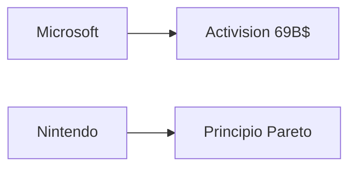

# Mario Meets Pareto: lo que Nintendo enseña sobre eficiencia en una industria inflada

En 2026, cuando la industria del videojuego global mueve más de 200.000 millones de dólares anuales, una publicación reciente del blog de Mayerowitz titulada *"Mario Meets Pareto"* vuelve a poner sobre la mesa una pregunta incómoda: ¿por qué Nintendo, con presupuestos ridículamente bajos comparados con sus competidores, sigue dominando culturalmente mientras gigantes como Electronic Arts o Activision Blizzard gastan miles de millones en juegos que la crítica destroza?

La pieza parte de una observación simple: el principio de Pareto —aquella regla empírica que dice que el 80% de los resultados provienen del 20% de las causas— se manifiesta de forma extraordinaria en el diseño de Super Mario Bros. y, por extensión, en toda la filosofía de Nintendo. No es solo un hallazgo curioso de game design. Es una declaración de principios sobre cómo se construye valor en una industria que ha confundido escala con calidad.

## El principio 80/20 aplicado al diseño de videojuegos

Cuando trasladamos esta lógica a la economía del sector, el contraste se vuelve incómodo. Nintendo lanzó títulos como *Tears of the Kingdom* con presupuestos estimados cercanos a los 100 millones de dólares. Una cifra alta, sí, pero que palidece frente a los 200-300 millones que Electronic Arts destina a cada entrega de *EA Sports FC*, o los más de 200 millones de *Call of Duty: Modern Warfare III* de Activision. Y lo más revelador: los juegos de Nintendo consistentemente obtienen mejores críticas, mayor retención de jugadores y, a menudo, mayores márgenes de beneficio por unidad vendida.

## La enfermedad del AAA bloat

Electronic Arts, propiedad desde 2022 de un consorcio que incluye al fondo soberano de Arabia Saudí (PIF) y al fondo de inversión Silver Lake, ha convertido la franquicia *FIFA* en una máquina de monetización anual. Pero cuando intentó innovar con *Anthem* o *Battlefield 2042*, los fracasos fueron sonados. El principio de Pareto, aplicado con disciplina, habría evitado esos descalabros: identificar el 20% de mecánicas que realmente disfruta el jugador y protegerlas con uñas y dientes.

## Las asimetrías de poder en el sector

Dicho esto, Nintendo sigue siendo una de las pocas grandes del sector que no se ha dejado absorber por la lógica de la financiarización. Sony Interactive Entertainment, Microsoft Gaming y los fondos detrás de EA son, en esencia, vehículos para la extracción de valor a corto plazo. Nintendo sigue siendo, ante todo, una empresa de diseño.

## Lo que los estudios indie pueden aprender

La lección que *"Mario Meets Pareto"* deja en el aire es especialmente relevante para los estudios independientes. En un mercado saturado de juegos con presupuestos inflados, ciclos de desarrollo eternos y mecánicas redundantes, la disciplina parsimoniosa de Nintendo ofrece una alternativa: hacer menos, mejor, y dejar que el jugador descubra la profundidad.

Juegos como *Hollow Knight*, *Celeste* o *Balatro* —este último convertido en fenómeno viral en 2024— aplican exactamente esta filosofía. Equipos pequeños, mecánicas claras y un foco obsesivo en pulir el 20% que realmente importa. El resultado: márgenes de beneficio extraordinarios en relación con la inversión.

## Conclusión: una pregunta que la industria no quiere hacerse

La próxima vez que un ejecutivo de un estudio AAA justifique un presupuesto de 300 millones de dólares en un juego que recibirá un 65 en Metacritic, vale la pena recordar la lección de Mario. El principio de Pareto no es solo una curiosidad matemática. Es una descripción incómoda de cómo se crea valor real en industrias creativas.

En un sector donde el capital se concentra cada vez más en manos de fondos de inversión, soberanos y gigantes tecnológicos —PIF, Silver Lake, Microsoft, Sony, Tencent—, la pregunta incómoda es si queda espacio para la disciplina de diseño que Nintendo encarna. La historia sugiere que sí, pero solo para quienes estén dispuestos a resistir la presión de hacer más, más grande, más caro.

