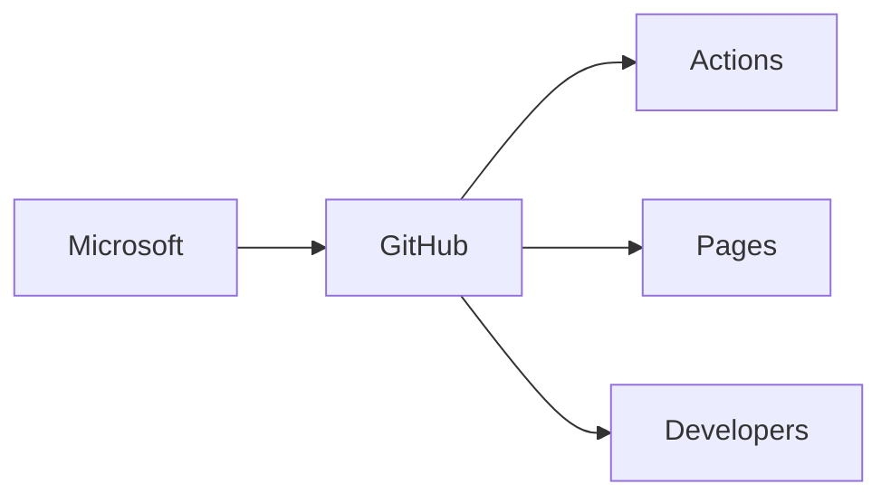

# Cuando GitHub se cae: la dependencia oculta del desarrollo de software global en Microsoft

El pasado 26 de octubre, GitHub —el mayor repositorio de código del planeta— reportó disponibilidad degradada en dos de sus servicios más críticos: **GitHub Actions** (la plataforma de CI/CD que automatiza el despliegue de software) y **GitHub Pages** (el servicio de hosting estático integrado). Para muchos usuarios fue una molestia menor. Para la industria tecnológica, fue un recordatorio incómodo: una sola empresa, dueña de una sola plataforma, sostiene silenciosamente gran parte del engranaje sobre el que se construye el software moderno.

## La arquitectura oculta de la dependencia

Con más de **100 millones de usuarios** y más de **420 millones de repositorios**, GitHub opera como infraestructura crítica para startups, Fortune 500, gobiernos y proyectos open source por igual. Cuando sus Actions fallan, las pipelines de despliegue se rompen. Cuando Pages se cae, sitios completos desaparecen.

Lo notable no es que un servicio falle —toda infraestructura falla—, sino **el grado de delegación que hemos aceptado colectivamente**. Empresas enteras ejecutan sus flujos críticos de producción sobre infraestructura que no controlan, que no auditan en profundidad, y cuya continuidad depende de decisiones tomadas por un gigante cotizado en Nasdaq que responde ante sus accionistas, no ante la comunidad.

## Microsoft y la larga tradición de capturar plataformas

El historial es elocuente:

- **1997**: compra de WebTV para entrar en el mercado de consumo.
- **2011**: adquisición de Skype por 8.500 millones, plataforma que meses antes había prometido neutralidad.
- **2014**: compra de Mojang (Minecraft) por 2.500 millones, para asegurar presencia cultural entre las nuevas generaciones.
- **2016**: compra de LinkedIn por 26.200 millones, el mayor movimiento de captura de datos profesionales de la historia.
- **2018**: GitHub, por 7.500 millones.
- **2023**: cierre definitivo de Activision Blizzard por **69.000 millones de dólares**, la mayor adquisición del sector tecnológico hasta la fecha.

Cada compra sigue un patrón reconocible: identificar un punto de paso obligado en el ecosistema, adquirirlo, integrarlo suavemente en la suite corporativa, y extraer valor a través del cross-selling de Azure, Office 365 y los servicios de IA de OpenAI.

## La ilusión de la redundancia

Ante cada caída de GitHub, surge el consuelo habitual: *"existen alternativas"*. Y es cierto: GitLab, Bitbucket, Codeberg, SourceHut. El problema es que la mera existencia de alternativas no resuelve el problema de fondo.

Primero, porque las alternativas están atrapadas en la **misma infraestructura cloud** —mayoritariamente AWS, Azure o Google Cloud—. Un fallo en una región de cualquier hyperscaler puede tumbarlas a todas simultáneamente.

Segundo, porque la **inercia organizativa** es brutal. Migrar un repositorio corporativo con años de historial, pull requests, integraciones, CI runners, secrets y políticas de acceso es un proyecto que pocas empresas se permiten emprender. El coste del cambio suele ser mayor que el coste de aceptar la dependencia.

Tercero, porque la red de efectos del ecosistema —las GitHub Actions de terceros, los paquetes en GitHub Container Registry, las Pages como CDN implícita— crea un **vendor lock-in** por capas, no por contrato.

## Las consecuencias económicas reales

Para una startup, una hora de caída de Actions puede significar un retraso en una entrega a cliente, una demo fallida, un SLA incumplido. Para una empresa mediana con cientos de pipelines, son horas de productividad quemadas en tareas reactivas que nadie presupuestó.

Pero el coste verdadero es **estructural**: hemos externalizado una capacidad crítica. Igual que la financiarización externaliza la gestión de tesorería, la nube y el SaaS han externalizado la operación de infraestructura. Cuando esa externalización se concentra en tres o cuatro actores, el riesgo sistémico se multiplica.

Microsoft, además, no es solo un proveedor: es **competidor directo** de cualquier empresa de software que venda herramientas de desarrollo. ¿Cuánta confianza puede depositar en GitHub un competidor directo de Azure DevOps o de las herramientas de IA de Microsoft? La pregunta se responde sola.

## Lecciones que nunca aprendemos

En 2017, cuando AWS S3 cayó durante cuatro horas y tumbó medio internet, escribimos artículos reflexivos sobre la fragilidad de la nube. En 2021, cuando Facebook estuvo seis horas fuera de servicio por un cambio de configuración BGP, volvió a escribirse. En 2023, con el incidente de Cloudflare, lo mismo. Y aquí estamos, en 2025, con otra caída que vuelve a poner en evidencia lo mismo.

El patrón es claro: **la industria tecnológica es incapaz de aprender lecciones de resiliencia porque su modelo de negocio las contradice**. La concentración es más rentable que la distribución. La integración vertical paga más dividendos que la interoperabilidad. El lock-in es más predecible que la libertad de movimiento.

Quizás la pregunta no sea cuándo volverá a caer GitHub, sino cuántas caídas más necesitamos para empezar a construir, de verdad, alternativas que no sean solo cosméticas. Porque la soberanía tecnológica no se decreta: se ejerce. Y hoy, para millones de desarrolladores en el mundo, esa soberanía está en manos de un solo accionista mayoritario en Redmond, Washington.

