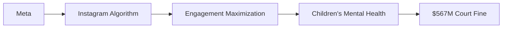

# Meta, los 567 millones y el negocio de capturar menores

## El tamaño real de la multa

Y aquí está el punto clave: el algoritmo de recomendación de Instagram, los Reels infinitos, los sistemas de notificaciones y los mecanismos de "me gusta" no son accidentes de diseño. Son la materialización de un modelo de negocio que premia el engagement por encima del bienestar. Cuando ese engagement se extrae de menores de edad, el costo no es solo humano: es sistémico. Pero el sistema sigue recompensando a quien lo ejecuta.

## Big Tech y la asimetría de poder

La diferencia con Rockefeller o Carnegie es que estas plataformas no solo dominan un sector: son la infraestructura sobre la que se construyen otros negocios. Cuando Meta cambia su algoritmo, miles de empresas de medios, creadores de contenido y anunciantes reajustan sus estrategias. Cuando Instagram lanza una nueva función, aplicaciones enteras —desde Snapchat hasta TikTok de ByteDance— modifican su hoja de ruta. Esa es la esencia del poder estructural: no necesitas controlar formalmente a tus competidores; ellos se autorregulan en función de tus movimientos.

## El precedente de la tabacalera

¿Estamos ante un patrón similar? Los documentos internos de Meta filtrados por Haugen, las declaraciones de exempleados como Arturo Béjar (quien dirigió equipos de integridad de la plataforma), y los múltiples informes de la Surgeon General de EE.UU. apuntan a un conocimiento previo del daño. La pregunta no es si Meta sabía, sino si el marco regulatorio actual permite que ese conocimiento se traduzca en consecuencias reales y proporcionales.

## Regulación asimétrica

Mientras la Unión Europea avanza con la Digital Services Act (DSA) y la AI Act, que imponen obligaciones de transparencia algorítmica y responsabilidad por contenido dañino, Estados Unidos sigue atrapado en una dinámica donde cada estado, cada condado, debe litigar por separado contra corporaciones con presupuestos legales superiores al PIB de muchos países.

## El algoritmo como caja negra

Un aspecto crítico que la multa no resuelve: el algoritmo. La sentencia puede obligar a pagar daños, pero no puede obligar a Meta a revelar cómo su sistema de recomendación prioriza contenido que intensifica la dismorfia corporal, la ansiedad o la depresión en adolescentes. La propiedad intelectual y la complejidad técnica se convierten en escudo corporativo. Pedir transparencia algorítmica a una empresa cuyo valor depende de la opacidad de su tecnología es pedirle que se suicide comercialmente.

## ¿Hacia dónde vamos?

La multa de 567 millones es un síntoma, no una cura. Es la expresión de un sistema donde el costo de hacer daño se internaliza como gasto operativo, no como restricción al modelo de negocio. Mientras los ingresos publicitarios de Meta sigan creciendo trimestre a trimestre, las sanciones serán absorbidas como el costo de la gasolina para una empresa de transporte.

Hasta que eso ocurra, las multas seguirán llegando. Y Meta seguirá pagando. Y el negocio seguirá igual. La diferencia entre castigar a una empresa y transformar una industria sigue siendo, como hace un siglo, la diferencia entre tratar los síntomas o construir las condiciones estructurales que hagan que el daño deje de ser rentable.

