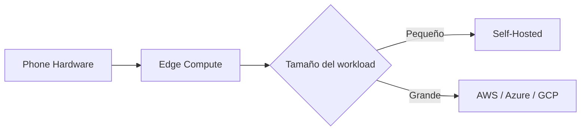

## El servidor en el bolsillo: cómo los smartphones desafían a AWS y Azure

Un desarrollador publica una entrada con un título provocador: "Mi servidor ahora es un teléfono". No es clickbait. Es una descripción literal de una tendencia que las grandes plataformas de cloud computing preferirían que no miraras con atención. Un dispositivo que cabe en la palma de tu mano, con un SoC comparable al de servidores de hace apenas una década, ejecutando servicios de producción. ¿Estamos ante una regresión tecnológica o ante el prólogo de un cambio estructural?

### La concentración del cloud: un oligopolio que factura billones

Para entender por qué este fenómeno importa, conviene recordar dónde estamos. El mercado global de infraestructura cloud está dominado por tres jugadores: **Amazon Web Services**, **Microsoft Azure** y **Google Cloud Platform**. Según las estimaciones más recientes de Synergy Research, concentran aproximadamente el 65% del gasto empresarial en cloud público. AWS, el pionero que lanzó EC2 en 2006, sigue siendo el líder con cerca del 31% de cuota, seguido por Azure (24%) y GCP (11%).

Pero aquí está el detalle incómodo: gran parte de ese gasto se financió con deuda barata y con la expectativa de capturar todo el mercado de cómputo del planeta. Es el mismo modelo de "land grab" que vimos en los ferrocarriles del siglo XIX o en las telecos de los 90. Construyes para que todos dependan de ti.

### Por qué un teléfono puede ser un servidor

La historia del autor de "My server is a phone now" no es un capricho. Es una respuesta a varias fuerzas simultáneas:

- **La democratización del silicio.** Un chip como el Apple A17 Pro o el Snapdragon 8 Gen 3 integra CPU, GPU y NPU con capacidades que habrían costado miles de dólares en hardware dedicado hace apenas cinco años. ARM, la arquitectura que los gobierna, es ahora el estándar del sector.
- **El abaratamiento del almacenamiento.** Un iPhone de gama media ofrece 128 GB por menos de 500 dólares. Los SSD NVMe empresariales cuestan más por gigabyte y ofrecen menos densidad por vatio.
- **La saturación de los modelos de facturación cloud.** Los egress fees de AWS —las tarifas que pagas por sacar datos de su infraestructura— se han convertido en una de las quejas más recurrentes del ecosistema. Empresas como Dropbox o Basecamp han migrado workloads específicamente para escapar de estos costes.

El resultado es contraintuitivo: en ciertos casos, desplegar un servicio en un teléfono dedicado con conexión a Internet y un script de mantenimiento puede ser competitivo en coste frente a una instancia EC2 t3.medium, sobre todo para cargas pequeñas o experimentales.

### Edge computing: la contrarreforma que viene

Pero hay una diferencia crucial entre el edge corporativo y el experimento del desarrollador anónimo: la propiedad del hardware. Cuando despliegas en Cloudflare, sigues alquilando capacidad dentro de una plataforma centralizada. Cuando ejecutas en tu propio teléfono, posees el ciclo de cómputo. Es la diferencia entre ser inquilino y ser propietario.

### Las lecciones históricas que se repiten

Lo que vemos ahora puede ser el inicio de otro ciclo: la computación personal regresa, pero esta vez con esteroides. Los teléfonos de 2024 tienen más potencia bruta que los servidores que alojaron las primeras versiones de Facebook. Y, a diferencia de los mainframes, no requieren contratos de mantenimiento con IBM ni cuotas de licencia con Oracle. El coste marginal de añadir un nodo es casi cero.

### ¿Se rompe el oligopolio?

Pero la pregunta relevante es otra: ¿cuántas cargas de trabajo realmente necesitan esa escala? La respuesta, cada vez más, es "menos de las que crees". Y cada workload que se ejecuta en un dispositivo propio es un workload que no factura para Jeff Bezos, Satya Nadella o Sundar Pichai.

### Conclusión: el poder está en el hardware que ya tienes

En un sector donde el capital se ha concentrado hasta extremos casi feudales, la posibilidad de que un dispositivo de consumo se convierta en infraestructura productiva es, en sí misma, una declaración política. No contra las grandes tecnológicas, sino a favor de un modelo donde el cómputo vuelva a estar en manos de quien lo usa.

