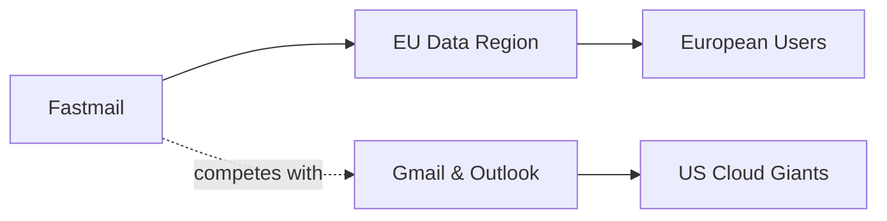

# Fastmail's EU Region Is a Small Provider's Quiet Rebellion Against the Gmail-Outlook Duopoly

Cuando Brendan Eich y Jarred Wilkenson fundaron Fastmail en 1999, el correo electrónico todavía era una conversación entre iguales: protocolos abiertos, servidores IMAP, identidades distribuidas. Veinticinco años después, ese ecosistema ha colapsado en un duopolio casi perfecto. Google y Microsoft procesan la mayoría de los correos personales y profesionales del planeta. Ahora, desde una oficina modesta en Filadelfia, una empresa que apenas registra como porcentaje del mercado global lanza algo que parece modesto pero tiene implicaciones profundas: una **región de datos completa en la Unión Europea**.

## Lo que realmente anunció Fastmail

Pero detrás del lenguaje corporativo hay una pregunta más incómoda: **¿por qué una empresa estadounidense hace esto cuando Google y Microsoft no lo hacen de forma equivalente?**

Google, por ejemplo, opera centros de datos en Europa pero deja la puerta abierta a que el personal técnico acceda a los datos desde fuera del continente, bajo el argumento contractual de que el procesamiento sigue siendo "europeo". Microsoft hizo algo similar con su "EU Data Boundary" en 2024, pero la promesa sigue siendo parcial. Fastmail, en cambio, promete que los datos europeos nunca saldrán de jurisdicciones europeas sin consentimiento explícito. La diferencia es semántica para algunos, existencial para otros.

## La concentración que Fastmail intenta romper

Aquí está la asimetría de poder que define la industria del correo electrónico:

- Gmail existe porque los datos de correo son combustible para el negocio publicitario de Google, que facturó más de 300.000 millones de dólares en 2023.
- Outlook existe porque Microsoft necesita mantener a las empresas atadas a su ecosistema Office y Azure.
- Fastmail existe porque alguien está dispuesto a pagar 5 dólares al mes por un servicio que no lo explota.

Es un experimento de mercado que demuestra algo que la teoría económica del siglo XX daba por sentado y que el capitalismo de vigilancia ha borrado: **los consumidores están dispuestos a pagar por privacidad cuando se les da la opción y se les explica el coste oculto de las alternativas gratuitas**.

## El contexto histórico: del email abierto al email cautivo

En los años 90, el correo electrónico era un mosaico de proveedores. Cualquier universidad, empresa o ISP tenía su propio servidor. El protocolo SMTP e IMAP garantizaba interoperabilidad. No existía el "lock-in" porque los estándares abiertos lo impedían. Esta diversidad era funcional, aunque caótica.

1. **Google lanzó Gmail en 2004 con 1 GB gratuito**, una capacidad obscena para la época, financiado por publicidad contextual.
2. **Microsoft empaquetó Outlook con su suite ofimática**, aprovechando el dominio histórico de Office en empresas.
3. **Ambos invirtieron miles de millones en interfaces pulidas y aplicaciones móviles**, creando una ventaja de experiencia de usuario que los proveedores pequeños no podían igualar.

El resultado fue un proceso natural de selección que, en retrospectiva, parece más una construcción de barreras de entrada que una simple preferencia del consumidor. Cada año que pasa, migrar fuera de Gmail u Outlook se vuelve más difícil por el peso acumulado de contactos, historiales, integraciones y, sobre todo, costumbre.

## Las dinámicas de poder detrás de la regulación europea

Pero la soberanía digital europea tiene una contradicción fundamental: **se construye sobre hardware, redes y, en muchos casos, software estadounidense**. AWS, Azure y Google Cloud dominan la infraestructura cloud europea. Fastmail, al menos, opera sus propios servidores en lugar de depender de estos hiperescaladores. Es una distinción que importa.

El analista Mathieu Pelsers, del grupo de trabajo de Gaia-X, lo resumió así en una entrevista reciente: "Puedes tener los datos más protegidos del mundo y seguir siendo rehén de un proveedor que decide cuándo te los devuelve". Fastmail intenta cortar esa cuerda, aunque sigue dependiendo de centros de datos arrendados.

## ¿Gana el usuario o gana el mercado?

Hay una lectura optimista: empresas independientes como Fastmail, Proton y Tutanota están demostrando que existe un mercado viable para servicios de privacidad premium. Esto podría animar a más competidores y romper gradualmente el duopolio del correo electrónico.

Y hay una lectura menos optimista: la fragmentación geográfica de datos (regiones UE, US, APAC) podría convertirse en una nueva barrera de entrada. Si los usuarios europeos eligen proveedores con región UE y los estadounidenses eligen proveedores con región US, las pequeñas empresas podrían verse obligadas a mantener múltiples infraestructuras solo para competir, algo que solo las gigantes pueden permitirse.

En otras palabras, **la soberanía digital bien intencionada podría terminar reforzando a quienes pretendía limitar**, si no se acompaña de interoperabilidad real entre servicios.

