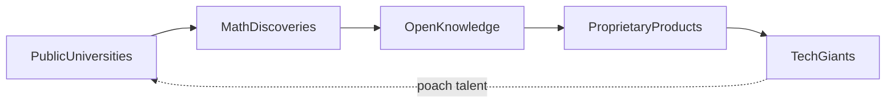

El matemático Slava Gukov anunció recientemente un resultado que cierra un capítulo abierto durante décadas: ha demostrado que existen hexágonos mágicos para órdenes arbitrariamente grandes. Más allá de la elegancia intrínseca del problema —organizar números en una celosía hexagonal donde cada fila, columna y diagonal sumen lo mismo— la noticia ofrece una lente útil para examinar algo menos visible: cómo se financia, distribuye y monetiza el conocimiento matemático fundamental en la era de las grandes tecnológicas.

## El problema, brevemente

Un hexágono mágico de orden *n* es una disposición hexagonal de números donde todas las líneas rectas suman el mismo valor. Durante años se sospechó que solo existían para órdenes 1, 3 y 4. El nuevo trabajo extiende esto a cualquier *n*. Es el tipo de resultado que rara vez aparece en titulares pero que, históricamente, ha terminado alimentando criptografía, códigos correctores de errores y, más recientemente, los fundamentos de los algoritmos de inteligencia artificial.

## Quién paga la matemática pura

La pregunta incómoda que este tipo de descubrimientos suscita es: ¿quién sostiene la investigación que no tiene aplicación comercial inmediata? La respuesta corta: cada vez menos instituciones públicas, y cada vez más actores con agendas específicas.

Durante la Guerra Fría, la matemática pura en Estados Unidos floreció bajo el paraguas de la NSF, la DARPA y, de forma crucial, los laboratorios corporativos. **Bell Labs**, entonces parte de AT&T, albergó a algunos de los matemáticos más importantes del siglo XX. Claude Shannon trabajó allí, igual que Andrew Odlyzko. **IBM Research** produjo resultados análogos. La estructura era relativamente simple: las empresas obtenían talento, los matemáticos obtenían salarios, y el conocimiento fluía libremente porque la economía lo permitía.

- **Google** y su filial **DeepMind**, que han desarrollado sistemas como AlphaProof y FunSearch, diseñados explícitamente para descubrir o verificar resultados matemáticos. No es filantropía: la compañía necesita matemáticas para sus algoritmos de búsqueda, optimización y criptografía post-cuántica.
- **Microsoft Research**, que mantiene equipos de matemáticos aplicados con publicación abierta pero orientación estratégica hacia Azure, Copilot y problemas internos de la empresa.
- **Meta**, cuya organización FAIR publica abundantemente pero con un sesgo evidente hacia arquitecturas de redes neuronales que alimentan sus productos publicitarios.
- **Renaissance Technologies**, el fondo de cobertura de Jim Simons, que ha demostrado que las matemáticas avanzadas —topología, teoría de números, análisis estocástico— pueden convertirse en retornos de inversión de tres dígitos. La firma ha absorbido matemáticos de talla mundial pagando salarios que ninguna universidad puede igualar.

## La concentración del talento

Lo que vemos es una transferencia silenciosa pero profunda: el talento matemático global migra de universidades públicas hacia estructuras corporativas cerradas o semi-cerradas. Cuando Gukov trabaja en su blog personal (mantenido, irónicamente, sobre infraestructura de Google), está publicando en un terreno que las grandes tecnológicas han mapeado y, en muchos sentidos, colonizado.

## Patrones históricos

La situación recuerda, con un giro interesante, a la época de las casas de moneda europeas. La matemática avanzaba donde el poder la financiaba: árbitros, navegación, artillería. Hoy, los nuevos "príncipes" son las grandes tecnológicas, y las matemáticas que les interesan son las que pueden convertir en ventaja competitiva medible.

## El caso especial de la IA y las matemáticas

Y aquí está la ironía profunda: cuando un sistema automatizado descubre un hexágono mágico, ¿quién es el "autor"? ¿La empresa que entrenó al sistema? ¿Los investigadores que diseñaron el prompt? ¿La tradición matemática acumulada durante siglos? La pregunta no es abstracta; tiene implicaciones para patentes, propiedad intelectual y, eventualmente, para la estructura misma de la carrera académica.

## Una reflexión necesaria

El descubrimiento de Gukov es genuinamente bello y, como tal, merece celebrarse sin reservas. Pero la pregunta sobre quién puede permitirse perseguir este tipo de belleza —y quién se beneficia cuando se traduce en código ejecutable— es una pregunta que la industria tecnológica rara vez aborda con franqueza.

La matemática fundamental sigue siendo, en gran medida, un bien público. Pero los medios para producirla se están privatizando aceleradamente. Mientras las universidades públicas sufren recortes y los departamentos de matemáticas se contraen en muchas regiones, las grandes tecnológicas amplían sus equipos de investigación fundamental. El equilibrio resultante no es ni inherentemente bueno ni malo, pero merece atención: cuando el conocimiento base de la civilización digital se concentra en manos de cinco o seis empresas, las decisiones sobre qué investigar, qué publicar y qué patentar se vuelven, inevitablemente, decisiones de poder.

Quizás el verdadero valor de noticias como la del hexágono mágico no esté en el resultado mismo, sino en recordarnos que cada teorema publicado en abierto coexiste con una economía que, silenciosamente, decide quién puede seguir produciendo teoremas mañana.

---

TechGiants -.->|captar talento| PublicUniversities

