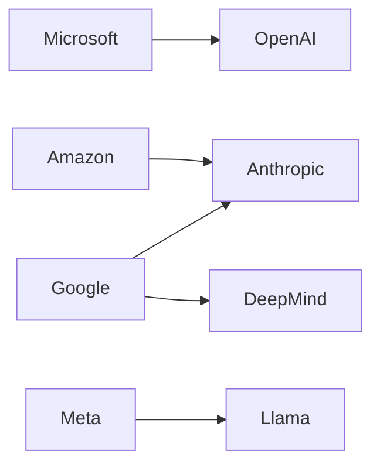

# Aprender con LLMs: la ilusión de autonomía cognitiva bajo el monopolio de tres gigantes

La publicación de *Laurentiu Gabriel* en su blog personal —y discutida recientemente en Hacker News— propone un método interesante: usar modelos de lenguaje grandes (LLMs) como tutores personalizados para dominar temas complejos. La propuesta es pedagógicamente sólida. Pero si sacamos la lupa del "cómo usarlo" y la ponemos en el "quién lo controla", el panorama se vuelve considerablemente más oscuro.

Porque cuando un estudiante apela a ChatGPT para entender termodinámica, está entablando una relación con un puñado de corporaciones que ejercen un poder sin precedentes sobre el conocimiento, los datos y la atención. Y eso merece un análisis que vaya más allá del truco productivo.

## La ilusión de la horizontalidad

Pero esa apariencia oculta una realidad estructural: el mercado de modelos frontera está concentrado en un oligopolio de facto. Según el Stanford AI Index 2024, más del 80% de los despliegues comerciales de IA generativa a gran escala provienen de tres actores: **OpenAI** (respaldada por Microsoft con una inversión superior a 13.000 millones de dólares), **Anthropic** (financiada por Google y Amazon con compromisos que superan los 7.000 millones combinados) y **Google DeepMind** (integrada verticalmente en Alphabet). Meta, con Llama, opera más bien como excepción de código abierto parcial dentro de una estrategia de captura de ecosistema.

Esto no es un detalle técnico: define quién decide qué sabe un LLM, qué censura aplica, qué sesgos reproduce y, crucialmente, cómo monetiza cada interacción.

## Quien paga la fiesta pone la música

El modelo de negocio de los LLMs es, en esencia, extracción de renta cognitiva. Cada consulta que un estudiante formula entrena implícitamente el sistema mediante señales de retroalimentación (thumbs, conversaciones continuadas, retención). Los proveedores obtienen tres cosas:

1. **Renta inmediata** mediante suscripciones (ChatGPT Plus a 20 USD/mes, Claude Pro a 20 USD, Gemini Advanced a 20 USD) o APIs facturadas por tokens.
2. **Datos comportamentales** que refinan el producto y crean barreras de entrada para competidores más pequeños.
3. **Lock-in epistémico**: cuando un profesional integra un LLM en su flujo de aprendizaje, migrar a otra herramienta implica reconstruir prompts, ajustes y memoria contextual.

Es el mismo patrón que Google aplicó durante dos décadas con el buscador: la herramienta "gratuita" se convierte en infraestructura crítica, y la portabilidad se vuelve prohibitivamente costosa. La historia del software empresarial está plagada de ejemplos análogos — Lotus 1-2-3, luego Excel; BlackBerry, luego iOS — donde la captura inicial de hábito se transforma en monopolio funcional.

## La asimetría del conocimiento embebido

Esto significa que el "tutor" con el que aprendes termodinámica funciona gracias al trabajo no remunerado de miles de físicos, divulgadores y autores. La pregunta ética — quién debería compensar a quién — rara vez aparece en los artículos sobre productividad con IA.

## El vector geopolítico

Cuando Anthropic o OpenAI aplican guardrails alineados con valores occidentales (o con los valores de sus inversores principales, como el Effective Altruism para Anthropic o el profit motive para OpenAI post-board crisis 2023), están definiendo qué se puede preguntar, qué se puede saber.

## ¿Hay alternativas reales?

Sí, aunque con limitaciones. Modelos de código abierto como **Llama 3** de Meta, **Mistral** (francés), **Qwen** (chino con versiones abiertas) o **DeepSeek** permiten despliegue local. Pero su calidad todavía queda por debajo de los modelos frontera en razonamiento complejo. Y aquí opera una ironía clásica del capitalismo de plataformas: la opción "soberana" requiere expertise técnico que excluye precisamente a quienes más se beneficiarían.

Proyectos como **Nous Research** o **EleutherAI** exploran caminos de entrenamiento distribuido y ético, pero viven al filo de la sostenibilidad financiera, dependiendo de donaciones y de la benevolencia de donaciones corporativas.

## Conclusión: aprender es un acto político

La próxima vez que abras ChatGPT para entender un concepto difícil, recuerda: estás alquilando acceso a infraestructura cognitiva controlada por tres corporaciones. Tu pregunta es un microdato más en su modelo de negocio. Tu dependencia es su activo.

Construir un ecosistema de aprendizaje verdaderamente soberano requerirá algo más que prompts ingeniosos: exigirá políticas públicas de alfabetización algorítmica, modelos abiertos financiados colectivamente, y quizás, una revisión profunda de cómo se compensan los conocimientos que alimentan a estos sistemas. Hasta entonces, seguir "aprendiendo con LLMs" será, para bien y para mal, un acto cargado de implicaciones que rara vez aparecen en la pantalla del chat.

---