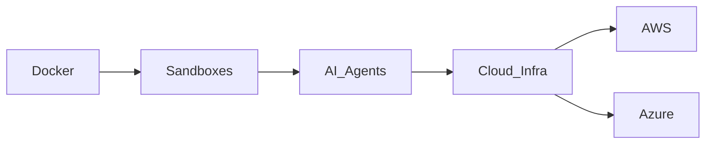

# Docker Sandboxes: El gigante de los contenedores apuesta por la infraestructura de agentes IA

Docker ha anunciado Docker Sandboxes, entornos aislados y desechables diseñados específicamente para agentes de inteligencia artificial. En superficie, parece una extensión natural de lo que la empresa ha hecho durante más de una década: empaquetar software en contenedores portables. Pero la jugada revela mucho más sobre la industria tecnológica de 2025: una carrera frenética por controlar la capa de infraestructura sobre la que se ejecutarán los millones de agentes IA que las empresas prometen desplegar.

## El contexto histórico: de revolucionario a incumbente

Para entender el peso de este movimiento, hay que recordar dónde estaba Docker hace apenas una década. En 2013, la empresa democratizó los contenedores Linux y transformó para siempre la ingeniería de software. Pero la historia posterior fue menos gloriosa. Kubernetes, originado en Google, ganó la guerra de orquestación, y Docker perdió relevancia en su propio terreno. En 2019, Docker vendió su negocio enterprise a Mirantis. En 2024, salió a bolsa en medio de expectativas moderadas sobre su capacidad de mantener relevancia.

## El mercado que Docker quiere conquistar

El concepto detrás de Docker Sandboxes es relativamente directo: cada agente de IA necesita un entorno aislado donde ejecutar código, acceder a herramientas y completar tareas sin comprometer el sistema host. Hasta ahora, los desarrolladores han improvisado soluciones con máquinas virtuales, contenedores efímeros o plataformas especializadas como E2B, Modal o Fly.io.

Docker está apostando a que su marca, su ecosistema y su estándar de facto en contenedores le dan ventaja para capturar este mercado emergente. La pregunta es si esa ventaja es real o simplemente un anacronismo corporativo.

## Dinámicas de poder: el juego de la infraestructura

Docker, al posicionarse en la capa de sandboxes, está haciendo una jugada similar a lo que intentó HashiCorp con Terraform: convertirse en el estándar obligatorio que ninguna empresa puede evitar. HashiCorp fue adquirido por IBM por 6.400 millones de dólares precisamente por esa posición estratégica. Docker vale aproximadamente la mitad en bolsa, pero su potencial de adquisición o crecimiento sigue atado a esta misma lógica.

## Implicaciones para desarrolladores y empresas

Para los desarrolladores individuales, Docker Sandboxes podría ser una herramienta útil que simplifica un problema real: ejecutar código de forma segura en nombre de agentes IA. Para las empresas, la decisión es más compleja. Adoptar Docker Sandboxes significa apostar por un proveedor que ha demostrado capacidad técnica pero cuya posición competitiva a largo plazo no está garantizada.

## Conclusión: ¿innovación o supervivencia corporativa?

La pregunta que deberíamos hacernos como industria no es solo si Docker Sandboxes es una buena herramienta, sino si queremos que la infraestructura de los agentes IA se concentre en unas pocas plataformas controladas por empresas con obligaciones con sus accionistas. La historia de la tecnología está llena de estándares abiertos que se convirtieron en jaulas doradas, y de comunidades de desarrolladores que descubrieron demasiado tarde que habían construido los cimientos del monopolio de otro.

Quizás, en lugar de celebrar cada nuevo producto de infraestructura como un avance inevitable, deberíamos preguntar quién se beneficia realmente cuando la capa sobre la que se ejecuta la inteligencia artificial del futuro queda en manos de unos pocos.