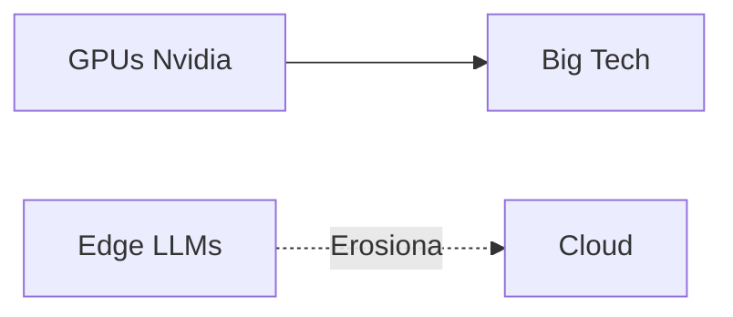

# Needle2: los 14 megabytes que amenazan el trono de la IA corporativa

La promesa suena casi herética en 2026: un modelo de lenguaje *agentivo* —capaz de ejecutar acciones, no solo generar texto— que cabe en 14 megabytes. Suficiente para correr en un teléfono, un reloj inteligente, un altavoz o un robot industrial. Sin nube. Sin OpenAI. Sin pagar a nadie por cada token generado.

Cactus Compute, la pequeña empresa detrás de Needle2, publicó esta semana su demostración en Hacker News. La reacción fue inmediata: cientos de puntos y un debate encendido sobre si estamos ante el inicio de una nueva era de la inteligencia artificial o ante una curiosidad técnica sobrevalorada.

Pero más allá del logro ingenieril, lo que Needle2 revela es una fractura profunda en el modelo de negocio que han construido los gigantes del sector.

## El feudo de los 800 mil millones

Para entender por qué un modelo de 14 MB es una declaración política, hay que mirar quién domina hoy la inteligencia artificial generativa. **OpenAI**, respaldada por Microsoft, opera con una valoración superior a los 150.000 millones de dólares. **Anthropic** acaba de cerrar rondas que la sitúan cómodamente por encima de los 60.000 millones. **Google** ha fusionado DeepMind con su división de productos para integrar Gemini en cada rincón de su ecosistema. **Meta** reparte Llama como si fuera software libre, pero su verdadera ventaja sigue siendo el control de la distribución —Instagram, WhatsApp, Facebook— y la capacidad de cómputo propia.

Todas estas empresas comparten un modelo económico idéntico: la inferencia ocurre en sus centros de datos. Cada pregunta que le haces a ChatGPT, cada consulta a Claude, cada interacción con Gemini alimenta un negocio basado en el procesamiento centralizado y el cobro por uso. La nube no es solo una arquitectura técnica: es una estructura de poder que convierte al usuario en producto y al desarrollador en vasallo de la API.

## El contraataque desde el borde

La lógica del modelo on-device rompe cada uno de los pilares de ese negocio:

- **No necesitas una API.** No hay facturación por token.
- **No hay latencia de red.** La respuesta es instantánea.
- **No hay datos que salgan del dispositivo.** La privacidad es estructural, no una promesa de marketing.
- **No necesitas comprar infraestructura de cómputo a Nvidia** ni alquilar capacidad en Azure, AWS o Google Cloud.

Es el equivalente a lo que representó el ordenador personal frente al mainframe de IBM en los años ochenta, o el smartphone frente al PC de escritorio en 2007. La promesa de devolver el control al usuario, aunque sea parcialmente.

**Apple** ya exploró este camino con Apple Intelligence y sus modelos locales. **Google** lanzó Gemini Nano para Android. **Microsoft** promociona los "Copilot+ PCs" con NPUs dedicadas. Pero todas estas son estrategias defensivas de incumbentes que intentan no perder el control mientras la tecnología migra inevitablemente al borde.

Cactus Compute, en cambio, es un actor pequeño sin los lastres de un imperio publicitario que proteger ni una plataforma de búsqueda que defender. Su motivación es genuinamente diferente: si el modelo corre en el dispositivo, el software se vuelve más valioso, no menos. La inteligencia se embebe en el producto, no se alquila como servicio recurrente.

## ¿Revolución real o ajuste incremental?

Para casos como controlar un robot aspirador, procesar comandos de voz en un altavoz inteligente o automatizar flujos en un wearable, esa limitación no es un problema: es exactamente lo que se necesita. La pregunta no es si Needle2 es "mejor" que GPT-4 en términos absolutos, sino si este enfoque desplaza capas enteras del mercado.

Hay un precedente interesante: **SQLite**. Esa biblioteca de bases de datos, de dominio público, ejecutable en cualquier dispositivo, con cero dependencias de red, sostiene silenciosamente buena parte de la infraestructura digital del planeta. No "compitió" con Oracle o PostgreSQL en el sentido tradicional: los desplazó en los lugares donde no tenía sentido desplegar un servidor. Needle2 podría seguir una trayectoria similar: no derrotar a OpenAI en su terreno, pero sí erosionar la base de usuarios que justifican su valoración estratosférica.

## El factor geopolítico

Empresas chinas como **DeepSeek**, **Alibaba** o **Baidu** ya están publicando modelos pequeños y eficientes por las mismas razones. La carrera ya no es solo por el modelo más grande, sino por el modelo más útil por vatio consumido. Esa es una métrica que Nvidia preferiría que no existiera.

## Conclusión: la descentralización como acto de rebeldía

Needle2 es, por ahora, una apuesta. Puede que en dos años sea un caso de estudio de cómo las pequeñas empresas abren camino antes de ser absorbidas por las grandes. Puede que termine en la pila de proyectos interesantes pero inviables comercialmente. Pero señala una dirección que incomoda a quienes han construido su ventaja competitiva sobre la centralización del cómputo.

La próxima vez que un modelo de 14 megabytes haga algo útil en tu bolsillo, recuerda: en la industria tecnológica, el tamaño nunca ha sido lo que importa. El control, sí.

