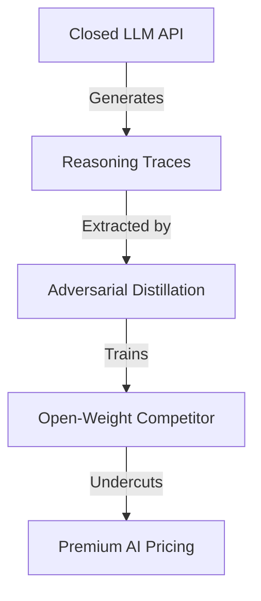

Durante meses, OpenAI, Anthropic y Google DeepMind han construido una narrativa comercial muy específica: sus modelos de "razonamiento" — o1, o3, Claude con extended thinking, Gemini Thinking — no solo responden, sino que *piensan*. Y ese pensamiento, esas cadenas de razonamiento que el modelo produce antes de darte una respuesta, son el corazón de su ventaja competitiva. Son, en esencia, el nuevo petróleo.

Pero un equipo de investigadores acaba de publicar un trabajo demoledor en [stolen-thoughts.com](https://stolen-thoughts.com/) que demuestra algo incómodo: **las trazas de razonamiento de los LLM propietarios pueden extraerse, destilarse y replicarse con una eficiencia alarmante**. Lo que se vende como propiedad intelectual sagrada resulta ser, técnicamente, extraíble a escala.

## Qué han descubierto realmente

## La ilusión de la propiedad en la IA

## El verdadero juego de poder

Las trazas de razonamiento son ese foso, o se supone que lo son. Si un investigador con un presupuesto modesto puede extraer suficiente información de la API para entrenar un modelo rival, el **costo de replicación cae dramáticamente**. Y cuando el costo de replicación cae, los márgenes colapsan, y con ellos, la tesis de inversión.

## ¿Qué significa esto para el resto de la industria?

Es, en cierto sentido, una nueva forma de extractivismo: el Sur Global entrenando modelos con datos generados por el Norte Global que cobra tarifas premium. Las preguntas sobre quién se beneficia, quién paga, y quién pierde, son las mismas que llevamos siglos haciéndonos sobre cualquier recurso valioso.

## A modo de reflexión

La pregunta no es si las trazas de razonamiento pueden robarse — claramente sí — sino qué tipo de industria estamos construyendo sobre la premisa de que no pueden. Porque cada vez que un paper como este aparece, queda más claro que **el verdadero foso de las grandes labs de IA no es técnico, sino de capital, datos y relaciones regulatorias**. Y esos, al menos por ahora, siguen siendo más difíciles de replicar que una cadena de pensamiento.

Aunque, viendo la velocidad a la que se mueve todo, no apostaría a que eso dure para siempre.

