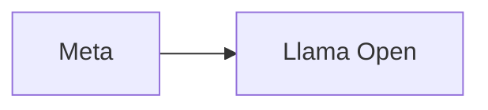

# Zuckerberg ataca a rivales cerrados: la apertura de Meta bajo la lupa

Mark Zuckerberg ha vuelto a desplegar su narrativa favorita: la del jardín abierto frente a los *walled gardens* de la competencia. Su reciente crítica a los rivales de inteligencia artificial "cerrados", coincidiendo con el lanzamiento de nuevos modelos abiertos de Meta, merece un análisis menos complaciente y más estructural.

## La genealogía del "open" según Meta

Esta práctica, que los críticos denominan *open washing*, no es exclusiva de Meta. OpenAI —cuyo nombre ya es una contradicción en términos dado su giro hacia el secretismo comercial desde 2019— y Anthropic han seguido rutas similares. La pregunta relevante no es si Meta es más o menos abierta que sus competidores, sino qué función estratégica cumple esta apertura en su modelo de negocio.

## Concentración de capital y guerra de plataformas

La verdadera batalla de la IA no es filosófica, es material. NVIDIA controla aproximadamente el 80% del mercado de GPUs especializadas, apoyada en la foundry de TSMC. Microsoft ha invertido más de 13.000 millones de dólares en OpenAI y mantiene una integración profunda con Azure. Google reorganizó toda su estructura bajo Alphabet para acelerar la carrera. Anthropic cuenta con el respaldo financiero simultáneo de Amazon y Google.

En este contexto, Meta necesita un ejército de aliados que no podría reclutar pagando salarios completos. La comunidad open source cumple esa función: desarrolladores que adoptan PyTorch, afinan Llama y crean herramientas alrededor del ecosistema de Meta sin que la empresa desembolse un sueldo directo. Es, en palabras crudas, trabajo altamente especializado para una de las empresas más ricas del planeta.

## Las paradojas del discurso zuckerbergiano

Cuando Zuckerberg habla de "rivales cerrados", omite convenientemente varios detalles. Meta Platforms sigue siendo una de las corporaciones más opacas del sector tecnológico en lo que respecta a moderación de contenido, algoritmos de feed y manejo de datos personales. La apertura en IA coexiste con el secretismo en el corazón de su negocio publicitario.

Además, la apertura de Meta no es desinteresada: requiere que los modelos se ejecuten en hardware compatible con su stack, idealmente con chips optimizados para PyTorch. Quien adopta Llama se vincula, aunque sea indirectamente, al ecosistema de Meta. No es cautiverio, pero tampoco es neutralidad.

## Lecciones históricas

En cada caso, el ganador aparente —la comunidad open source— terminó subordinada a los intereses del gigante que patrocinaba la apertura. Hoy, hablar de "IA abierta" sin analizar quién financia los modelos, quién entrena los datos con qué mano de obra y quién se beneficia de su adopción masiva, es un análisis incompleto.

## ¿Qué sigue?

El discurso de Meta sobre la apertura es, en el mejor de los casos, una verdad a medias. En el peor, es una herramienta de marketing sofisticada que confunde a reguladores, desarrolladores y opinión pública. Mientras tanto, la concentración de capital en el sector de IA no ha hecho más que acelerarse: pocas empresas pueden permitirse entrenar modelos frontera, y la dependencia de NVIDIA, TSMC y un puñado de proveedores cloud configura un nuevo tipo de cuello de botella industrial.

La pregunta que deberíamos hacernos no es si Meta es más abierta que OpenAI o Anthropic, sino si la propia categoría de "abierto" tiene sentido en una industria donde los recursos necesarios para crear modelos competitivos están fuera del alcance de cualquier actor independiente. La apertura, como concepto regulatorio y filosófico, merece un debate que las declaraciones de Zuckerberg no están precisamente ayudando a esclarecer.

Quizás el problema de fondo es que, en la economía política de la inteligencia artificial, todas las aperturas son estratégicas, todas las cerraduras son defensivas, y la neutralidad es un lujo que solo pueden permitirse quienes no tienen nada que ganar ni perder. Meta, definitivamente, no está en esa categoría.

