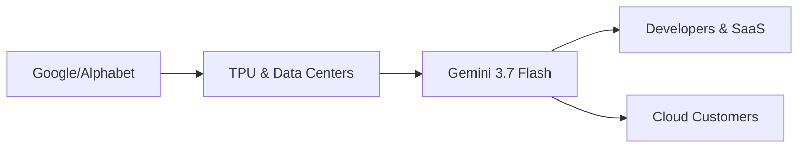

# Gemini 3.7 Flash: Google Refuerza Su Imperio del Cómputo

## El contexto: una carrera de gigantes

La inteligencia artificial generativa dejó de ser, hace tiempo, un territorio de startups audaces y laboratorios académicos. Hoy es una industria dominada por cuatro actores con balances de miles de millones: **Google/Alphabet**, **Microsoft/OpenAI**, **Anthropic** (respaldada por Amazon) y **Meta**. Gemini 3.7 Flash no compite contra el modelo open-source de turno; compite dentro de un oligopolio donde la variable decisiva ya no es la novedad algorítmica, sino el coste por token, la latencia y la integración vertical.

Google tiene una ventaja estructural que ningún rival puede replicar fácilmente: su propio *stack*. TPU, infraestructura de Google Cloud, distribución vía Search, Android, Workspace y, cada vez más, integraciones con Samsung y otros fabricantes. Cuando lanza un "Flash", no está vendiendo solo un modelo: está vendiendo acceso a un ecosistema verticalmente integrado que reduce costes marginales hasta umbrales que un competidor independiente no puede igualar.

## La lógica económica de los modelos "Flash"

Lo que Google no dice en el comunicado —y rara vez dice cualquier hyperscaler— es el coste real de entrenar y servir estos modelos. Las cifras de "inferencia eficiente" siempre se comparan contra baselines internos. La pregunta relevante es: **¿cuál es el coste por millón de tokens incluyendo amortización de entrenamiento, electricidad y coste de capital?** Ahí es donde las grandes plataformas tienen una ventaja de 3x a 10x frente a cualquier competidor que no controle su propia cadena de suministro de silicio y energía.

## Capital, compute y la nueva frontera del extractivismo

Aquí conviene recordar algo que el marketing tecnológico suele ocultar: la inteligencia artificial moderna es una industria de capital intensivo con rendimientos crecientes. Cada nueva generación de modelos requiere más datos, más GPUs o TPUs, más electricidad y más ingenieros senior. Esto crea una **curva de costes que penaliza a los rezagados**.

Goldman Sachs estima que los hyperscalers invertirán cerca de **400.000 millones de dólares en infraestructura de IA solo en 2026**. Alphabet, Microsoft, Amazon y Meta representan la inmensa mayoría de esa cifra. Anthropic y OpenAI, aunque nominalmente independientes, dependen financieramente de estos mismos actores (Microsoft-OpenAI, Amazon-Anthropic) y, en la práctica, de su acceso a capacidad de cómputo contratada.

## Qué significa para desarrolladores y competidores pequeños

Para un desarrollador que construye un producto, Gemini 3.7 Flash ofrece una opción atractiva: barato, rápido, razonablemente capaz, con un ecosistema de herramientas maduro. La trampa es la misma de siempre: **vendor lock-in**. Cuando tu arquitectura se optimiza para un proveedor, migrar a otro tiene un coste —técnico, económico y humano— que crece con el tiempo. AWS lo demostró con su base instalada; Google lo está demostrando ahora en IA.

Para los competidores pequeños, cada lanzamiento "Flash" de un hyperscaler es una señal de alarma. Si tu modelo no puede competir en precio por inferencia, necesitas diferenciarte de forma muy clara en capacidades, privacidad, despliegue on-premise o modelo de negocio. Mistral, Cohere y los laboratorios chinos juegan esta partida en una liga con recursos muy desiguales.

