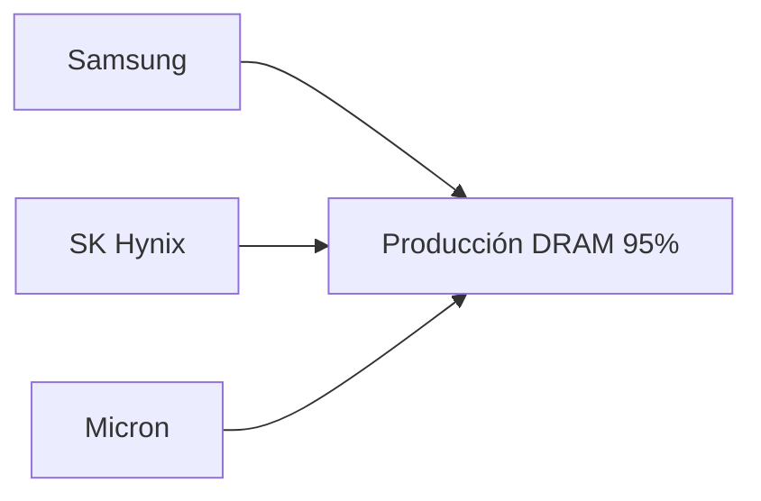

La próxima vez que alguien le diga que la optimización a nivel de memoria no importa, muéstrele este repositorio. Y pregúntele quién, realmente, controla los bytes que mueven el futuro.

```mermaid
graph LR
  Samsung --> DRAM[Producción DRAM 95%]
  SK[SK Hynix] --> DRAM
  Micron[Micron] --> DRAM
```

