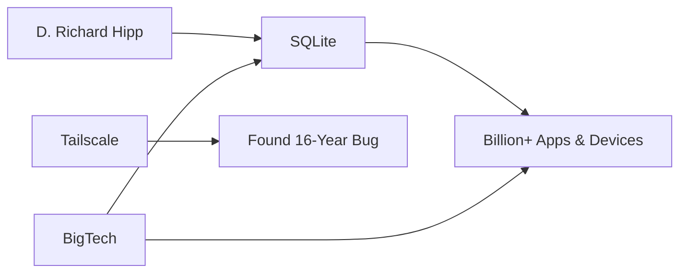

# El bug de 16 años en SQLite: ¿Quién mantiene realmente la columna vertebral de Internet?

Durante dieciséis años, un bug crítico en SQLite — la base de datos más desplegada del planeta — pasó desapercibido. No fue descubierto por un equipo de seguridad dedicado, una agencia gubernamental ni un consorcio de corporaciones preocupadas. Lo encontró Tailscale, una empresa de VPN respaldada por capital de riesgo, no porque estuvieran auditando SQLite, sino porque el bug literalmente rompió su entorno de producción. El episodio, meticulosamente documentado por el equipo de ingeniería de Tailscale, no es meramente una curiosidad técnica. Es un espejo que refleja la estructura de poder oculta de la industria tecnológica contemporánea.

## El bug: qué se rompió realmente

El error, relacionado con el mecanismo de Write-Ahead Logging (WAL) de SQLite, podía causar corrupción de datos bajo condiciones específicas pero completamente plausibles. Tailscale lo detectó porque sus servidores — que utilizan SQLite a una escala inusualmente intensiva para una empresa típica — comenzaron a experimentar fallos inexplicables. Tras meses de investigación, rastrearon la causa raíz hasta una sección de código introducida en 2008, dieciséis años antes.

## El patrón histórico

El caso de SQLite difiere en un matiz importante: SQLite es un proyecto con su propio modelo de financiación, no un proyecto mantenido «altruistamente» por un equipo disperso. Pero el problema estructural es idéntico: la economía de la infraestructura de software crítica no se alinea con quién se beneficia de ella. Google, Apple, Microsoft, Meta, Amazon — los nombres que dominan el discurso público sobre tecnología — extraen un valor colosal de SQLite, pero su relación con el proyecto sigue siendo asimétrica. Lo utilizan a escala masiva, contribuyen con parches ocasionales y rara vez financian su desarrollo de forma proporcional a su dependencia.

## La ironía de Tailscale

Hay algo revelador en que Tailscale — una empresa privada fundada en 2019 y respaldada por firmas como Accel y Andreessen Horowitz — sea quien descubrió el bug. Tailscale no es una organización benéfica de código abierto. Es una empresa comercial que vende suscripciones B2B. Su misión no es auditar SQLite: es ofrecer una solución de VPN. Pero al utilizar SQLite intensivamente, y al romperse su producto debido al bug, tenían incentivos económicos directos para encontrar la causa raíz.

Así es como funciona el mercado como mercado: una empresa descubre una falla porque le conviene, la reporta de forma responsable, y el mantenedor de SQLite lo corrige. Pero la pregunta que queda suspendida en el aire es: ¿cuántos bugs similares existen en el código que mueve el mundo, esperando a que alguna empresa con los recursos e incentivos adecuados tropiece con ellos?

## Conclusión: lo que nos dice el bug

La próxima vez que una empresa tecnológica te venda una visión sobre cómo la inteligencia artificial va a «transformar el mundo», podría valer la pena preguntar: ¿cuántas personas mantienen el software que ya transformó el mundo hace veinte años? ¿Quién paga por su trabajo? ¿Y qué pasa cuando nadie lo hace?

D. Richard Hipp → SQLite