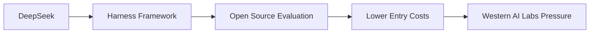

# DeepSeek Harness: la preview que reordena el tablero del desarrollo de IA

Cuando una empresa china publica un *developer preview* de su framework de entrenamiento y evaluación de modelos de lenguaje, la noticia no es técnica: es geopolítica. **DeepSeek Harness** no es solo un conjunto de herramientas para desarrolladores. Es un gesto deliberado dentro de una disputa de poder que llevaba meses fraguándose en silencio, y que ahora se hace explícita en GitHub y en la documentación de DeepSeek.

Para entender por qué importa, conviene recordar quién es DeepSeek. Fundada en 2023 como un spin-off del fondo cuantitativo High-Flyer, la compañía irrumpió en el ecosistema global con modelos como DeepSeek-V3 y DeepSeek-R1, entrenados con presupuestos que, según sus propios reportes, son una fracción de los desembolsados por OpenAI o Anthropic. Esa narrativa —"más por menos"— incomodó a Silicon Valley, y motivó declaraciones como la de **Marc Andreessen** describiendo a R1 como el "momento Sputnik" de la IA. No era una exageración retórica: era una confesión de que el centro de gravedad del sector se había desplazado.

## Qué es Harness y por qué no es trivial

Harness es un framework de evaluación y orquestación que permite a investigadores y desarrolladores probar, comparar y entrenar modelos de lenguaje bajo condiciones reproducibles. En la práctica, significa que cualquier equipo —desde una startup europea hasta un laboratorio universitario en Bangalore— puede ejecutar benchmarks estandarizados sin tener que reinventar la infraestructura ni pagar licencias propietarias.

Lo relevante no es la funcionalidad en abstracto, sino **qué posición ocupa en la cadena de valor**. Durante los últimos tres años, el control del *stack* de evaluación ha sido una de las principales fuentes de poder de las grandes empresas. OpenAI con su API y sus benchmarks internos, Anthropic con Claude y sus "responsible scaling policies", Google con su ecosistema de Vertex AI: todos han definido qué significa que un modelo sea "bueno", y han cobrado peajes —directos o indirectos— por participar en esa conversación.

## Las estructuras de capital detrás del movimiento

Esto no invalida el aporte técnico —el código es el código—, pero sí obliga a leerlo en contexto. En el polo occidental, los modelos abiertos de **Meta** (Llama) o **Mistral** también responden a lógicas de capital: Zuckerberg necesita una narrativa alternativa al "metaverso" para sostener el múltiplo bursátil de Meta, y Mistral, pese a su origen francés, acaba de levantar rondas donde participan **Microsoft** y los principales fondos de Silicon Valley. La apertura, en todos los casos, es instrumental.

El beneficiario silencioso de esta fragmentación es **NVIDIA**. Cada vez que un nuevo actor —DeepSeek, Mistral, Cohere, incluso Baidu— entra al juego con infraestructura propia, la demanda de GPUs H100 y H200 se sostiene. Jensen Huang ha construido, probablemente, el monopolio más sólido del siglo XXI: no controla los modelos, no controla los datos, pero controla el insumo sin el cual nada funciona. En su última presentación trimestral, NVIDIA reportó márgenes operativos superiores al 60%, una cifra que haría sonrojar a cualquier empresa industrial y que solo es posible cuando eres el cuello de botella de una industria entera.

## Lecciones de historia que conviene no olvidar

¿DeepSeek sigue el mismo guion? Probablemente sí, pero desde una esquina distinta. La pregunta incómoda para Washington y Bruselas no es si el código de DeepSeek es seguro —los *developer previews* rara vez incluyen pesos de modelos completos ni datos sensibles—, sino si la fragmentación del ecosistema de IA acelera o frena la capacidad de los gobiernos occidentales para regularlo. Cuando un desarrollador en Berlín puede entrenar un modelo competitivo con hardware comercial y un framework chino descargable de GitHub, la idea de un "cártel de la IA" controlado por unas pocas empresas en California se vuelve, por primera vez en años, objetivamente falsa.

## El espejo que DeepSeek le pone a Silicon Valley

Quizás lo más revelador de Harness no esté en sus características técnicas, sino en lo que expone sobre el resto de la industria. Mientras OpenAI mantiene sus benchmarks bajo llave y Anthropic factura sus modelos más avanzados a 15 dólares por millón de tokens, DeepSeek publica un framework que cualquiera puede auditar, forkear y desplegar. La asimetría es informativa: dice quién necesita transparencia para competir, y quién necesita opacidad para preservar márgenes.

En términos de dinámica industrial, esto anticipa una fase de commoditización. La capa de modelos de frontera, todavía concentrada en cuatro o cinco actores, podría empezar a parecerse más a la infraestructura cloud: márgenes altos al principio, compresión gradual a medida que las alternativas se multiplican. Cuando eso ocurra —y Harness es un paso en esa dirección—, el valor se desplazará hacia arriba (chips, energía, centros de datos) o hacia abajo (aplicaciones, integraciones, datos propietarios). No permanecerá donde está hoy.

## Conclusión: la pregunta ya no es técnica, es de poder

DeepSeek Harness es, en última instancia, un recordatorio de que la IA no es solo un problema de ingeniería: es un problema de distribución de poder. Cada herramienta que baja el costo de entrada, cada framework que democratiza la evaluación, cada modelo abierto que circula fuera del control de un puñado de empresas en California, Shenzhen o Seattle, reconfigura quién puede participar y bajo qué reglas.

La próxima vez que un *developer preview* aparezca en HackerNews, conviene leerlo menos como un anuncio de producto y más como un movimiento en un tablero que casi nadie está mirando con claridad. Porque en tecnología, como en política, quien controla las herramientas de medición, controla la realidad.