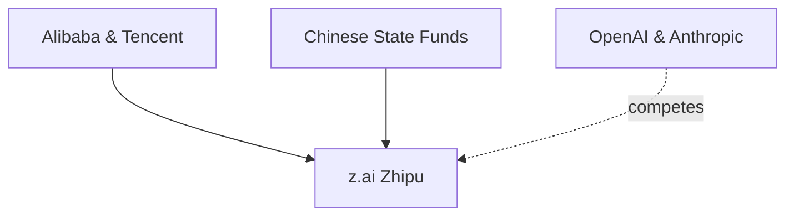

# GLM-5.3 y la nueva geopolítica del código: cómo la IA china reconfigura el tablero global

La semana pasada, z.ai —rebautizada así recientemente desde su nombre anterior, Zhipu AI— presentó GLM-5.3, un modelo que la compañía describe como capaz de tareas de programación "fronterizas" y que exhibe, según sus propios benchmarks, "capacidades cibernéticas emergentes". El anuncio puede leerse como una mera actualización técnica más en un calendario saturado de releases. Pero leído con la lente de las dinámicas de poder que estructuran la industria, dice mucho más: revela cómo la inteligencia artificial se ha convertido en un terreno de disputa estratégica donde convergen capital estatal, oligopolios tecnológicos y una nueva carrera armamentista digital.

## Quién está detrás de z.ai

Entre sus inversionistas se encuentran Alibaba, Tencent y varios fondos soberanos y municipales chinos. Esta estructura de capital no es accesoria: define el tipo de investigación que se prioriza, los mercados a los que se accede y, sobre todo, las tolerancias regulatorias. En un ecosistema donde el capital está tan entrelazado con el poder político, la autonomía científica es siempre relativa.

## Lo que significa "capacidades cibernéticas emergentes"

El comunicado oficial habla de "capacidades cibernéticas emergentes" —emergent cyber capabilities, en inglés— que aparecen cuando el modelo se entrena a escala suficiente. La frase es deliberadamente ambigua. Puede referirse a la capacidad del modelo para encontrar y explotar vulnerabilidades en software, automatizar tareas de penetration testing, o generar código malicioso sofisticado. z.ai, por supuesto, enmarca estas habilidades en términos defensivos y de "red teaming".

## Concentración de capital: el viejo problema con un nuevo disfraz

- **Venture capital concentrado**: fondos como Sequoia, Andreessen Horowitz o sus equivalentes chinos (IDG Capital, la antigua Sequoia China —hoy HongShan—) que han apostado por una media docena de laboratorios.
- **Alianzas estratégicas con hyperscalers**: la dependencia de infraestructura de cómputo de Alibaba Cloud, AWS, Azure o Google Cloud crea relaciones de poder verticales.
- **Apoyo estatal directo**: especialmente relevante en el caso chino, pero también presente en Estados Unidos vía el CHIPS Act y contratos del Departamento de Defensa.

Esta concentración implica que la investigación en IA de frontera —incluidas las decisiones sobre qué "capacidades emergentes" se descubren, miden y, eventualmente, despliegan— ocurre en un puñado de comités directivos. Las consecuencias democráticas de esta arquitectura son profundas y, en gran medida, todavía no se han debatido con la seriedad que merecen.

## Lecciones históricas: de ARPANET a los modelos de frontera

Recordemos que ARPANET, la semilla de Internet, fue un proyecto del Departamento de Defensa de Estados Unidos. La World Wide Web, la capa que democratizó la red, fue inventada en el CERN, una institución pública europea. Ambas tecnologías eventualmente escaparon del control de sus creadores originales y se transformaron en infraestructura civil.

¿Sucederá lo mismo con la inteligencia artificial? La respuesta probablemente sea sí, pero no sin fricciones. GLM-5.3 se publica como modelo open-weight, lo que significa que cualquier actor —desde una startup bien financiada hasta un grupo criminal organizado— puede descargarlo y adaptarlo. Esta decisión de apertura refleja una disputa filosófica que atraviesa toda la industria: ¿es la apertura una estrategia de mercado para ganar adoption, o un compromiso real con la democratización tecnológica?

## Reflexión final: qué estamos construyendo realmente

Como sociedad, tenemos dos opciones: dejar que estas decisiones sigan tomándose en consejos de administración opacos, o construir los espacios —regulatorios, académicos, civiles— donde se discuta abiertamente qué tipo de inteligencia artificial queremos y bajo qué reglas.

