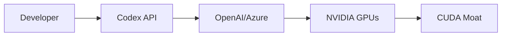

# 232 veces más rápido: la paradoja oculta del código optimizado por IA

Un desarrollador individual logró una aceleración de 232x en un kernel usando Codex, el modelo de código de OpenAI. El logro, documentado en un modesto blog personal, parece democratizar lo que hasta hace poco era territorio exclusivo de equipos de investigación en NVIDIA, Intel o Google. Pero detrás del titular se esconde una realidad más compleja sobre quién realmente controla la frontera del software de alto rendimiento.

## El logro técnico en contexto

Optimizar un kernel —ese fragmento de código que habla directamente con el hardware— ha sido durante décadas un arte reservado a especialistas. Los equipos de ingeniería de NVIDIA ajustan cada ciclo de instrucción para mantener su ventaja competitiva con CUDA. En AMD, los equipos de ROCm pelean por cerrar la brecha. En Google, XLA y JAX son proyectos que consumen presupuestos considerables.

Que un desarrollador anónimo, trabajando con Codex en su blog personal, haya alcanzado una mejora de 232x no es un detalle menor. Es la evidencia más reciente de que los modelos de IA están absorbiendo conocimiento técnico altamente especializado y poniéndolo al alcance de cualquiera con una suscripción a ChatGPT o acceso a la API de OpenAI.

## La narrativa de la democratización

La historia que OpenAI, Microsoft y el ecosistema de herramientas de programación con IA quieren contar es seductora: el programador individual, armado con un asistente inteligente, puede competir con los equipos de investigación más sofisticados del mundo. Es una narrativa que convenientemente justifica valoraciones de 300 mil millones de dólares y rondas de inversión que redefinen el capital riesgo tecnológico.

Pero hay una pregunta incómoda: ¿quién construyó el modelo que construyó el código? Codex es un derivado de GPT, entrenado por OpenAI, una empresa en la que Microsoft ha invertido más de 13 mil millones de dólares y que ahora estructura sus productos alrededor de Azure. Cada consulta a Codex no es solo una operación de software: es una transacción dentro de una cadena de valor extraordinariamente concentrada.

## La nueva feudalización del software

Lo que estamos presenciando no es democratización; es feudalización con interfaz amigable. El desarrollador independiente que logra el kernel 232x más rápido depende, en cada línea, de:

- Un modelo fundacional cuyo entrenamiento costó cientos de millones de dólares
- Una infraestructura de cómputo (Azure, en este caso) operada por uno de los cinco grandes hyperscalers
- Un hardware (GPUs de NVIDIA en la mayoría de los casos) controlado por un fabricante que captura más del 80% del mercado de aceleradores para IA
- Un ecosistema de kernels y compiladores dominado por CUDA, el foso tecnológico más efectivo de la última década

## Patrones históricos que se repiten

En cada ola tecnológica, la promesa de abstracción ha convivido con nuevas formas de dependencia. Los modelos de IA generativa son la abstracción más radical hasta la fecha: en lugar de abstraer el hardware, abstraen el conocimiento mismo. Y el conocimiento, en esta era, es quizás el recurso más concentrado del planeta.

## El kernel como campo de batalla

Cuando un desarrollador usa Codex para optimizar un kernel, está operando dentro de un campo de fuerzas que ni siquiera ve. Su código eventualmente correrá sobre hardware cuyas instrucciones privilegian arquitecturas específicas. Las optimizaciones que descubre un modelo entrenado predominantemente con código CUDA reflejarán ese sesgo estructural. AMD con ROCm e Intel con oneAPI intentan romper ese cerco, pero la inercia del ecosistema sigue siendo abrumadora.

## Lo que realmente está en juego

El caso del kernel 232x es más significativo de lo que parece porque ilustra tres tendencias que definirán la próxima década:

1. **La compresión del ciclo de investigación**: tareas que requerían meses ahora se resuelven en días, lo que acelera la innovación pero también acelera la obsolescencia del trabajo humano rutinero.

2. **La dependencia asimétrica**: los pequeños actores se vuelven más productivos, pero su dependencia de proveedores centralizados crece proporcionalmente. Microsoft, Google, Amazon y Meta no solo proveen herramientas; definen qué se puede construir y a qué costo.

3. **La captura del talento**: cuando el conocimiento técnico se externaliza a modelos, las empresas que los controlan acumulan una ventaja competitiva que se retroalimenta. Cada consulta entrena el sistema. Cada interacción es extractiva.

