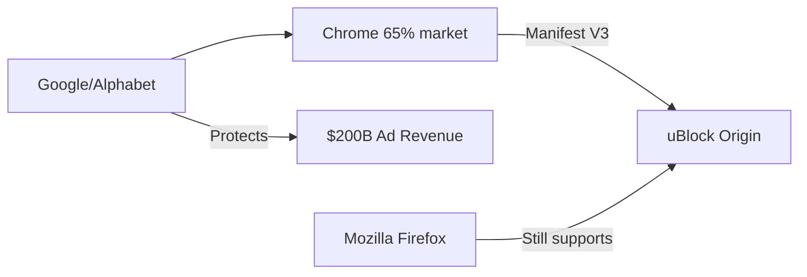

## Firefox, el último refugio de uBlock Origin: lo que el cerco a los bloqueadores dice sobre el poder de Google

En los últimos años, algo cambió silenciosamente en la web. Millones de usuarios que durante una década bloquearon anuncios y rastreadores con un solo clic han descubierto que su escudo digital simplemente dejó de funcionar. El motivo no es un fallo técnico ni un virus: es una decisión deliberada de Google, ejecutada a través de una especificación técnica que la mayoría nunca leerá. Firefox es, hoy por hoy, el último navegador importante donde **uBlock Origin** sigue funcionando con todas sus capacidades.

### El fin de una era técnica

La historia comienza con **Manifest V3**, la nueva arquitectura de extensiones que Google ha impulsado en Chrome y que, por extensión, afecta a todos los navegadores basados en Chromium: Edge de Microsoft, Brave, Opera, Arc, Vivaldi. La versión anterior, Manifest V2, permitía a extensiones como uBlock Origin interceptar todas las peticiones de red del navegador mediante la API `webRequest`. La nueva especificación reemplaza ese mecanismo por `declarativeNetRequest`, que limita severamente el número de reglas y elimina la capacidad de modificar dinámicamente las peticiones.

En la práctica, esto significa que bloqueadores sofisticados como uBlock Origin, que dependen de reglas actualizadas en tiempo real y filtros complejos, no pueden operar al mismo nivel. Raymond Hill, el desarrollador principal de uBlock Origin, lo explicó con crudeza técnica en GitHub: las versiones futuras de su extensión en Chrome serán una "versión limitada" o, en el peor escenario, simplemente no serán viables.

### Por qué importa: el negocio de la publicidad

uBlock Origin, junto con otras herramientas similares, representa una amenaza existencial para ese modelo. No porque bloquee anuncios en sí —eso es legal y legítimo—, sino porque demuestra que la web puede funcionar sin el pesado lastre publicitario. Cada usuario que instala un bloqueador es, en términos económicos para Google, un cliente que se resta de su inventario publicitario, un dato que deja de alimentar su perfil de comportamiento, una transacción programática que no se ejecuta.

### La concentración como arma competitiva

El verdadero poder de Google no está solo en su navegador, sino en que **Chrome controla más del 65% del mercado global** y, lo que es más importante, en que su motor de renderizado, Chromium, es la base sobre la que se construyen la mayoría de los navegadores competidores. Cuando Google cambia Manifest V3, no está tomando una decisión para una aplicación: está modificando las reglas del juego para toda una capa de la infraestructura web.

Esto es lo que los economistas llaman **lock-in institucional**: cuando el actor dominante usa su posición para cambiar los estándares de la industria de manera que favorecen su modelo de negocio. No es monopolio al estilo clásico, donde una empresa vende un producto a un precio excesivo. Es algo más sutil: el actor dominante define qué es posible técnicamente, y los competidores —incluso los que quisieran diferenciarse— quedan atados a su ecosistema.

Microsoft, con Edge, no ha mostrado intención de desviarse del estándar. Brave, que tiene su propio negocio publicitario, ha desarrollado Brave Shields como alternativa, pero acepta las limitaciones de Manifest V3. Opera y los demás navegadores Chromium están, en la práctica, alineados con la hoja de ruta de Google.

### El caso Mozilla: el dependiente incómodo

Mozilla, la fundación sin ánimo de lucro detrás de Firefox, se encuentra en una posición paradójica. Históricamente, ha dependido de Google para aproximadamente el 85% de sus ingresos, a través de un acuerdo por el que Google es el motor de búsqueda predeterminado en Firefox. Este acuerdo ha sido descrito por críticos como un caso de "captura regulatoria blanda": Mozilla existe como contrapeso narrativo a Google, pero financieramente está condicionada por él.

Que Firefox siga soportando plenamente uBlock Origin no es solo una decisión técnica: es una declaración de principios en un ecosistema donde casi todos los demás actores han aceptado, implícita o explícitamente, los nuevos términos. Es también, posiblemente, una de las últimas cartas de diferenciación que le quedan a Mozilla en un mercado donde su cuota ha caído por debajo del 3%.

### Tendencias históricas: del navegador libre a la infraestructura corporativa

Hace tres décadas, el navegador era el campo de batalla de una guerra abierta —Netscape contra Internet Explorer— que terminó con la derrota del primero y un juicio antimonopolio contra Microsoft. Años después, Google lanzó Chrome y repitió, en otra escala, el mismo patrón: construir una infraestructura abierta (Chromium) que termina centralizando el poder en un solo actor.

### El usuario como materia prima

Detrás de toda esta discusión hay una pregunta incómoda: ¿a quién pertenece la experiencia de navegación? Cuando un usuario instala Chrome, acepta —en un clic que rara vez lee— que el navegador es un producto gratuito cuyo verdadero cliente son los anunciantes. El usuario no es el consumidor; es la materia prima que se vende a los anunciantes.

uBlock Origin, en su modestia, era una de las pocas herramientas que devolvía al usuario cierto control sobre esa transacción. Su marginación en los navegadores principales no es solo un problema para los power users: es un indicador de cómo las decisiones de arquitectura web se toman cada vez más en salas de juntas donde el usuario final no tiene representación.

### Conclusión: lo que Firefox aún puede significar

La pregunta de fondo no es si los bloqueadores de anuncios sobrevivirán —probablemente lo harán en formas más sofisticadas, integradas en VPNs o sistemas operativos alternativos—. La pregunta es si sobrevivirá la idea de que el usuario tiene derecho a controlar su propia experiencia digital, o si esa decisión quedará, definitivamente, en manos de tres o cuatro corporaciones que controlan la infraestructura sobre la que corre internet.

---

Google[Google/Alphabet] --> Chrome[Chrome 65% market]
Chrome -->|Manifest V3| uBlock[uBlock Origin]
Google -->|Protects| Ads[$200B Ad Revenue]
Firefox[Mozilla Firefox] -->|Still supports| uBlock

