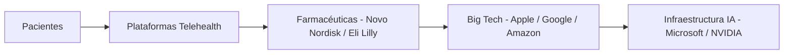

# Semaglutida y demencia: la nueva frontera de las Big Tech en salud

Un estudio reciente publicado en *Alzheimer's & Dementia* sugiere que los pacientes que usan semaglutida —el principio activo de Ozempic y Wegovy— tienen un 26% menos de riesgo predicho de demencia a cinco años. El titular es tentador. La realidad, como siempre, es más compleja: se trata de un análisis observacional, no de un ensayo clínico controlado, lo que significa que correlación no implica causalidad. Pero más allá de la cautela médica, lo verdaderamente interesante de esta noticia es lo que revela sobre el nuevo mapa de poder en la intersección entre salud, datos y tecnología.

## El nuevo eje del capitalismo: la farmacia como plataforma

Durante décadas, la industria farmacéutica fue un oligopolio relativamente estable: Pfizer, Merck, Roche, Novartis, Johnson & Johnson. Hoy, ese mapa se ha reconfigurado. **Novo Nordisk**, la farmacéutica danesa detrás de Ozempic, alcanzó en 2024 una capitalización de mercado superior a los 600.000 millones de dólares, llegando a valer más que toda la economía de Dinamarca. Su rival, **Eli Lilly**, fabricante de Mounjaro y Zepbound, superó los 800.000 millones y se convirtió brevemente en la empresa de salud más valiosa del mundo.

## Entran las Big Tech: Apple, Google, Amazon y la carrera silenciosa

**Alphabet**, a través de **Verily** y **Calico**, lleva una década invirtiendo en longevidad y biología computacional. Aunque muchos de sus proyectos han sido discretos, su capacidad para procesar datos genómicos a escala —combinada con su infraestructura de IA y la reciente apuesta de Google DeepMind por modelos de plegamiento de proteínas como AlphaFold— la posiciona como un actor estructural en la próxima generación de fármacos.

**Amazon**, con **One Medical** y **Amazon Pharmacy**, ha entrado directamente en la cadena de prescripción y distribución. Si sumamos su capacidad logística y la integración con Alexa como interfaz conversacional de salud, el escenario es claro: las Big Tech no quieren fabricar Ozempic. Quieren ser el **intermediario** que decide quién lo recibe, cuándo y bajo qué condiciones.

## El negocio invisible: telehealth, datos y la tokenización de la salud

Mientras tanto, gigantes como **Microsoft** y **NVIDIA** están vendiendo la infraestructura de cómputo que hace posible entrenar los modelos de IA que estas empresas usarán mañana para personalizar tratamientos, predecir efectos adversos y, eventualmente, sustituir parte del trabajo clínico. La cadena de valor se verticaliza silenciosamente: chip → nube → modelo de IA → plataforma de prescripción → paciente.

## Lo que el estudio no dice (y por qué importa)

Volviendo al hallazgo sobre demencia: si los datos se confirman en ensayos clínicos rigurosos, las implicaciones económicas son enormes. La demencia es un mercado proyectado en más de un billón de dólares anuales a nivel global. Un fármaco que la prevenga —aunque sea parcialmente— reconfiguraría la jerarquía de patentes, los presupuestos de los sistemas de salud y, sobre todo, **las alianzas estratégicas** entre las farmacéuticas que lo produzcan y las tecnológicas que lo distribuyan.

