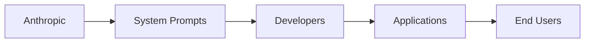

# System Prompts de Claude: el control invisible que redefine la economía de la IA

Anthropic acaba de publicar documentación oficial sobre **system prompts** en su plataforma para desarrolladores. Para el observador casual, parece un detalle técnico menor: instrucciones persistentes que definen el comportamiento de un modelo de lenguaje. Pero detrás de esta movida se esconde una de las batallas más importantes —y menos discutidas— de la industria tecnológica contemporánea: **quién establece las reglas con las que opera la inteligencia artificial**.

## ¿Qué son realmente los system prompts?

Un system prompt es, en esencia, una capa de instrucciones que el desarrollador coloca al inicio de cada conversación con Claude. Define el tono, los límites, el rol y las restricciones que el modelo debe seguir. No es una simple "configuración": es la **constitución operativa** de la IA dentro de una aplicación determinada.

Lo que Anthropic ha hecho ahora es **formalizar y documentar públicamente** esta práctica. En un mercado donde la diferenciación técnica entre modelos se reduce cada trimestre, las empresas necesitan construir fosos de defensa (moats) que vayan más allá de los benchmarks. La documentación oficial de system prompts es precisamente eso: un intento de crear un ecosistema de desarrolladores que piense "a la manera Anthropic".

## La guerra de plataformas que nadie nombra

Para entender la trascendencia de este anuncio, hay que mirar el tablero completo. OpenAI, Anthropic, Google DeepMind y Meta compiten en un mercado donde el producto central —el modelo de lenguaje— se ha convertido en una **commodity**. Las diferencias en capacidad bruta son cada vez más marginales, y los precios por token caen en picada desde 2023.

En este contexto, la batalla se desplaza hacia tres frentes:

1. **La capa de distribución**: ¿Quién logra que más aplicaciones integren su modelo?
2. **La capa de herramientas**: ¿Quién ofrece SDKs, frameworks y documentación más pulidos?
3. **La capa de gobernanza**: ¿Quién define qué puede y qué no puede hacer la IA?

Los system prompts son, simultáneamente, una herramienta de los tres frentes. Permiten a Anthropic ofrecer una experiencia de desarrollador "más controlada" —léase: más predecible y, por tanto, más vendible— al mismo tiempo que establece un estándar que refuerza su posición en la cadena de valor.

## El paralelismo con la App Store de Apple

Cuando Apple lanzó la App Store en 2008, no ofreció únicamente una tienda de aplicaciones: instauró un sistema de reglas que decidía qué aplicaciones podían existir, cómo debían comportarse y bajo qué condiciones operaban. Fue el germen de un modelo donde el control normativo de la plataforma se convirtió en el verdadero negocio, mucho más rentable que el hardware o el software base.

Los system prompts de Claude siguen una lógica estructural similar. **Anthropic no solo ofrece un modelo; ofrece un marco normativo** dentro del cual el modelo opera. Los desarrolladores que construyen sobre Claude aceptan implícitamente las prioridades, los sesgos y las restricciones que Anthropic ha decidido implementar. Y lo hacen a cambio de acceso a una capacidad técnica que, por sí sola, ya no es un diferenciador competitivo sostenible.

## ¿De quién son los valores?

Hay una pregunta que esta documentación hace explícita y que rara vez se discute en los medios generalistas: **¿qué valores están codificados en los prompts de sistema de Claude?** Anthropic ha construido su marca sobre la promesa de una "IA segura" y "alineada", pero esa alineación tiene una dimensión política ineludible. Las decisiones sobre cómo responder a temas controvertidos, qué tono usar, qué información priorizar, son —en el fondo— decisiones de diseño con consecuencias sociales.

## El costo oculto para los desarrolladores

Para un startup que construye un producto sobre Claude, la adopción de system prompts no es inocua. Implica:

- **Dependencia funcional**: cambiar de proveedor (de Claude a GPT, por ejemplo) requiere reescribir las instrucciones base.
- **Riesgo regulatorio**: si Anthropic modifica sus prompts por defecto, el comportamiento de la aplicación puede alterarse sin aviso.
- **Cesión de control editorial**: el desarrollador delega en Anthropic la definición de "comportamiento apropiado".

Este es el clásico **lock-in de plataforma**, pero aplicado a una capa de la stack tecnológico que hasta hace dos años simplemente no existía. Y al igual que ocurrió con las bases de datos en los años 2000 —cuando Oracle, IBM y Microsoft consolidaron posiciones que aún hoy son difíciles de revertir—, estamos presenciando la formación de un nuevo oligopolio con efectos de red que se acumulan silenciosamente.

## ¿Hacia dónde vamos?

La pregunta ya no es si la IA transformará la economía —eso es un hecho— sino **quién escribirá las reglas no escritas** que gobernarán esa transformación. Los system prompts son una pista de respuesta: la escribirán quienes controlen la infraestructura, el capital y los datos. Como siempre ha ocurrido en la historia de la tecnología.

Tal vez el momento de prestar atención a estos detalles no sea cuando la inteligencia artificial alcance la singularidad, sino ahora, cuando todavía se está decidiendo —mediante documentación técnica publicada en plataformas para desarrolladores— quién tiene voz y quién no en el nuevo orden digital.

