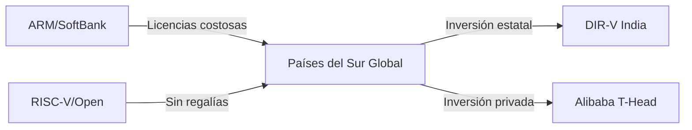

# RISC-V y el Sur Global: La Crítica que Silicon Valley No Quiso Escuchar

Hace unas semanas, un artículo titulado *"RISC-V: They should have known better"* circuló por los círculos habituales de ingeniería, provocando un debate que terminó cruzando el Atlántico. La respuesta, escrita por un ingeniero que se identifica como parte del llamado "tercer mundo", no se quedó en lo técnico: tocó una fibra mucho más profunda sobre quién diseña la tecnología que todos usamos y quién paga el precio de esas decisiones.

Como analista de tecnología, creo que este cruce de argumentos merece una lectura más allá del flame war. Hay aquí una disputa sobre **poder, estándares y soberanía tecnológica** que define gran parte del siglo XXI.

## Lo que el Sur Global realmente ve

Cuando un ingeniero de India, Nigeria, Brasil o Vietnam lee artículos como *"They should have known better"*, la lectura es diferente a la de un ingeniero de San José o Múnich. No se trata de inferioridad técnica, sino de un desacuerdo fundamental sobre las prioridades de diseño.

Desde la óptica del Sur Global, RISC-V no es un experimento académico ni un proyecto ideológico de hippies del open source. Es, posiblemente, **la primera oportunidad real en 40 años** de construir capacidad tecnológica soberana sin depender de un duopolio que cobra licencias por cada chip que sale de una fábrica.

Recordemos quién controla realmente el silicio hoy:

- **ARM** (SoftBank/compañía pública) licencia a Apple, Qualcomm, MediaTek, Samsung y prácticamente todo el ecosistema móvil. SoftBank compró ARM por 32.000 millones de dólares en 2016 y la sacó a bolsa en 2023 valorada en más de 50.000 millones.
- **x86** es un mercado cautivo de Intel y AMD, con un pasado de demandas cruzadas y una guerra legal de décadas.
- **Nvidia** intentó comprar ARM en 2020 por 40.000 millones de dólares; el regulador del Reino Unido, EE.UU. y China bloquearon la operación. Un evento que pocos recuerdan con la importancia que merece.


## El precedente histórico: Linux, Android y el espejismo del "open"


¿Pasará lo mismo con RISC-V? Empresas como **SiFive** (fundada por los creadores de RISC-V en UC Berkeley) ya están capitalizando. Alibaba, a través de su filial **T-Head**, ha invertido agresivamente en implementaciones RISC-V. **Western Digital** y **Samsung** tienen líneas de investigación activas. La pregunta no es si habrá concentración, sino **quién la controlará** y bajo qué reglas.

## La crítica original: ¿de qué hablaba realmente?

El artículo *"They should have known better"* probablemente señalaba decisiones de diseño de RISC-V — el número de instrucciones, la fragmentación de extensiones, la falta de un perfil unificado, las decisiones del comité de arquitectura. Críticas legítimas, técnicamente hablando.

Pero el problema es el **encuadre implícito**: asumen que los diseñadores originales debían optimizar para el caso de uso occidental, donde ya existen ARM, x86, abundante capital de riesgo y cadenas de suministro maduras.

Un ingeniero del Sur Global responde: **¿optimizar para quién?** Cuando tu país paga regalías a ARM, Qualcomm y Synopsys, cuando tu moneda fluctúa y tu gobierno no subsidia semiconductores, cuando tu acceso a litografía avanzada está bloqueado por controles de exportación — la elección de RISC-V no es una preferencia técnica, es una **decisión de supervivencia económica**.

## La geopolítica ya está aquí


Europa, a través del **European Processor Initiative**, también financia diseños RISC-V. No por romanticismo open source, sino porque después de la crisis de los semiconductores de 2020-2022 y la dependencia de Asia para la fabricación, la autonomía tecnológica dejó de ser un lujo.


## ¿Y entonces qué?


La historia sugiere que las tecnologías abiertas, una vez que escalan, tienden a ser **absorbidas por el capital concentrado** en lugar de democratizar realmente. La esperanza del Sur Global es que RISC-V, al ser una ISA y no solo un software, sea más difícil de capturar. Pero la esperanza no es estrategia.

Mientras tanto, vale la pena leer ambas posturas. El artículo original aporta rigor técnico. La respuesta, una perspectiva que Silicon Valley rara vez se molesta en considerar. Y eso, por sí solo, ya es una señal de qué tan distorsionado está el debate.

---


```
A[ARM/SoftBank] -->|Licencias costosas| B[Países del Sur Global]
C[RISC-V/Open] -->|Sin regalías| B
B -->|Inversión estatal| D[DIR-V India]
B -->|Inversión privada| E[Alibaba T-Head]
```


