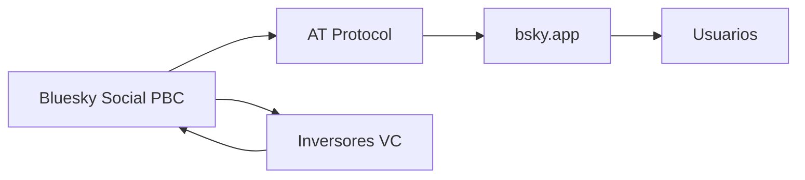

## El logo fantasma en cada captura de pantalla

A primera vista, podría parecer una estrategia de marketing legítima. En un ecosistema saturado, las plataformas jóvenes compiten por cada mención visible. Si un usuario captura un post viral y lo comparte en Instagram, Discord o Reddit, el logo de Bluesky viaja con la imagen, recordándole al espectador de dónde viene. Es el equivalente digital del estampado en una camiseta de marca: sutil, persistente, gratuito.

Pero detrás de esta decisión hay una historia más profunda sobre cómo se construye el poder en las plataformas sociales contemporáneas, y sobre las contradicciones que viven los proyectos descentralizados cuando intentan crecer.

## La descentralización como producto, no como principio

Bluesky nació en 2019 como iniciativa de Jack Dorsey, entonces CEO de Twitter, con la promesa de construir un protocolo abierto que evitara los males de las plataformas centralizadas. El proyecto se escindió en 2021, y desde entonces ha navegado por una tensión estructural: ¿es una empresa, una comunidad, o un estándar abierto?

El AT Protocol, la base técnica de Bluesky, permite en teoría que los usuarios migren entre servidores manteniendo su identidad y su red. Es una idea potente, heredera del espíritu de ActivityPub (Mastodon) y de los fallos históricos de la web abierta. Sin embargo, la realidad operativa dista de la utopía federada que sugiere su marketing.

Hoy, la mayor parte de la actividad de Bluesky ocurre en su propio servidor oficial, bsky.app, controlado por Bluesky Social PBC, una empresa con sede en Estados Unidos, financiada por rondas de capital lideradas por fondos como Blockchain Capital, Andreessen Horowitz y el propio Dorsey. El hecho de que el logo aparezca automáticamente en las capturas de pantalla es, en este contexto, un gesto clásico de construcción de marca corporativa disfrazado de funcionalidad técnica.

La diferencia es que Bluesky aún está a tiempo de decidir si quiere ser la próxima Mastodon —una federación modesta pero coherente con sus principios— o la próxima Twitter pre-Elon: una marca fuerte sobre infraestructura abierta, pero con un solo actor tomando las decisiones importantes.

El detalle del logo en las capturas es un recordatorio constante de cuál de las dos entidades tiene el control efectivo sobre la experiencia cotidiana del usuario.

## Conclusión: leer entre píxeles

La próxima vez que veas un logo de Bluesky en una captura compartida por un amigo, recuerda: no es solo una marca. Es una declaración silenciosa de propiedad en una economía donde la atención es la mercancía más cara.

