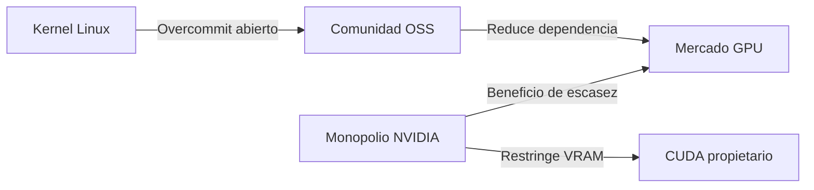

# Linux 7.3 y el overcommit de VRAM: cómo el código abierto resuelve lo que NVIDIA ignora

## Una mejora técnica con implicaciones políticas

El kernel Linux acaba de incorporar una mejora sustancial en la gestión de memoria gráfica virtual (VRAM). En términos simples: cuando una aplicación pide más VRAM de la disponible, el sistema ahora puede "prometer" esa memoria y negociarla de forma mucho más eficiente, en lugar de fallar o colapsar. Es una mejora discreta en el código, pero esconde una historia más densa sobre cómo se distribuye el poder tecnológico en 2026.

El trabajo, detallado por el desarrollador que mantiene el blog pixelcluster.dev, lleva meses madurando en listas de correo y revisiones de código. No es producto de una corporación con presupuesto millonario, sino de contribuidores individuales y un puñado de empresas (Red Hat, Intel, AMD) que mantienen infraestructura crítica del software mundial casi por compromiso ideológico.

## El elefante en la sala: NVIDIA

Lo que esta mejora evidencia, sin embargo, es un problema que NVIDIA no tiene incentivos para resolver: la gestión deficiente de VRAM cuando se ejecutan cargas de trabajo intensivas.

NVIDIA Corporation, valorada en más de tres billones de dólares y prácticamente monopolista del mercado de GPUs para IA y HPC, ofrece controladores propietarios donde la VRAM no puede overcommitearse de forma nativa en sistemas Linux para uso general. Las técnicas de "unified memory" o "oversubscription" existen, pero están atadas a CUDA, su ecosistema cerrado, y frecuentemente requieren hardware específico (como sus chips Grace Hopper o las recientes GB200).

¿Por qué? Porque la escasez artificial de VRAM es, paradójicamente, un motor de ventas. Si la memoria de tus GPUs H100 nunca es suficiente, comprarás más GPUs. Es el mismo modelo que históricamente usó IBM con la mainframes y que Microsoft reprodujo con las licencias de Windows Server: la fricción técnica como mecanismo de extracción de rentas.

## La nube como nuevo campo de batalla

Estos gigantes tienen sus propias implementaciones de overcommit (AWS Nitro, Azure Confidential Computing, etc.), pero todas asumen un modelo donde el hardware GPU lo provee casi exclusivamente NVIDIA. Cuando un cliente quiere ejecutar, por ejemplo, una carga de inferencia con un modelo de 70B parámetros y repartirla entre GPUs más económicas, choca con limitaciones que el kernel Linux, curiosamente, sí podría mitigar a nivel de sistema operativo.

Aquí aparece una tensión clave: ¿el overcommit de VRAM debería ser responsabilidad del kernel, del driver propietario, del orquestador de contenedores, o del hypervisor? La respuesta, como casi siempre en tecnología, depende de quién controla el stack.

## El precedente histórico: memoria virtual y Unix

En los años 70, Unix introdujo la memoria virtual como una abstracción que hacía fungible la RAM: el sistema operativo podía "prometer" más memoria de la físicamente disponible y resolver la asignación de forma eficiente mediante paginación. Esta innovación democratizó el acceso a un recurso escaso y trasladó al sistema operativo la responsabilidad de gestionarlo, rompiendo el control vertical que el hardware había tenido hasta entonces.

Ahora estamos viendo una iteración similar, pero aplicada al recurso más escaso y caro del siglo XXI: la memoria de las GPUs que entrenan modelos de inteligencia artificial. La diferencia es que, por primera vez, una empresa —NVIDIA— controla tanto el hardware como la capa de software que ejecuta encima (CUDA), creando un monopolio vertical casi sin precedentes desde Microsoft en los 90.

## AMD, Intel y el dilema del competidor

AMD ha intentado romper este monopolio con Instinct y ROCm, mientras Intel compite con Gaudi y sus nuevos Xeon para IA. Sin embargo, ambos siguen siendo proveedores de hardware atrapados en un mercado donde el software importa más que el silicio. Cada mejora del kernel Linux que haga la VRAM más fungible o gestionable les conviene estratégicamente: erosiona la prima que NVIDIA cobra por su "eficiencia mágica" en gestión de memoria.

## Conclusión: el código libre como contrapoder silencioso

Hay una ironía productiva en que Linux —un proyecto nacido hace más de tres décadas de la obsesión de un estudiante finlandés— siga siendo el laboratorio donde se prueban soluciones a problemas que las grandes tecnológicas no resuelven porque no les conviene.

