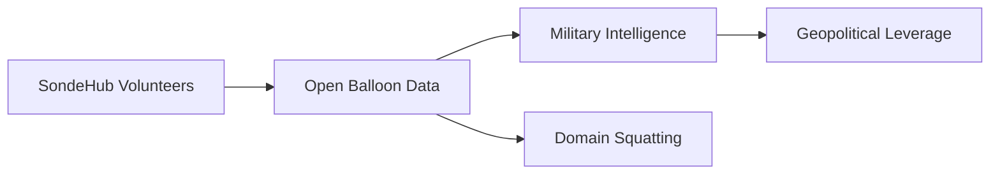

# Cuando un dominio comprado por broma se convirtió en guerra geopolítica: el caso SondeHub

## El incidente que nadie vio venir

SondeHub es, en su superficie, un proyecto modesto. Una comunidad de radioaficionados y entusiastas del clima que rastrea sondeos atmosféricos —globos meteorológicos con sensores de radiosonda— y publica sus coordenadas, altitudes y trayectorias en tiempo real. Nació como un pasatiempo técnico. Su infraestructura es simple: un frontend, una API, repositorios en GitHub, y unos cuantos dominios que cualquiera podría comprar por doce dólares al año.

Entonces, alguien compró un dominio asociado al ecosistema. La broma —o el cálculo— detonó una respuesta desproporcionada: revelaciones sobre el papel real de los datos, tensiones entre comunidades open source, y una pregunta incómoda sobre quién protege la infraestructura que sostiene la información moderna.

## La economía política de los dominios

En este caso, el dominio en cuestión no era SondeHub.org original —ese sigue bajo control del proyecto—, sino variantes o assets adyacentes. Pero el principio es el que importa: cualquier persona con catorce dólares y una tarjeta de crédito puede adquirir un nombre que, por motivos históricos, técnicos o de SEO, redirige tráfico, reputación y credibilidad a un punto arbitrario de internet. No se necesita una Microsoft, una Alphabet o una Amazon para manipular la percepción pública. Basta con un registrador.

Esto invierte una de las narrativas favoritas de Silicon Valley: la de que la web abierta es un espacio meritocrático donde el código bueno gana. La realidad es más cruda. La web es un sistema feudal disfrazado de anarquía. Los dominios son tierras, los registradores son señores, y los proyectos pequeños viven en el espacio entre arrendamientos renovables anualmente. Un error, un cambio de política en un registrar, o un actor hostil pueden borrar años de trabajo comunitario en cuestión de horas.

## El lado militar de los datos abiertos

Antes, capturar datos abiertos significaba montar una estación de escucha. Hoy, los datos ya están en la nube, en formato JSON, refrescándose cada treinta segundos en un endpoint público. Proyectos como SondeHub, ADS-B Exchange (rastreo de vuelos), MarineTraffic (buques) o OpenStreetMap son, simultáneamente, regalos a la ciudadanía y regalos a los servicios de inteligencia extranjeros. Esta dualidad no es un fallo de diseño; es estructural.

Empresas como Palantir, Anduril o el ecosistema de defensa israelí (Rafael, Elbit) han construido imperios de miles de millones precisamente sobre esta premisa: agregar datos abiertos y privados para producir inteligencia accionable. La capa de recolección es gratuita. La capa de interpretación es la que cuesta, y la que concentra capital.

## Voluntarios sosteniendo infraestructura crítica

Quizás el ángulo más incómodo del caso SondeHub no es geopolítico, sino laboral. Un puñado de desarrolladores no remunerados mantiene, sin contrato, sin SLA, sin seguro de responsabilidad, un servicio que múltiples gobiernos consumen implícitamente. Si mañana los mantenedores se queman, el dominio expira, o el costo de la nube en AWS se vuelve insostenible, no hay quien pague la cuenta.

Cloudflare y AWS han construido modelos de negocio brillantes sobre esta externalización: ofrecen créditos y servicios gratuitos a proyectos open source que luego generan tráfico, datos, y prestigio de marca, mientras esos proyectos absorben el riesgo operativo. Es el mismo esquema que sostiene a Wikipedia frente a Alphabet, o a Mozilla frente a Google Chrome. La asimetría es estable —hasta que deja de serlo.

Históricamente, cuando la infraestructura civil se militariza, los estados toman el control. La internet fue financiada por DARPA precisamente porque se entendía que las redes de comunicación son infraestructura de seguridad nacional. El problema es que el péndulo se ha movido demasiado: hemos devuelto la responsabilidad de la infraestructura informativa crítica a las comunidades, mientras privatizamos los beneficios en empresas de defensa y datos.

## Reflexión: ¿quién paga la neutralidad de la red?

El caso SondeHub debería leerse como una señal de alerta, no como una anécdota. Cuando un proyecto mantenido por voluntarios se convierte en recurso bélico, el marco deja de ser "comunidad" y pasa a ser "infraestructura crítica". Y la infraestructura crítica requiere financiamiento, gobernanza y protección.

Pero la industria tecnológica ha internalizado la ficción de que lo open source es gratis, infinito y eternamente renovable. No lo es. Cada línea de código no pagada es una línea que puede dejar de existir el día que alguien —un bromista, un estado hostil, un registrador con políticas cambiantes— decida presionarla.

Quizás la pregunta no sea qué pasó con un dominio, sino cuántos proyectos críticos dependen hoy de la buena voluntad de un puñado de personas que podrían, legítimamente, dejar de mantener mañana. Y quién asumiría entonces el costo de haber confundido hobby con infraestructura nacional.

