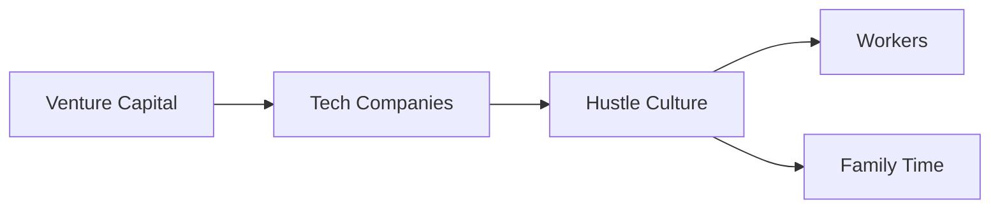

El blog post de Nicholas Charrière —"Being ambitious and being a dad"— toca un nervio que la industria tecnológica prefiere mantener adormecido: la incompatibilidad estructural entre los ritmos que exige el capital de riesgo y la posibilidad de una paternidad presente. No es un problema individual. Es un problema de diseño organizacional.

## La cultura del hustle no es un accidente: es un modelo de extracción

La narrativa del "trabaja duro y serás recompensado" en Silicon Valley lleva décadas ocultando una realidad más cruda. Las startups respaldadas por capital venture operan bajo una presión temporal brutal: o creces exponencialmente en 18-24 meses, o mueres. Esta lógica fue codificada por fondos como Sequoia Capital en los años 90 y refinada por Andreessen Horowitz en los 2000. El resultado es un sistema donde fundadores y empleados tempranos son empujados a tratar la empresa como una extensión de su cuerpo, sin horarios, sin vacaciones, sin vida privada.

Empresas como WeWork ilustraron el colapso de este modelo cuando la propia narrativa de "trabaja, vive, crece" empezó a revelar sus costos humanos. Pero el fenómeno no se limita a las startups. Las grandes tecnológicas también lo han internalizado. Google presumió durante años su política de "20% de tiempo libre" y beneficios parentales generosos; en 2023, la empresa despidió a cientos de ingenieros mientras mantenía a sus ejecutivos con paquetes de compensación de decenas de millones de dólares. La asimetría es reveladora: el capital siempre se protege a sí mismo antes que a las familias de sus empleados.

## La paternidad como variable de ajuste del modelo de negocio

## La falsa meritocracia y el "capital humano" como coartada

El lenguaje de la industria —"tu valor de mercado", "construye tu marca personal", "invierte en ti mismo"— convierte a los trabajadores en responsables individuales de su propio bienestar. Si no puedes con el ritmo, el problema eres tú, no el sistema. Esta es la misma lógica que empresas como Uber y Lyft aplicaron a sus conductores: convertirlos en "socios" para externalizar responsabilidades laborales y precarizar el ingreso.

Para los padres en tech, esto significa una presión adicional. Si tu empresa te pide ser "dueño de tu carrera" y simultáneamente te exige disponibilidad permanente, la paternidad se convierte en un lujo que requiere justificación constante. LinkedIn está lleno de posts performativos de ejecutivos masculinos que vuelven al trabajo "porque les apasiona" —actuando la elección como si fuera liberación.

## Lecciones históricas que la industria ha decidido olvidar

En tech, esa memoria histórica se ha borrado deliberadamente. Los ingenieros son clasificados como "trabajadores del conocimiento" supuestamente inmunes a las necesidades corporales. Las oficinas tienen mesas de ping-pong y cerveza gratis, pero ninguna guardería. Es la misma lógica que el historiador Jason Hickel documenta en *Less Is More*: convertir el lujo en salario y la precariedad en estilo de vida aspiracional.

## Empresas que fingen resolver un problema que ellas mismas crean

## Una salida que no puede ser individual

