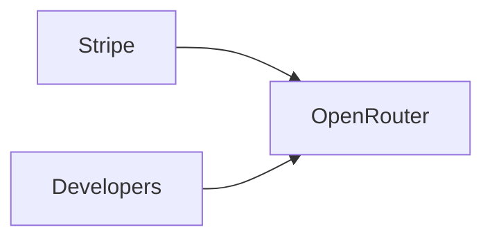

# OpenRouter se une a Stripe: la nueva frontera de la consolidación en infraestructura de IA

La adquisición de OpenRouter por parte de Stripe, anunciada esta semana, no es una operación corporativa más. Es un movimiento que revela hacia dónde se dirigen las batallas más importantes del ecosistema de inteligencia artificial: no en la frontera del modelo, sino en la capa de enrutamiento que conecta esos modelos con el resto de la economía digital.

Esa abstracción es ahora el activo que Stripe acaba de comprar.

## Por qué Stripe quiere ser el punto de paso obligatorio

Esto es lo que los economistas llaman un cuello de botella extractivo, y es el santo grial de cualquier plataforma tecnológica.

## Un patrón histórico que se repite

Lo vimos con los **CDN** en la primera década del siglo —Akamai, Cloudflare y Fastly sobrevivieron; docenas de competidores desaparecieron—, con la **infraestructura cloud** en la segunda década —AWS capturó cerca del 32% del mercado, seguido por Azure y Google Cloud— y, más recientemente, con las **plataformas de datos** como Snowflake, Databricks y MongoDB. En cada caso, la fragmentación inicial dio paso a un oligopolio funcional en menos de una década.

## Las dinámicas de poder detrás del routing

En medio de este mercado fragmentado, quien controla el router controla una cantidad desproporcionada de información: sabe qué modelos se usan más, qué clientes gastan más, qué patrones de fallo existen, qué precios son tolerables. Esa inteligencia de mercado es, en sí misma, una ventaja competitiva formidable. Stripe, que ya conoce los flujos de pago de millones de negocios, ahora sabrá también cómo esos negocios están integrando la IA en sus operaciones.

Para los desarrolladores independientes y las startups pequeñas, esto plantea una pregunta incómoda: ¿quieren confiar su acceso a la inteligencia artificial a una sola empresa que también controla sus pagos? La comodidad de un *one-stop shop* viene acompañada de una dependencia que, en el peor de los casos, podría convertirse en un bloqueo de salida difícil de revertir.

## Lo que viene ahora: el platform play de Stripe

La pregunta interesante no es si esta adquisición fue inteligente —lo fue—, sino qué hará Stripe a continuación. Las opciones son múltiples y todas profundizan su posición estructural:

- **Integración profunda con su producto de pagos**: cobrar automáticamente a los clientes por uso de inferencia, ofreciendo facturación unificada y métricas de consumo.
- **Servicios financieros para empresas de IA**: líneas de crédito, adelantos de *cash flow* basados en consumo de API, productos que solo tienen sentido si Stripe ve todos los datos.
- **Una tienda de aplicaciones de IA**: posicionarse como el App Store de la inteligencia artificial, donde los desarrolladores descubren y consumen modelos bajo un paraguas único.

## Conclusión: la consolidación como destino, no como accidente

El caso de OpenRouter ilustra una verdad incómoda del capitalismo tecnológico: la infraestructura tiende a la concentración, no por accidente, sino por diseño. Los mercados de red, las economías de escala y los efectos de plataforma empujan inexorablemente hacia el oligopolio. La inteligencia artificial, pese a toda su retórica de "democratización" y "apertura", no escapa a esa dinámica.

La pregunta para los próximos meses no es si OpenRouter mejorará como producto tras unirse a Stripe —probablemente sí—. La pregunta es si vamos a asistir en tiempo real a la construcción de la próxima utilidad monopolística de internet, y si lo haremos con los ojos abiertos o repitiendo los mismos debates que tuvimos con AWS, con los motores de búsqueda, con las redes sociales.

Porque en tecnología, quien controla el router, controla el futuro.

