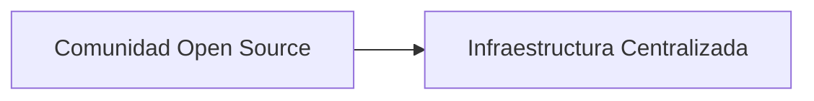

# Un dominio de broma, una guerra real: la fragilidad oculta de la infraestructura abierta

Lo que comenzó como una broma entre colegas terminó exponiendo una de las verdades más incómodas de la internet moderna: nuestra infraestructura "descentralizada" depende de un puñado de empresas privadas que operan como puntos únicos de fallo geopolítico. La historia de SondeHub, una plataforma comunitaria que rastrea globos de radiosonda utilizados para observaciones meteorológicas, es un caso de estudio perfecto sobre cómo las guerras del siglo XXI se libran también en el plano de los nombres de dominio.

## El incidente que nadie vio venir

SondeHub es un proyecto de código abierto mantenido por una comunidad de entusiastas y meteorólogos aficionados que, desde hace años, ha construido una red global para rastrear los globos meteorológicos que lanzan los servicios meteorológicos nacionales. Estos globos, aparentemente inocuos, transmiten datos atmosféricos cruciales. Lo que muchos no saben es que durante conflictos bélicos recientes —particularmente en el contexto de la guerra en Ucrania—, los datos de radiosondas se han convertido en información estratégicamente sensible. Las correcciones de artillería, la planificación de vuelos de combate, la predicción de condiciones para operaciones especiales: todo depende de modelos meteorológicos precisos, y los datos de radiosondas son su materia prima.

Según relata xssfox en su blog, alguien adquirió un dominio relacionado con SondeHub como una broma o por curiosidad, y esa posesión aparentemente trivial escaló hasta convertirse en un vector de interferencia geopolítica. Los detalles del caso revelan hasta qué punto un nombre de dominio puede convertirse en un arma cuando se inserta en un contexto de guerra híbrida.

## Por qué un dominio es un arma

Cuando alguien adquiere un dominio estratégicamente posicionado —un *typo*, una variante, o un dominio adyacente a infraestructura crítica— obtiene una palanca desproporcionada. Puede redirigir tráfico, desplegar campañas de phishing, capturar credenciales, o simplemente denegar el servicio. En contextos bélicos, estas capacidades se multiplican. Un dominio que imita a una plataforma de inteligencia abierta no necesita ser técnicamente sofisticado para causar daño: solo necesita existir y ser creíble.

## La falsa descentralización de la infraestructura abierta

Aquí está la paradoja que SondeHub expone crudamente: proyectos que se presentan como distribuidos, comunitarios y resilientes, en realidad dependen de manera casi total de infraestructura comercial centralizada. El código puede estar en GitHub, los datos pueden replicarse en miles de nodos, pero el dominio principal, los certificados TLS, y el tráfico de los usuarios finales pasan por un número mínimo de empresas.

**Cloudflare**, por ejemplo, protege una porción significativa de los sitios web del mundo. Su modelo de negocio —proxy inverso, mitigación de DDoS, distribución de contenido— lo ha convertido en un guardián de facto de internet. Si Cloudflare decide no dar servicio a un proyecto, o si un gobierno lo presiona para que lo haga, el proyecto colapsa *de facto* aunque su infraestructura lógica siga intacta. Casos similares involucran a GoDaddy, que en el pasado ha suspendido dominios por presiones políticas o legales, o a AWS, cuyo poder sobre el ecosistema cloud es tan grande que Amazon ha sido comparado con un "guardia de tráfico planetario".

## Conclusión: repensar la resiliencia

El incidente de SondeHub debería servir como una llamada de atención para desarrolladores, financiadores y reguladores. La dependencia de proveedores centralizados de DNS, certificados y tráfico no es un detalle técnico menor: es una vulnerabilidad estructural que los Estados y actores maliciosos saben cómo explotar. Construir "resiliencia" en la nube no significa nada si el dominio puede ser apropiado, el certificado revocado, o el tráfico interceptado en la frontera por un proveedor que responde a jurisdicciones extrañas.

Quizás la verdadera pregunta que deja este episodio no sea técnica, sino política: ¿quién debe controlar la infraestructura que sostiene la información global? Mientras esa pregunta siga respondiéndose en los consejos de administración de unas pocas empresas californianas, los chistes seguirán convirtiéndose en guerras, y las guerras seguirán encontrando nuevos chistes donde materializarse.

