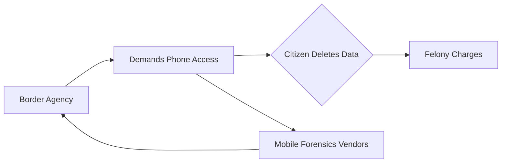

# Deleting Your Phone Data at the Border Is Now a Felony: Inside the Surveillance Capital Machine

In August 2026, a New York man named Samuel Tunick did something millions of travelers do every year without thinking twice: he deleted photos from his phone before crossing back into the United States. The difference is that Tunick now faces felony charges, and his case is quietly becoming the most important digital rights case of the decade.

What looks like a quirky legal footnote is actually a window into a much larger architecture of power—one where a handful of specialized technology firms have built billion-dollar businesses around extracting data from your devices, where law enforcement's playbook keeps expanding faster than the courts can interpret it, and where the average citizen's right to control their own information is being negotiated in real time, often without their knowledge.

## The Mobile Forensics Industry: A Quiet Giant

To understand the Tunick case, you have to understand the industry that made it possible. The global mobile forensics market is projected to exceed $3 billion by 2027, and it is dominated by a handful of companies whose names most consumers have never heard.

**Cellebrite**, the Israeli company, is the most visible. It went public on the Nasdaq in 2021 and has built its business on selling hardware and software that can extract data from locked smartphones, often bypassing manufacturer encryption. Its flagship UFED (Universal Forensic Extraction Device) is a workhorse at ports of entry, police departments, and intelligence agencies across at least 100 countries. The company's stated mission is to help law enforcement solve crimes; its unstated business model depends on the assumption that every device is a treasure trove waiting to be opened.

**Magnet Forensics**, a Canadian firm acquired by private equity giant Thoma Bravo in 2023, is the other major player. Thoma Bravo, a firm with a long history of buying up enterprise software companies and squeezing them for margins, saw mobile forensics as a logical extension of its cybersecurity and compliance portfolio. The acquisition itself tells a story: the tools used to search your phone are now part of the same financial ecosystem that owns your productivity software.

**Grayshift**, a secretive Atlanta-based startup, made waves with its GrayKey device, reportedly capable of cracking recent iPhone models. The company has largely operated in the shadows, the kind of firm that wins contracts through relationships with the FBI, ICE, and Customs and Border Protection (CBP) without ever appearing in consumer tech press.

Together, these companies represent a new layer in what scholars have long called the surveillance industrial complex—a term coined in the 1970s but more relevant than ever. The difference is that today's surveillance is mediated through consumer devices, sold as productivity tools, and operated by private contractors who profit from each successful extraction.

## From the Crypto Wars to the Border Patrol

But the Crypto Wars never really ended—they just moved to a different battlefield. The 2016 San Bernardino case, in which the FBI tried to compel Apple to break into an iPhone belonging to a terror suspect, was the most public flashpoint. Apple, under Tim Cook, refused. The FBI eventually turned to a third party—widely believed to be Cellebrite or a similar firm—and cracked the phone without Apple's help. The precedent was set: if the government couldn't compel cooperation, it could purchase access instead.

Since then, the steady erosion of Fourth Amendment protections at the border has accelerated. The legal doctrine of the "border search exception," which allows searches without a warrant, was designed for suitcases, not terabytes of personal data. But courts have been slow to challenge the practice, in part because the technology has outpaced the law, and in part because the companies making the extraction tools have powerful lobbying arms and entrenched relationships with agencies.

## The Asymmetry of Power

What makes the Tunick case significant is not that border agents searched a phone—courts have allowed that for years. It is that the act of *resisting* that search, by deleting data, has been elevated to a felony. The charges reportedly hinge on obstruction statutes that were written long before smartphones existed, but are now being applied to digital behavior.

## What the Industry Isn't Saying

The major technology companies, including Apple and Google, have a complicated position. Apple markets privacy as a feature; its "What's on your iPhone stays on your iPhone" campaign is, in part, a marketing response to the very real problem the Tunick case illustrates. But Apple also cooperates with thousands of law enforcement requests annually and has built specific compliance infrastructure to do so. The company's encryption is strong, but its business model depends on being acceptable to governments, not adversarial to them.

Google, which controls Android—the operating system on roughly 70% of the world's smartphones—has been even more accommodating. Android's fragmentation means that many devices are not encrypted by default, and the company has not fought the kind of public battle Apple staged in 2016. The result is a two-tier privacy regime: well-heeled iPhone users with the latest hardware enjoy relatively strong protection, while most of the world, on older or mid-range Android devices, remains vulnerable.

## A System Designed to Expand

The mobile forensics industry is, by design, in a constant arms race with device manufacturers. Each new iPhone release triggers investment in new cracking tools. Each new encryption protocol prompts a marketing refresh from Cellebrite. The economic logic is unbreakable: as long as governments have budgets to spend and citizens have data to protect, the industry will continue to grow.

The Tunick case should serve as a warning not because he is sympathetic or not, but because it reveals a system that has been quietly assembled over two decades, funded by taxpayers, built by private contractors, and ratified by courts that have not yet reckoned with what it means to live in a world where your phone is the most detailed record of your life.

