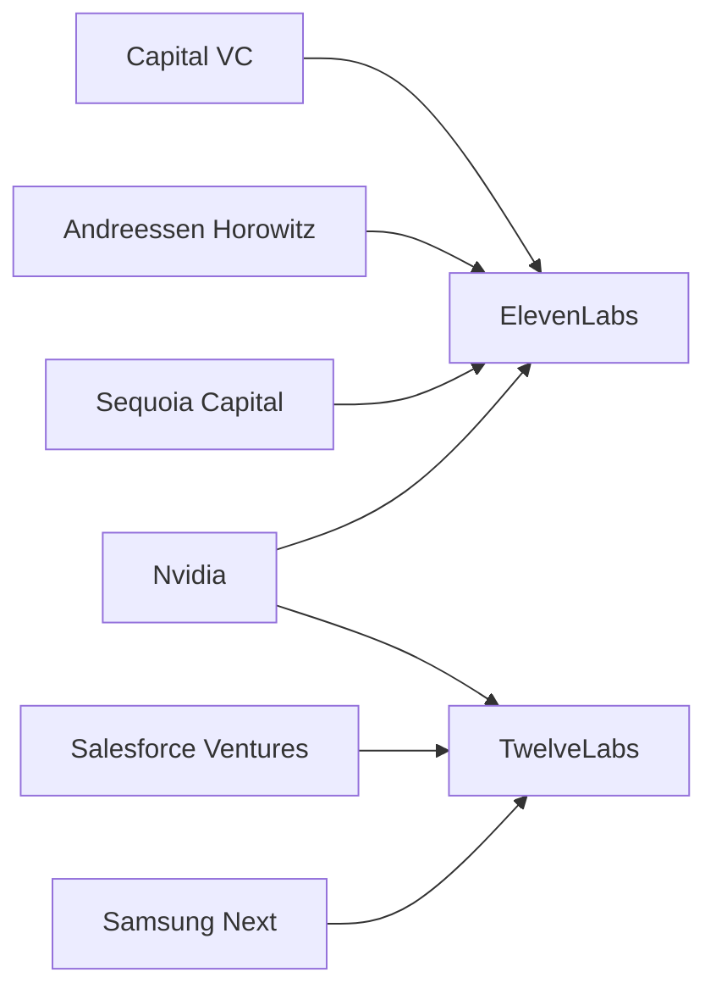

# ElevenLabs, TwelveLabs, ThirteenLabs: la numerología del capital en la era de la inteligencia artificial

Hay un detalle aparentemente trivial que atraviesa el ecosistema de startups de inteligencia artificial de 2024 y 2025, y que merece más atención de la que recibe: la obsesión por los nombres numerados. ElevenLabs irrumpió en 2022 con un valor de mercado que escaló hasta los 3.300 millones de dólares en apenas dos rondas de inversión, especializándose en síntesis de voz mediante IA generativa. TwelveLabs, fundada un año antes pero con una propuesta distinta —comprensión semántica de vídeo mediante modelos multimodales—, captó capital de la mano de inversores como Nvidia, Salesforce Ventures y Samsung Next. La existencia misma de un "ThirteenLabs" como concepto —o como startup real en ciernes— no es un accidente. Es un síntoma.

## El número como marca: más que marketing, una estrategia de posicionamiento

En una industria saturada de cientos de nuevas empresas que prometen revolucionarlo todo con modelos de lenguaje, visión computacional o generación multimodal, la diferenciación nominal se ha convertido en una forma primitiva pero efectiva de *claim staking*. Cuando ElevenLabs eligió su nombre —un guiño a su tecnología original de clonación de voz con once parámetros fundacionales en su arquitectura inicial, según explica la propia compañía—, estaba haciendo algo más que bautizarse: estaba reclamando un lugar en una secuencia mental. Once. Doce. Trece. El cerebro humano completa la serie automáticamente.

## Quién financia a quién: el mapa de poder

Lo más revelador de este patrón no es el branding, sino lo que hay detrás. ElevenLabs cuenta entre sus inversores a Andreessen Horowitz, Sequoia Capital y Nat Friedman, antiguos ejecutivos de GitHub. TwelveLabs ha levantado capital de la mano de Nvidia, el actor que probablemente más poder acumula hoy en la cadena de valor de la inteligencia artificial por controlar el silicio. Cuando una empresa como Nvidia invierte en una startup de comprensión de vídeo, no está diversificando una cartera: está tejiendo una red de dependencias que refuerzan su posición como infraestructura indispensable.

El mensaje implícito es claro: en la nueva geografía del capital tecnológico, los inversores no buscan aplicaciones puntuales, sino posiciones en capas estratégicas de la pila de IA. Voz, vídeo, imagen, texto, código: cada modalidad es una frontera disputada, y cada frontera requiere un campeón financiado. La proliferación de "labs" numerados refleja una industrialización acelerada de lo que antes eran proyectos de investigación académicos.

## La concentración en cifras

Para dimensionar lo que está ocurriendo, basta con mirar los números. En 2024, las startups de IA generativa captaron aproximadamente 56.000 millones de dólares en inversión global, según datos de CB Insights y PitchBook. Esta cifra representa más del 40% de toda la inversión en capital riesgo del año en ciertos segmentos, y está concentrada en menos de 200 empresas. Los nombres de marca como ElevenLabs o TwelveLabs son los escaparates visibles de un proceso mucho más opaco: la concentración sin precedentes de capital en un puñado de empresas que controlan talento computacional, datos de entrenamiento y relaciones con proveedores de GPU.

## El laboratorio como ficción institucional

Hay algo ligeramente performático en el uso de la palabra "Labs" en los nombres de estas empresas. Google tiene Google Labs, Meta tiene Meta AI (anteriormente Facebook AI Research), Microsoft tiene Microsoft Research. Son instituciones reales dentro de corporaciones que facturan cientos de miles de millones de dólares al año. Pero una startup de cinco años con cien empleados y un modelo fundacional tomado de un paper publicado en arXiv no es, en sentido estricto, un laboratorio. Es una empresa de producto que ha adoptado la estética del laboratorio para señalar credibilidad científica.

## ¿Qué viene después del trece?

La pregunta más interesante que deja esta serie de nombres es cuál será el siguiente. ¿Veremos un TwentyLabs? ¿Un HundredLabs? La respuesta depende de hasta dónde llegue la moda y de cuántos actores nuevos puedan entrar en la secuencia. Pero hay un techo lógico: a medida que los números crecen, pierden su efecto de rareza. El doce sigue siendo exótico; el veinte ya suena a marca de detergente. Por eso cabe esperar que en algún momento el patrón mute: los siguientes laboratorios no se llamarán por su número, sino por alguna otra propiedad estilizada de su modelo —el número de parámetros, la ventana de contexto, el dataset de entrenamiento— siguiendo el precedente de modelos como GPT, Claude o Gemini.

Lo que permanece constante, debajo de los nombres, es la estructura de poder: pocas empresas, mucho capital, talento escaso y dependencias crecientes de un puñado de proveedores de infraestructura. La numerología del branding es la capa más superficial de un proceso de concentración que merece escrutinio, no fascinación. Cada nuevo "Labs" que aparece en el radar de los inversores es, en realidad, una ficha más en un tablero que ya estaba cargado.

