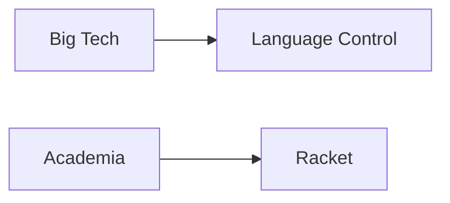

# Racket and the Quiet Resistance to Corporate-Controlled Programming

When a new tutorial titled "A Friendly Introduction to Racket" surfaced recently on Hacker News, the discussion that followed revealed something deeper than a simple language recommendation. It exposed the simmering discomfort many developers feel about the increasingly corporate-controlled nature of the tools they use every single day.

Racket, a dialect of Scheme and descendant of Lisp, has been quietly developed in academic circles for over two decades. Its roots stretch across the University of Utah, Rice University, and Northeastern University, where researchers like Matthias Felleisen and the PLT (Programming Language Team) group have maintained it as a tool for language-oriented programming, education, and research. Unlike the JavaScript frameworks, TypeScript transpilers, and proprietary SDKs that dominate modern software development, Racket is built by people whose primary allegiance is to pedagogy and intellectual curiosity—not quarterly earnings calls.

## The Corporate Homogenization of Programming Languages

To understand why a friendly Racket tutorial matters in 2025, consider who actually controls the languages you use today. **Microsoft** maintains TypeScript, C#, and increasingly the JavaScript ecosystem through GitHub and npm. **Google** stewards Go, Dart, Kotlin's de facto roadmap through Android's first-class status, and shapes the web standards process via Chromium dominance. **Apple** owns Swift and gatekeeps the entire iOS developer economy. **Meta** shaped React, JSX/TSX, and the surrounding tooling ecosystem. Even Java, once a hopeful "open" standard, was pulled tightly into Oracle's commercial orbit after the 2010 acquisition of Sun Microsystems.

The pattern is unmistakable: capital concentration in the technology industry has produced a corresponding concentration in the foundational tools of software development. When a handful of trillion-dollar corporations control the languages, frameworks, and package registries that millions of developers depend on, the result is a new form of digital feudalism—one where the "barons" rarely need to write a single line of code to extract rent from the entire ecosystem.

## The Economics of Open Source

**GitHub, owned by Microsoft since 2018, hosts the majority of open source projects. npm is also a Microsoft property.** PyPI depends on infrastructure grants and corporate sponsorship. Even when the code is "free as in beer," the governance structures increasingly resemble traditional corporate hierarchies—with maintainers working under employer mandates and corporate priorities shaping the roadmap.

## Language Diversity as an Antitrust Question

There's a compelling argument that the homogenization of programming languages under corporate control constitutes an emerging antitrust concern. When developers are funneled into proprietary ecosystems—TypeScript for the Microsoft stack, Swift for Apple platforms, Go for Google's cloud services—the result is reduced competition, less innovation, and ultimately, higher switching costs for everyone involved.

The European Union's Digital Markets Act, which designates certain tech companies as "gatekeepers," could eventually be applied to language and toolchain providers. But regulatory action typically lags years behind technical realities, and by then the network effects are already locked in.

## Why Racket Matters Right Now

Racket's continued existence—and the warm reception of accessible tutorials about it—signals that some developers still value intellectual freedom over corporate convenience. The language offers features that mainstream alternatives are only beginning to discover: hygienic macros, a powerful macro system that lets you extend the language itself, and a design philosophy that treats programmers as thinkers rather than product assemblers.

More importantly, Racket's community operates on academic norms: peer review, public discourse, and a long-term view of software as a cumulative human achievement. This stands in stark contrast to the quarterly cadence of corporate development, where entire frameworks can be deprecated in eighteen months and communities can be left stranded.

Of course, Racket isn't going to displace TypeScript or Go. The network effects, hiring pipelines, and corporate mandates are simply too strong. But its persistence demonstrates that alternative models remain possible. Every developer who learns Racket, contributes to its ecosystem, or teaches it to students adds a small counterweight to the gravitational pull of Big Tech.

## A Choice About Our Tools

The question isn't whether Racket will win the language wars. It's whether we'll notice what we lose as a profession when alternatives like it quietly disappear.

